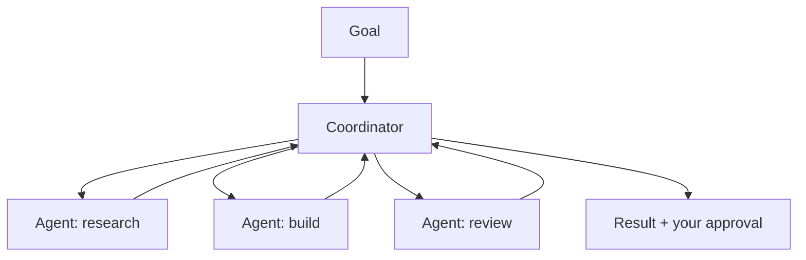

<LevelBadge level="advanced" />

<VerifyNote lastVerified="2026-06-20" source="https://docs.anthropic.com">
Cowork وفِرَق الوكلاء هي واجهات سريعة التطوّر لعام 2026 — تتغيّر الأسماء والتوافر والقدرات كثيرًا. تأكّد من التفاصيل الحالية في وثائق/إعلانات Anthropic الرسمية.
</VerifyNote>

إلى جانب الوكيل المفرد، ما فتئت Anthropic تطلق واجهات **على مستوى المنتج** لتمكين الوكلاء من أداء عمل تعاوني ومستدام: **Cowork** (مساحة عمل مكتبية وكيلية) و**فِرَق الوكلاء** (وكلاء متعدّدون يتعاونون). هذه الصفحة خريطة عامة — تحقّق من التفاصيل المحدّدة في الوثائق الرسمية، إذ تتطوّر هذه الأمور بسرعة.

## Claude Cowork

اعتبره **مساحة عمل ينجز فيها الوكيل عملًا حقيقيًا متعدّد الخطوات** إلى جانبك — عاملًا على الملفات والأدوات على مدى زمني أطول من جولة محادثة واحدة، بإشرافك أنت. إنه النظير الموجّه للمستهلك/المحترفين لبناء وكيل على الواجهة البرمجية: الحلقة مُتاحة جاهزة، وأنت توجّه الأهداف.

## فِرَق الوكلاء

حيث لا يكفي وكيل واحد، **يتعاون وكلاء متعدّدون** — مقسّمين هدفًا واحدًا، لكلٍّ دوره وأدواته، منسّقين نحو نتيجة. من حيث المفهوم يحاكي ذلك [الوكلاء الفرعيين](/docs/claude-code/subagents) في Claude Code، لكن كواجهة منتج للتعاون المستدام متعدّد الوكلاء بدلًا من مهمة فرعية مفوّضة واحدة.

## كيف يرتبط هذا ببقية الموقع

- بناؤه بنفسك، برمجيًا ← [بناء الوكلاء](/docs/api/building-agents) + [Agent SDK](/docs/claude-code/headless-and-agent-sdk).
- التفويض داخل جلسة برمجة ← [الوكلاء الفرعيون](/docs/claude-code/subagents).
- حلقة/حالة/جدولة مُستضافة ← [الوكلاء المُدارون](/docs/api/managed-agents).

## الثابت: الإشراف

:::warning استقلالية أكبر، عناية أكبر
العمل متعدّد الوكلاء والطويل المدى يضخّم القيمة *والمخاطر* معًا. أبقِ البشر ضمن الحلقة في الإجراءات ذات العواقب، وضيّق نطاق الوصول إلى الأدوات بإحكام، وتحقّق من المخرجات — راجع [الاستخدام المسؤول](/docs/security/responsible-use) و[تأمين الوكلاء](/docs/security/securing-agents).
:::

## التالي

- [الوكلاء الفرعيون والوكلاء المتوازون](/docs/claude-code/subagents)
- [الوكلاء المُدارون](/docs/api/managed-agents)
- [الاستخدام المسؤول والأخلاقيات والتحقّق](/docs/security/responsible-use)
