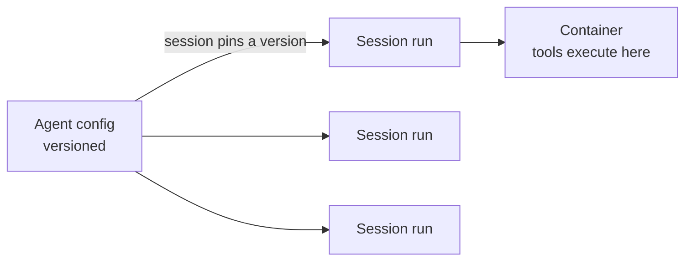

<LevelBadge level="advanced" />

<VerifyNote lastVerified="2026-06-26" source="https://platform.claude.com/docs/en/docs/agents-and-tools">
قدرات الوكيل المُدار وتوافره يتغيران — الـ API في مرحلة تجريبية (beta). تحقق من نقاط النهاية وأسماء الحقول والوصول في الوثائق الرسمية قبل البناء عليه.
</VerifyNote>

<Callout type="objectives" items={["افهم ما الذي تتولاه عنك حلقة الوكيل المُدار (المُستضافة من Anthropic)", "افصل بين الكائنين الأساسيين: وكيل (Agent) مُصدَّر مقابل جلسة (Session) لكل تشغيل", "احقن الأسرار بأمان عبر الخزائن (Vaults) — دون أن يراها النموذج إطلاقاً", "ضع وكيلاً على جدول cron باستخدام عمليات النشر المجدولة — دون جدولة تستضيفها بنفسك", "اعرف متى يتفوق المُدار على الحلقة المخصصة، والضوابط التي تظل سارية"]} />

إذا كان [بناء حلقة الوكيل الخاصة بك](/docs/api/building-agents) بنية تحتية أكبر مما ترغب في امتلاكه، فإن الوكيل **المُدار** (المُستضاف من Anthropic) يشغّل الحلقة نيابةً عنك — لتركّز على *مهمة* الوكيل، لا على سباكة الجلسات وإعادة المحاولات والحالة والجدولة.

## الكائنان: الوكيل مقابل الجلسة

هذا هو النموذج الذهني الذي يتعلق به كل شيء آخر. وهما منفصلان عن قصد.

- **الوكيل** هو *تكوين مُخزَّن ومُصدَّر* — النموذج، ومُحفِّز النظام، والأدوات، وخوادم MCP، والمهارات. تنشئه مرة واحدة. كل تحديث ينشئ نسخة جديدة غير قابلة للتغيير.
- **الجلسة** هي *نسخة وقت تشغيل* — تنفيذ واحد يشير إلى وكيل بواسطة المُعرِّف. التكوين يعيش على الوكيل، لا على الجلسة أبداً.

<Callout type="tip">
الجلسات **تُثبَّت** على نسخة الوكيل التي أُنشئت بها: الجلسات قيد التشغيل تحتفظ بنسختها، والجلسات الجديدة تحصل على الأحدث. هكذا تشحن تغييرات التكوين دون كسر العمل الجاري.
</Callout>

## ما الذي يقدمه لك "المُدار"

بدلاً من صياغة الحلقة واستضافتها يدوياً، تحصل على لبنات بناء مُستضافة:

- **الجلسات** — عمليات تشغيل دائمة تنشئها لكل تنفيذ وتستأنفها؛ تبثّ الأحداث عبر SSE.
- **البيئات** — بنية تحتية للحاويات، إما `cloud` (مُستضافة من Anthropic) أو `self_hosted` (الأدوات تُنفَّذ داخل شبكة VPC الخاصة بك). حاوية واحدة لكل جلسة هي مساحة عمل الوكيل.
- **مخازن الذاكرة** — حالة دائمة عبر الجلسات، مع الإصدارات والتنقيح، دون أن توصّل قاعدة بيانات بنفسك.
- **الخزائن** — أسرار لمصادقة MCP والخدمات الأخرى.
- **عمليات النشر المجدولة** — وكلاء يعملون على جدول cron، دون إشراف.

<PromptCard title="أنشئ وكيلاً (تكوين مُصدَّر)، ثم شغّل جلسة عليه">{`# 1. Create the agent once
POST /v1/agents        -> returns $AGENT_ID
# 2. Each execution is a session pinned to that agent
POST /v1/sessions      { "agent": "$AGENT_ID" }`}</PromptCard>

## الخزائن: أسرار لا يراها النموذج أبداً

كثيراً ما يحتاج الوكيل المستقل إلى مفتاح API — لكن *النموذج* يجب ألا يقرأه أبداً. بيانات اعتماد الخزنة (`mcp_oauth`، `static_bearer`، `environment_variable`) يجري استبدالها عند الخروج: بيانات اعتماد من نوع `environment_variable` تُحقن في الصندوق الرملي وقت التنفيذ و*لا تكون مرئية أبداً* للنموذج.

<Callout type="warning">
هذا هو النمط الآمن لمنح الوكيل وصولاً قوياً. لا تلصق المفاتيح في مُحفِّز النظام أو في رسالة — فإنها تصبح جزءاً من السياق الذي يمكن للنموذج (ولسجلّاتك) رؤيته. ضعها في خزنة.
</Callout>

## عمليات النشر المجدولة: وكيل على جدول cron

**عملية النشر** ترفق جدول cron بوكيل. عندما يُطلق الجدول، يبدأ جلسة جديدة ويُكمل مهمته — دون جدولة عليك بناؤها أو استضافتها. مناسبة لمزامنة بيانات ليلية، أو فحص امتثال أسبوعي، أو ملخّص يومي.

<Steps items={[
  {title: "عرّف الجدول", body: "POST /v1/deployments مع agent وenvironment_id وinitial_events (يجب أن تتضمن user.message) وschedule: تعبير cron بصيغة POSIX إضافة إلى منطقة زمنية بصيغة IANA."},
  {title: "كل إطلاق = تشغيل", body: "كل محاولة تشغيل تنشئ سجل تشغيل (بادئة drun_). النجاح يحمل session_id؛ والفشل يحمل error.type (مثل environment_archived أو session_rate_limited). اعرض عمليات التشغيل عبر GET /v1/deployment_runs?deployment_id=..."},
  {title: "تحكّم في دورة الحياة", body: "الإيقاف المؤقت يكبح الإطلاقات المستقبلية (عمليات التشغيل اليدوية تظل تعمل)؛ وإلغاء الإيقاف المؤقت يستأنف عند الحدوث التالي ولا يُعيد ملء الإطلاقات الفائتة؛ والأرشفة نهائية."},
  {title: "أطلق عند الطلب", body: "POST /v1/deployments/{id}/run يبدأ جلسة فوراً — حتى أثناء الإيقاف المؤقت — مع trigger_context.type: manual."}
]} />

<PromptCard title="فحص امتثال أسبوعي، أيام الجمعة الساعة 20:00 بتوقيت نيويورك">{`POST /v1/deployments
{
  "name": "Weekly compliance scan",
  "agent": "$AGENT_ID",
  "environment_id": "$ENVIRONMENT_ID",
  "initial_events": [
    {"type": "user.message", "content": [{"type": "text", "text": "Run the compliance scan and summarize findings."}]}
  ],
  "schedule": {"type": "cron", "expression": "0 20 * * 5", "timezone": "America/New_York"}
}`}</PromptCard>

<Callout type="tip">
صيغة cron هي `minute hour day-of-month month day-of-week`، بدقة على مستوى الدقيقة. يستخدم التوقيت الصيفي (DST) دلالات ساعة الحائط: الوقت الذي لا يوجد عند التقديم الربيعي يُتخطّى؛ والوقت الذي يحدث مرتين عند التأخير الخريفي يُطلق مرتين. اختر منطقة زمنية وساعة تتجنّب تلك الحواف لأي شيء حسّاس.
</Callout>

## متى تختار المُدار مقابل المخصص

| اختر **المُدار** عندما… | اختر **حلقة مخصصة / SDK** عندما… |
|---|---|
| تريد أن تُدار الاستضافة والحالة والجدولة والأسرار | تحتاج تحكماً كاملاً في الحلقة والأدوات |
| تبني نموذجاً أولياً بسرعة | لديك متطلبات بنية تحتية/امتثال مخصصة صارمة |
| بساطة التشغيل تهمّ أكثر من التحكم | تضمّن بعمق داخل مكدّسك الخاص |

إنه طيف — استدعاء واحد ← سير عمل ← وكيل مخصص (SDK) ← مُدار. ابدأ بأبسط ما تسمح به المهمة؛ وارتقِ فقط عندما تحتاج إلى ذلك.

## تنطبق الضوابط نفسها

سواء كان مُستضافاً أم لا، فإن الوكيل المستقل لا يزال يتخذ إجراءات. حافظ على **أقل امتياز ممكن**، و**تكلفة/تكرارات محدودة**، و**موافقة بشرية للخطوات الخطرة** — راجع [تأمين الوكلاء](/docs/security/securing-agents) و[تقوية عمليات التشغيل المستقلة](/docs/security/hardening-autonomous-runs).

<Callout type="takeaways" items={["الوكلاء المُدارون يتولّون الحلقة والجلسات والبيئات والذاكرة والخزائن والجدولة لتركّز على المهمة", "الوكيل تكوين مُصدَّر؛ والجلسة تشغيل واحد يُثبَّت على نسخة — التكوين يعيش على الوكيل، لا على الجلسة", "بيانات اعتماد environment_variable في الخزنة تُحقن وقت التنفيذ ولا تكون مرئية أبداً للنموذج — الطريقة الآمنة لمنح الوكيل أسراراً", "عملية النشر المجدولة هي تعبير cron + منطقة زمنية بصيغة IANA؛ كل إطلاق ينشئ تشغيلاً، وإلغاء الإيقاف المؤقت لا يُعيد ملء الإطلاقات الفائتة", "المُدار يقع عند الطرف المُستضاف من استدعاء واحد ← سير عمل ← مخصص ← مُدار؛ وضوابط الاستقلالية تظل سارية"]} />

## اختبر نفسك

<Quiz title="اختبر نفسك" questions={[
  {
    q: "ما الفرق بين الوكيل والجلسة؟",
    options: [
      "إنهما اسمان لنفس الكائن",
      "الوكيل تكوين مُصدَّر؛ والجلسة تنفيذ وقت تشغيل واحد يُثبَّت على نسخة وكيل",
      "الجلسة تحمل النموذج ومُحفِّز النظام؛ والوكيل مجرد مُعرِّف",
      "الوكيل يشغّل الأدوات؛ والجلسة تخزّن الأسرار"
    ],
    answer: 1,
    explain: "الوكيل هو التكوين المُخزَّن المُصدَّر (النموذج، المُحفِّز، الأدوات، MCP، المهارات). والجلسة نسخة لكل تنفيذ تشير إلى الوكيل وتُثبَّت على نسخته عند الإنشاء."
  },
  {
    q: "كيف ينبغي أن تعطي وكيلاً مُداراً مفتاح API يحتاجه؟",
    options: [
      "ضعه في مُحفِّز النظام ليتمكن الوكيل من قراءته",
      "مرّره في أول رسالة مستخدم في الجلسة",
      "خزّنه كبيانات اعتماد خزنة، تُحقن وقت التنفيذ ولا تكون مرئية أبداً للنموذج",
      "اكتبه بشكل ثابت داخل تعريف الأداة"
    ],
    answer: 2,
    explain: "بيانات اعتماد الخزنة (مثل نوع environment_variable) يجري استبدالها عند الخروج ولا تكون مرئية أبداً للنموذج — أما المفاتيح في المُحفِّز أو في رسالة فتصبح جزءاً من السياق المرئي."
  },
  {
    q: "أُوقفت عملية نشر مجدولة مؤقتاً لمدة يومين ثم أُلغي إيقافها. ماذا يحدث للإطلاقات التي كانت ستُطلق أثناء الإيقاف المؤقت؟",
    options: [
      "تُعاد تعبئتها — كل تشغيل فائت يُنفَّذ عند إلغاء الإيقاف المؤقت",
      "لا تُعاد تعبئتها؛ تستأنف عملية النشر ببساطة عند الحدوث المجدول التالي",
      "تُؤرشَف عملية النشر تلقائياً",
      "تُصفّ كل عمليات التشغيل الفائتة وتعمل بفارق دقيقة واحدة"
    ],
    answer: 1,
    explain: "إلغاء الإيقاف المؤقت يستأنف عند الحدوث التالي ولا يُعيد ملء الإطلاقات الفائتة. (لا يزال بإمكانك فرض تشغيل في أي وقت باستخدام الإطلاق اليدوي، حتى أثناء الإيقاف المؤقت.)"
  }
]} />

## التالي

- [بناء الوكلاء على الـ API](/docs/api/building-agents)
- [Cowork وفِرَق الوكلاء](/docs/api/cowork-and-agent-teams)
- [الوضع بلا واجهة وAgent SDK](/docs/claude-code/headless-and-agent-sdk)
- [تأمين الوكلاء](/docs/security/securing-agents)
