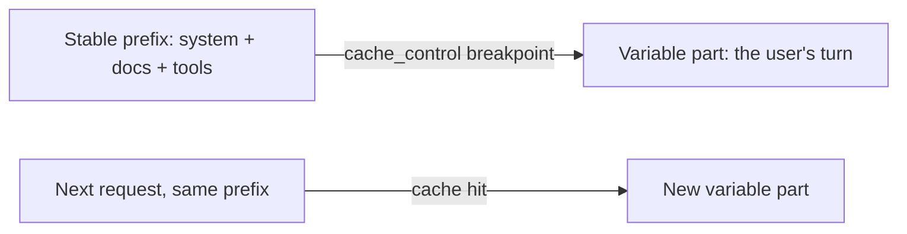

import Tabs from '@theme/Tabs';
import TabItem from '@theme/TabItem';

<LevelBadge level="advanced" />

<VerifyNote lastVerified="2026-06-21" source="https://docs.anthropic.com/en/docs/build-with-claude/prompt-caching">
آليات التخزين المؤقت، وشروط الأهلية، وتسعير الرموز المخزّنة مقابل الجديدة تتغير — تحقق من ذلك في وثائق التخزين المؤقت للموجّهات الرسمية.
</VerifyNote>

إذا كان كثير من طلباتك يتشارك جزءًا كبيرًا غير متغير — موجّه نظام طويل، أو مستند ضخم، أو كتالوج أدوات — فإن **التخزين المؤقت للموجّهات** يتيح لـ API إعادة استخدام البادئة المعالَجة بدلاً من إعادة قراءتها في كل استدعاء. وهذا يخفض كلًا من **التكلفة** و**زمن الاستجابة** على الجزء المخزّن مؤقتًا.

## كيف يعمل (النموذج الذهني)

تضع **نقطة فاصل للتخزين المؤقت** بعد البادئة الثابتة. في الاستدعاء الأول تُعالَج وتُخزَّن مؤقتًا؛ والاستدعاءات اللاحقة التي تتشارك **البادئة نفسها تمامًا** تصيب المخزن المؤقت وتدفع مقابلها أقل بكثير.



## ضع نقطة الفاصل (انسخ والصق)

أضف `cache_control` إلى **آخر كتلة ثابتة** — هنا، موجّه نظام كبير. يأتي دور المستخدم بعدها ويتغير بحرية؛ وكل شيء حتى الكتلة المعلَّمة وبما فيها يُخزَّن مؤقتًا.

<Tabs groupId="lang">
<TabItem value="python" label="Python">

```python
import anthropic

client = anthropic.Anthropic()

message = client.messages.create(
    model="claude-sonnet-4-6",
    max_tokens=1024,
    system=[
        {
            "type": "text",
            "text": LARGE_STABLE_PROMPT,  # long, unchanging — the cached prefix
            "cache_control": {"type": "ephemeral"},
        }
    ],
    messages=[{"role": "user", "content": "Summarize the key points."}],  # varies per call
)

print(message.usage.cache_read_input_tokens)  # > 0 means you got a hit
```

</TabItem>
<TabItem value="ts" label="TypeScript">

```ts
import Anthropic from "@anthropic-ai/sdk";

const client = new Anthropic();

const message = await client.messages.create({
  model: "claude-sonnet-4-6",
  max_tokens: 1024,
  system: [
    {
      type: "text",
      text: LARGE_STABLE_PROMPT, // long, unchanging — the cached prefix
      cache_control: { type: "ephemeral" },
    },
  ],
  messages: [{ role: "user", content: "Summarize the key points." }], // varies per call
});

console.log(message.usage.cache_read_input_tokens); // > 0 means you got a hit
```

</TabItem>
</Tabs>

يدفع الاستدعاء الأول علاوة **كتابة** صغيرة لملء المخزن المؤقت؛ وكل استدعاء لاحق بالبادئة نفسها يقرأها مرة أخرى بجزء بسيط من سعر الإدخال. يجب أن تكون البادئة طويلة بما يكفي لتكون مؤهلة — بضعة آلاف من الرموز، وذلك يعتمد على النموذج — وإلا فلن تُخزَّن مؤقتًا بصمت.

## الثابت الذي يصنع نجاحها أو يكسرها

:::warning التخزين المؤقت دقيق على مستوى البادئة
تتطلب إصابة المخزن المؤقت أن تكون البادئة المخزّنة **مطابقة بايتًا ببايت**. أكثر الأخطاء شيوعًا: *مُبطِل صامت* قرب أعلى الموجّه — طابع زمني، أو اسم مستخدم متغير، أو قائمة أدوات أُعيد ترتيبها — يغيّر البادئة ويُسقط معدل إصاباتك إلى صفر بهدوء.
:::

**ضع كل ما هو ثابت أولًا، وكل ما هو متغير أخيرًا،** وأبقِ البادئة ثابتة فعلًا.

## تحقق من أنها تعمل فعلًا

لا تفترض — اقرأها من حقل `usage` في الاستجابة:

- **`cache_creation_input_tokens`** — الرموز المكتوبة إلى المخزن المؤقت في هذا الاستدعاء (الطلب الأول).
- **`cache_read_input_tokens`** — الرموز المخدومة من المخزن المؤقت (التوفير).
- **`input_tokens`** — الباقي غير المخزّن، ويُحاسَب عليه بالسعر الكامل.

إذا بقي `cache_read_input_tokens` عند **الصفر** عبر طلبات متكررة يُفترض أن تتشارك بادئة، فإن مُبطِلًا صامتًا يعمل — قارن بايتات الموجّه المُصاغ بين استدعاءين للعثور عليه.

## أين يؤتي ثماره أكثر

- **موجّهات النظام** الطويلة المُعاد استخدامها عبر المستخدمين.
- **RAG / الإجابة على الأسئلة من المستندات** حيث يُستعلَم عن النص المصدري نفسه مرارًا.
- **الوكلاء** الذين لديهم كتالوج أدوات وتعليمات ثابتة عبر أدوار كثيرة.

اقرن التخزين المؤقت مع **المعالجة الدُّفعية** لأحمال العمل غير المتصلة، ومع اختيار الحجم المناسب للنموذج ([اختيار نموذج](/docs/api/choosing-a-model)) لأكبر توفير مجمّع — انظر [التكلفة وزمن الاستجابة](/docs/foundations/cost-and-latency).

## التالي

- [الرموز والسياق والتسعير](/docs/api/tokens-and-pricing)
- [البث المتدفق والأدوار المتعددة](/docs/api/streaming)
- [بناء الوكلاء على API](/docs/api/building-agents)
