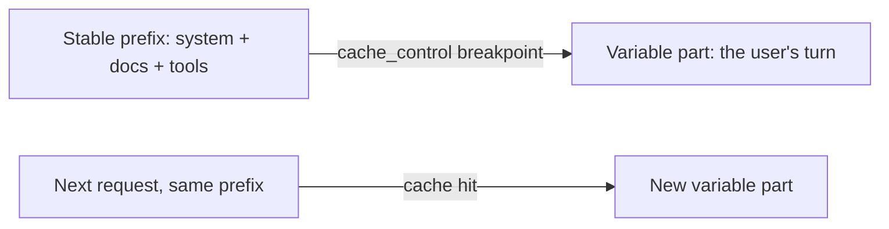

<LevelBadge level="advanced" />

<VerifyNote lastVerified="2026-06-20" source="https://docs.anthropic.com/en/docs/build-with-claude/prompt-caching">
تتغيّر آليات التخزين المؤقت وأهلّيته وتسعير الرموز المُخزَّنة مقابل الجديدة — تأكّد منها في وثائق التخزين المؤقت للمطالبات الرسمية.
</VerifyNote>

إذا كان كثير من طلباتك يشترك في جزء كبير لا يتغيّر — مطالبة نظام طويلة، أو مستند ضخم، أو فهرس أدوات — فإن **التخزين المؤقت للمطالبات** يتيح للواجهة البرمجية إعادة استخدام البادئة المُعالَجة بدلًا من إعادة قراءتها في كل استدعاء. وهذا يخفّض **التكلفة** و**الزمن** على الجزء المُخزَّن.

## كيف يعمل (النموذج الذهني)

تضع **نقطة فاصلة للتخزين المؤقت** بعد البادئة الثابتة. في الاستدعاء الأول تُعالَج وتُخزَّن؛ والاستدعاءات اللاحقة التي تشترك في **البادئة ذاتها تمامًا** تصيب التخزين المؤقت وتدفع مقابلها أقلّ بكثير.

## الثابت الذي يصنع نجاحه أو فشله

:::warning التخزين المؤقت دقيق على مستوى البادئة
تتطلّب إصابة التخزين المؤقت أن تكون البادئة المُخزَّنة **متطابقة بايتًا ببايت**. أكثر الأخطاء شيوعًا: *مُبطِل صامت* قرب أعلى المطالبة — طابع زمني، أو اسم مستخدم متغيّر، أو قائمة أدوات معاد ترتيبها — يغيّر البادئة ويُسقِط معدّل إصابتك بهدوء إلى صفر.
:::

**ضع كل ما هو ثابت أولًا، وكل ما هو متغيّر أخيرًا،** وأبقِ البادئة ثابتة حقًّا.

## أين يؤتي ثماره أكثر

- **مطالبات النظام** الطويلة المعاد استخدامها عبر المستخدمين.
- **RAG / الأسئلة والأجوبة على المستندات** حيث يُستعلَم النصّ المصدري نفسه مرارًا.
- **الوكلاء** ذوو فهرس أدوات وتعليمات ثابتة عبر جولات كثيرة.

اقرن التخزين المؤقت مع **التجميع في حِزَم** للأعباء غير المتزامنة، ومع تحجيم النموذج المناسب ([اختيار نموذج](/docs/api/choosing-a-model)) لتحقيق أكبر وفر مجمَّع — راجع [التكلفة والزمن](/docs/foundations/cost-and-latency).

## التالي

- [الرموز والسياق والتسعير](/docs/api/tokens-and-pricing)
- [البثّ والمحادثات متعدّدة الجولات](/docs/api/streaming)
- [بناء الوكلاء على الواجهة البرمجية](/docs/api/building-agents)
