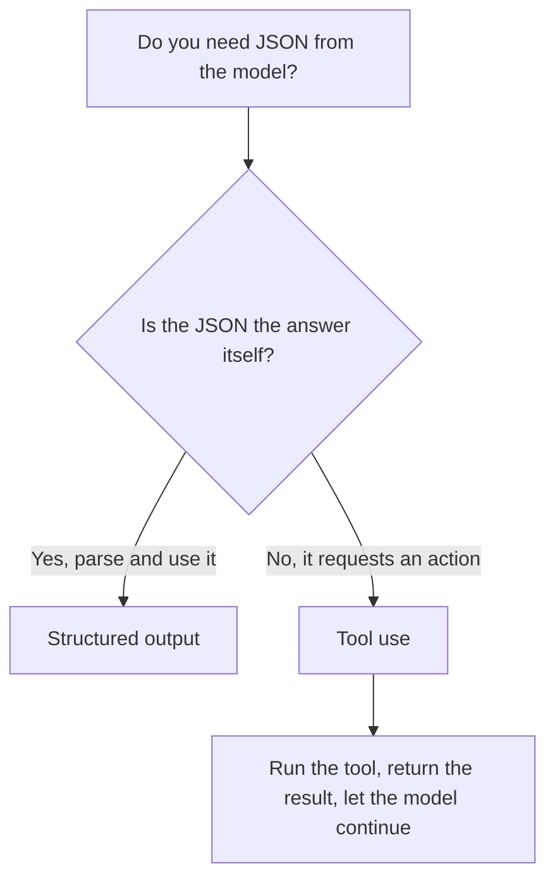

<LevelBadge level="intermediate" />

<VerifyNote lastVerified="2026-06-20" source="https://platform.claude.com/docs/en/docs/build-with-claude/structured-outputs">
تتطوّر الآلية الدقيقة لفرض المخطّط — تأكّد من النهج الحالي (إعداد المخرجات / مساعِدات التحليل) في الوثائق الرسمية.
</VerifyNote>

<Callout type="objectives" items={["اشرح لماذا تتفوّق المخرجات المفروضة بمخطّط على مطالبة النموذج بإنتاج JSON والأمل بالأفضل", "قدّم مخطّط JSON Schema وحلّل الاستجابة إلى كائن مُصنَّف بنوع (Pydantic / Zod)", "ميِّز المخرجات المنظَّمة عن استخدام الأدوات بحسب النيّة، لا بحسب الآلية", "طبّق النصائح الأربع للحصول على مخطّطات محكمة وموثوقة", "اختر الأداة الصحيحة بقاعدة إرشادية من سؤال واحد"]} />

عندما تغذّي مخرجات Claude برمجيات أخرى، فأنت بحاجة إلى **بنية موثوقة** — JSON صالح يطابق شكلًا معروفًا، في كل مرة. لا تعتمد على "ردّ بصيغة JSON" وتأمل خيرًا؛ استخدم دعم المخرجات المنظَّمة في المنصّة.

يأخذك هذا الدرس من *لماذا يفشل أسلوب المطالبة والأمل* إلى *كيف تفرض مخطّطًا وتحلّله إلى كائن مُصنَّف بنوع* — وكيف تميّز المخرجات المنظَّمة عن استخدام الأدوات حين يبدوان متطابقَين. اعمل عليه من أعلاه إلى أسفله، ثم اختبر نفسك بالاختبار القصير قرب النهاية.

## الطريقة الموثوقة

قدّم **مخطّط JSON Schema** للمخرجات ودع الواجهة البرمجية/SDK تفرضه، ثم حلّله إلى كائن مُصنَّف بنوع (مثل Pydantic في Python، أو Zod في TypeScript). تمنحك مساعِدات التحليل في SDK نتيجة مُصنَّفة بنوع بدلًا من سلسلة نصية عليك أن تطبّق عليها `JSON.parse` وتتحقّق منها بنفسك.

<Steps items={[
  {title: "حدِّد الشكل", body: "صُغ المخرجات التي تحتاجها على هيئة مخطّط JSON Schema — في Python عبر Pydantic BaseModel، وفي TypeScript عبر مخطّط Zod."},
  {title: "اطلب مخرجات مطابقة للمخطّط", body: "اطلب من النموذج أن يعيد بيانات تطابق ذلك المخطّط، بحيث تفرضه الواجهة البرمجية/SDK بدلًا من تركه للصدفة."},
  {title: "حلّل إلى كائن مُصنَّف بنوع", body: "استخدم مساعِدات التحليل في SDK للحصول على نتيجة مُصنَّفة بنوع مباشرةً — دون JSON.parse يدوي وتحقّق مُعدّ يدويًا."}
]} />

```python
# Conceptual shape — see the official docs for the current API surface.
from pydantic import BaseModel

class Ticket(BaseModel):
    title: str
    priority: str   # "low" | "medium" | "high"
    tags: list[str]

# Request the model to return data conforming to Ticket's JSON schema,
# then parse the response into a Ticket instance.
```

أتريد طلبًا ملموسًا تكيّفه؟ إليك شكل ما تُسلّمه للنموذج — استبدل النموذج بمخطّطك الخاص.

<PromptCard title="اطلب مخرجات مطابقة للمخطّط">{`Return the data conforming to this JSON Schema:

{
  "title": "string",
  "priority": "low | medium | high",
  "tags": ["string"]
}

Do not include any prose outside the JSON.`}</PromptCard>

## لماذا لا نطلب JSON عبر المطالبة فحسب؟

*يمكنك* أن تطلب JSON في المطالبة، وفي الحالات البسيطة ينجح ذلك — لكنه قد ينحرف: نصّ شارد، أو فاصلة زائدة في النهاية، أو حقل مفقود. المخرجات المفروضة بمخطّط تزيل هذه الفئة من الأخطاء، وهو ما يهمّ لحظة اعتماد نظام لاحق عليها.

<Callout type="warning" items={["JSON المطلوب بالمطالبة ينجح في العروض التوضيحية وينهار في الإنتاج: لا يظهر الخلل إلا حين يحلّله نظام لاحق.", "ثلاثة انحرافات كلاسيكية احذرها: نصّ شارد حول JSON، أو فاصلة زائدة في النهاية، أو حقل مطلوب مفقود."]} />

## المخرجات المنظَّمة مقابل استخدام الأدوات

كلتا الميزتين تُسلّمان النموذج **مخطّط JSON Schema**، لذا تبدوان متشابهتين — والناس يختارون الخطأ. الفرق في *النيّة*، لا في الآلية:

| | **المخرجات المنظَّمة** | **[استخدام الأدوات](/docs/api/tool-use)** |
|---|---|---|
| ما الذي تريده | **الإجابة النهائية**، بشكل ثابت | أن يستدعي النموذج **قدرةً** (استدعاء دالّة، جلب بيانات، تنفيذ إجراء) |
| من يستهلكه | شيفرتك مباشرةً | شيفرتك تُشغّل الأداة، ثم تُغذّي النتيجة عائدةً إلى النموذج |
| شكل الدور | ردّ واحد، وانتهى | حلقة: النموذج يسأل، أنت تنفّذ، النموذج يُكمل |
| الاستخدام المعتاد | الاستخراج، التصنيف، التحليل | الوكلاء، عمليات البحث الحيّة، الآثار الجانبية |

قاعدة سريعة للإرشاد:



إذا كان JSON *هو* المُخرَج المطلوب، فاستخدم المخرجات المنظَّمة. وإذا كان JSON هو النموذج يطلب من شيفرتك أن *تفعل* شيئًا، فهذا استخدام للأدوات. غالبًا ما يستخدم الوكلاء كليهما: الأدوات للتنفيذ، والمخرجات المنظَّمة لإعادة نتيجة نهائية نظيفة.

## نصائح

<Callout type="tip" items={["اجعل المخطّطات محكمة — استخدم القيم المُعدَّدة (enums) للخيارات الثابتة؛ وعلّم الحقول المطلوبة.", "صِف الحقول — أوصاف الحقول توجّه النموذج كأنها مطالبات مصغّرة.", "تحقّق على أي حال عند الحدود — التحليل الدفاعي تأمين رخيص.", "لمهام الاستخراج، تتفوّق المخرجات المنظَّمة + مخطّط واضح على النصّ الحرّ في كل مرة."]} />

<Callout type="takeaways" items={["سلّم الواجهة البرمجية/SDK مخطّط JSON Schema وحلّل إلى كائن مُصنَّف بنوع — لا تعتمد على المطالبة والأمل.", "مطالبة النموذج بإنتاج JSON قد تنحرف (نصّ شارد، فاصلة زائدة، حقل مفقود)؛ فرض المخطّط يزيل هذه الفئة من الأخطاء.", "تختلف المخرجات المنظَّمة عن استخدام الأدوات بحسب النيّة: JSON هو الإجابة مقابل JSON يطلب إجراءً.", "المخطّطات المحكمة، والحقول الموصوفة، والتحقّق عند الحدود تجعل الاستخراج والتصنيف موثوقَين."]} />

## ثبّت المصطلحات

<Flashcards cards={[
  {front: "المخرجات المنظَّمة", back: "تُسلّم الواجهة البرمجية/SDK مخطّط JSON Schema للإجابة النهائية وتحلّل الاستجابة إلى كائن مُصنَّف بنوع (Pydantic / Zod). إنّ JSON هو المُخرَج المطلوب."},
  {front: "استخدام الأدوات", back: "تُسلّم النموذج مخطّط JSON Schema ليتمكّن من استدعاء قدرة. تُشغّل شيفرتك الأداة، ثم تُغذّي النتيجة عائدةً — حلقة، لا إجابة من طلقة واحدة."},
  {front: "JSON Schema", back: "الشكل الذي تعتمد عليه كلتا الميزتين. في Python تصوغه عبر Pydantic BaseModel؛ وفي TypeScript عبر مخطّط Zod."},
  {front: "مساعِدات التحليل", back: "مساعِدات في SDK تُعيد نتيجة مُصنَّفة بنوع مباشرةً، فتتخطّى JSON.parse اليدوي والتحقّق المُعدّ يدويًا."},
  {front: "قاعدة إرشادية من سؤال واحد", back: "هل JSON هو الإجابة نفسها؟ نعم ← المخرجات المنظَّمة. لا، بل يطلب إجراءً ← استخدام الأدوات."}
]} />

<Quiz title="اختبر نفسك" questions={[
  {
    q: "ما الطريقة الموثوقة للحصول على JSON منظَّم من Claude؟",
    options: [
      "اطلب \"ردّ بصيغة JSON\" في المطالبة وأعد المحاولة عند الإخفاقات",
      "قدّم مخطّط JSON Schema، ودع الواجهة البرمجية/SDK تفرضه، ثم حلّل إلى كائن مُصنَّف بنوع",
      "ولِّد نصًّا حرًّا واكتب تعبيرًا نمطيًّا لاستخراج الحقول"
    ],
    answer: 1,
    explain: "قدّم مخطّط JSON Schema ودع الواجهة البرمجية/SDK تفرضه، ثم حلّل إلى كائن مُصنَّف بنوع مثل Pydantic (Python) أو Zod (TypeScript)."
  },
  {
    q: "لماذا تكون مطالبة النموذج بإنتاج JSON محفوفة بالمخاطر بمجرد اعتماد نظام لاحق عليها؟",
    options: [
      "إنها أبطأ من فرض المخطّط",
      "إنها قد تنحرف — نصّ شارد، أو فاصلة زائدة في النهاية، أو حقل مفقود",
      "إنها تكلّف رموزًا (tokens) أكثر من استخدام الأدوات"
    ],
    answer: 1,
    explain: "JSON المطلوب بالمطالبة ينجح في الحالات البسيطة لكنه قد ينحرف؛ والمخرجات المفروضة بمخطّط تزيل هذه الفئة من الأخطاء."
  },
  {
    q: "ما الذي يميّز المخرجات المنظَّمة عن استخدام الأدوات فعليًّا؟",
    options: [
      "المخرجات المنظَّمة تستخدم JSON Schema؛ بينما استخدام الأدوات لا يستخدمه",
      "النيّة: المخرجات المنظَّمة هي الإجابة النهائية بشكل ثابت، واستخدام الأدوات يستدعي قدرةً",
      "استخدام الأدوات لـ Python والمخرجات المنظَّمة لـ TypeScript"
    ],
    answer: 1,
    explain: "كلتاهما تُسلّمان النموذج مخطّط JSON Schema، لذا تبدوان متشابهتين. الفرق في النيّة، لا في الآلية — الإجابة النهائية مقابل استدعاء قدرة."
  },
  {
    q: "أيٌّ ممّا يلي نصيحة سليمة لتصميم المخطّطات؟",
    options: [
      "اترك الحقول اختيارية وتخطَّ القيم المُعدَّدة (enums) من أجل المرونة",
      "استخدم القيم المُعدَّدة (enums) للخيارات الثابتة، وعلّم الحقول المطلوبة، وتحقّق على أي حال عند الحدود",
      "ثِق بالمخطّط ولا تتحقّق أبدًا من المخرجات المُحلَّلة"
    ],
    answer: 1,
    explain: "اجعل المخطّطات محكمة (قيم مُعدَّدة، حقول مطلوبة)، وصِف الحقول كأنها مطالبات مصغّرة، ومع ذلك تحقّق عند الحدود كتأمين رخيص."
  }
]} />

## التالي

- [استخدام الأدوات / استدعاء الدوالّ](/docs/api/tool-use) — الأدوات أيضًا تستخدم مخطّطات JSON
- [أول استدعاء للواجهة البرمجية](/docs/api/first-call)
- [قوالب المطالبات القابلة لإعادة الاستخدام](/docs/templates/prompts)
