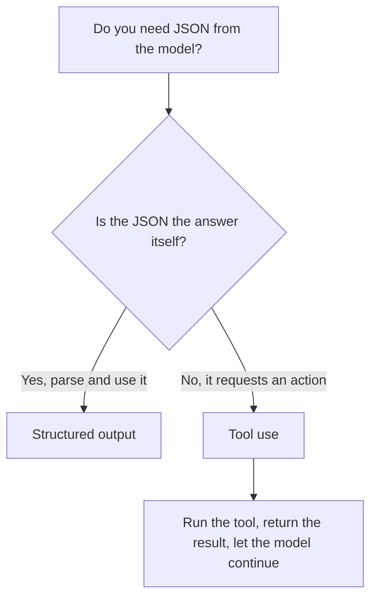

<LevelBadge level="intermediate" />

<VerifyNote lastVerified="2026-06-20" source="https://docs.anthropic.com/en/docs/build-with-claude/structured-outputs">
تتطوّر الآلية الدقيقة لفرض المخطّط — تأكّد من النهج الحالي (إعداد المخرجات / مساعِدات التحليل) في الوثائق الرسمية.
</VerifyNote>

عندما تغذّي مخرجات Claude برمجيات أخرى، فأنت بحاجة إلى **بنية موثوقة** — JSON صالح يطابق شكلًا معروفًا، في كل مرة. لا تعتمد على "ردّ بصيغة JSON" وتأمل خيرًا؛ استخدم دعم المخرجات المنظَّمة في المنصّة.

## الطريقة الموثوقة

قدّم **مخطّط JSON Schema** للمخرجات ودع الواجهة البرمجية/SDK تفرضه، ثم حلّله إلى كائن مُصنَّف بنوع (مثل Pydantic في Python، أو Zod في TypeScript). تمنحك مساعِدات التحليل في SDK نتيجة مُصنَّفة بنوع بدلًا من سلسلة نصية عليك أن تطبّق عليها `JSON.parse` وتتحقّق منها بنفسك.

```python
# Conceptual shape — see the official docs for the current API surface.
from pydantic import BaseModel

class Ticket(BaseModel):
    title: str
    priority: str   # "low" | "medium" | "high"
    tags: list[str]

# Request the model to return data conforming to Ticket's JSON schema,
# then parse the response into a Ticket instance.
```

## لماذا لا نطلب JSON عبر المطالبة فحسب؟

*يمكنك* أن تطلب JSON في المطالبة، وفي الحالات البسيطة ينجح ذلك — لكنه قد ينحرف: نصّ شارد، أو فاصلة زائدة في النهاية، أو حقل مفقود. المخرجات المفروضة بمخطّط تزيل هذه الفئة من الأخطاء، وهو ما يهمّ لحظة اعتماد نظام لاحق عليها.

## المخرجات المنظَّمة مقابل استخدام الأدوات

كلتا الميزتين تُسلّمان النموذج **مخطّط JSON Schema**، لذا تبدوان متشابهتين — والناس يختارون الخطأ. الفرق في *النيّة*، لا في الآلية:

| | **المخرجات المنظَّمة** | **[استخدام الأدوات](/docs/api/tool-use)** |
|---|---|---|
| ما الذي تريده | **الإجابة النهائية**، بشكل ثابت | أن يستدعي النموذج **قدرةً** (استدعاء دالّة، جلب بيانات، تنفيذ إجراء) |
| من يستهلكه | شيفرتك مباشرةً | شيفرتك تُشغّل الأداة، ثم تُغذّي النتيجة عائدةً إلى النموذج |
| شكل الدور | ردّ واحد، وانتهى | حلقة: النموذج يسأل، أنت تنفّذ، النموذج يُكمل |
| الاستخدام المعتاد | الاستخراج، التصنيف، التحليل | الوكلاء، عمليات البحث الحيّة، الآثار الجانبية |

قاعدة سريعة للإرشاد:



إذا كان JSON *هو* المُخرَج المطلوب، فاستخدم المخرجات المنظَّمة. وإذا كان JSON هو النموذج يطلب من شيفرتك أن *تفعل* شيئًا، فهذا استخدام للأدوات. غالبًا ما يستخدم الوكلاء كليهما: الأدوات للتنفيذ، والمخرجات المنظَّمة لإعادة نتيجة نهائية نظيفة.

## نصائح

- **اجعل المخطّطات محكمة.** استخدم القيم المُعدَّدة (enums) للخيارات الثابتة؛ وعلّم الحقول المطلوبة.
- **صِف الحقول.** أوصاف الحقول توجّه النموذج كأنها مطالبات مصغّرة.
- **تحقّق على أي حال** عند الحدود — التحليل الدفاعي تأمين رخيص.
- لمهام **الاستخراج**، تتفوّق المخرجات المنظَّمة + مخطّط واضح على النصّ الحرّ في كل مرة.

## التالي

- [استخدام الأدوات / استدعاء الدوالّ](/docs/api/tool-use) — الأدوات أيضًا تستخدم مخطّطات JSON
- [أول استدعاء للواجهة البرمجية](/docs/api/first-call)
- [قوالب المطالبات القابلة لإعادة الاستخدام](/docs/templates/prompts)
