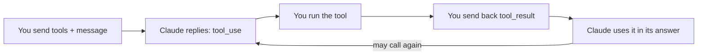

import Tabs from '@theme/Tabs';
import TabItem from '@theme/TabItem';

<LevelBadge level="intermediate" />

<VerifyNote lastVerified="2026-06-20" source="https://docs.anthropic.com/en/docs/build-with-claude/tool-use">
أشكال طلبات/استجابات استخدام الأدوات مستقرّة لكنها تتطوّر — تأكّد من الحقول في وثائق استخدام الأدوات الرسمية.
</VerifyNote>

يتيح **استخدام الأدوات** لـ Claude استدعاء دوالّ تُعرّفها *أنت* — بحث، أو آلة حاسبة، أو قاعدة بياناتك، أو أي واجهة برمجية — واستخدام النتائج. إنه أساس كل [وكيل](/docs/api/building-agents).

## الحلقة



1. تُضمّن قائمة من **تعريفات الأدوات** (الاسم، الوصف، مدخلات بصيغة JSON-Schema).
2. إذا قرّر Claude استخدام إحداها، يعيد كتلة `tool_use` (مع الوسائط) ويتوقّف.
3. **أنت تنفّذ** الأداة وتعيد المخرجات كـ `tool_result`.
4. يتابع Claude، ربما باستدعاء مزيد من الأدوات، حتى يجيب.

## تعريف أداة (Python)

```python
tools = [{
    "name": "get_weather",
    "description": "Get current weather for a city.",
    "input_schema": {
        "type": "object",
        "properties": {"city": {"type": "string"}},
        "required": ["city"],
    },
}]

msg = client.messages.create(
    model="claude-sonnet-4-6", max_tokens=1024,
    tools=tools,
    messages=[{"role": "user", "content": "What's the weather in Rome?"}],
)
# If msg.stop_reason == "tool_use": run the tool, then send a tool_result back.
```

## نصائح

- **الأوصاف مطالبات.** وصف `description` واضح للأداة وتوثيق المعاملات يحسّنان كثيرًا متى وكيف يستدعيها Claude.
- **تحقّق من المدخلات** التي تتلقّاها قبل التنفيذ — لا تثق بها بشكل أعمى أبدًا.
- **أعِد الأخطاء كنتائج.** إذا أخفقت أداة، أرسل `tool_result` يصف الخطأ كي يتمكّن Claude من التعافي.
- **أدوات من جهة الخادم.** تقدّم Anthropic أيضًا أدوات مدمجة (مثل البحث على الويب، وتنفيذ الشيفرة، واستخدام الحاسوب) — راجع الوثائق للاطّلاع على القائمة الحالية.

:::warning الأدوات = إجراءات = مخاطر
أي أداة تتّخذ إجراءات حقيقية ترث نموذجًا أمنيًا. طبّق أقل صلاحية ممكنة وأبقِ إنسانًا ضمن الحلقة للاستدعاءات الخطرة — راجع [تأمين الوكلاء والأدوات](/docs/security/securing-agents).
:::

## التالي

- [بناء الوكلاء على الواجهة البرمجية](/docs/api/building-agents)
- [المخرجات المنظَّمة](/docs/api/structured-output)
- [MCP والاتصال بالأدوات](/docs/api/mcp)
