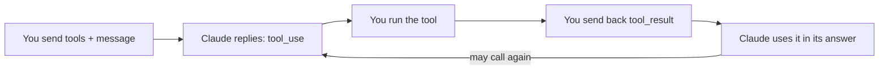

import Tabs from '@theme/Tabs';
import TabItem from '@theme/TabItem';

<LevelBadge level="intermediate" />

<VerifyNote lastVerified="2026-06-20" source="https://platform.claude.com/docs/en/docs/build-with-claude/tool-use">
أشكال طلب/استجابة استخدام الأدوات مستقرة لكنها تتطور — تأكّد من الحقول في وثائق استخدام الأدوات الرسمية.
</VerifyNote>

يتيح **استخدام الأدوات** لـ Claude استدعاء دوال تُعرّفها *أنت* — بحث، أو آلة حاسبة، أو قاعدة بياناتك، أو أي واجهة برمجية — واستخدام النتائج. إنه أساس كل [وكيل](/docs/api/building-agents).

<Callout type="objectives" items={["كيف تعمل الحلقة الوكيلة المكوّنة من أربع خطوات، من تعريفات الأدوات إلى الإجابة النهائية","كيف تعرّف أداة في Python باسم ووصف ومدخل بصيغة JSON-Schema","لماذا تعمل أوصاف الأدوات كمطالبات تشكّل متى وكيف يستدعيها Claude","كيف تتحقق من المدخلات، وتعيد الأخطاء كنتائج، وتستخدم الأدوات من جهة الخادم بأمان"]} />

## الحلقة

استخدام الأدوات محادثة، وليس استدعاءً واحدًا. أنت تُسلّم Claude قائمة من الأدوات؛ يختار Claude واحدة ويتوقّف؛ تشغّلها أنت وتُبلّغ بالنتيجة؛ يدمج Claude النتيجة في إجابته — مكرّرًا ذلك حسب الحاجة.

<Steps items={[{title: "أرسل القائمة", body: "تُضمّن قائمة من تعريفات الأدوات — لكل منها اسم ووصف ومدخل بصيغة JSON-Schema."}, {title: "يختار Claude أداة", body: "إذا قرّر Claude استخدام إحداها، فإنه يعيد كتلة tool_use مع الوسائط ويتوقّف."}, {title: "أنت تنفّذ", body: "تشغّل الأداة بنفسك وتعيد المخرجات كـ tool_result."}, {title: "يتابع Claude", body: "يتابع Claude، ربما باستدعاء مزيد من الأدوات، حتى يجيب."}]} />

## تعريف أداة (Python)

تعريف الأداة هو مجرد اسم، ووصف بلغة بسيطة، ومدخل بصيغة JSON-Schema. مرّره في `tools`، ثم تحقّق من `stop_reason` لتعرف متى يريد Claude أن يتصرف.

<PromptCard title="أداة get_weather + الاستدعاء الأول">{`tools = [{
    "name": "get_weather",
    "description": "Get current weather for a city.",
    "input_schema": {
        "type": "object",
        "properties": {"city": {"type": "string"}},
        "required": ["city"],
    },
}]

msg = client.messages.create(
    model="claude-sonnet-5", max_tokens=1024,
    tools=tools,
    messages=[{"role": "user", "content": "What's the weather in Rome?"}],
)
# If msg.stop_reason == "tool_use": run the tool, then send a tool_result back.`}</PromptCard>

## نصائح

الخيارات الصغيرة في كيفية تعريفك للأدوات والتعامل معها تُحدث فرقًا كبيرًا في الموثوقية.

- **الأوصاف مطالبات.** وصف `description` واضح للأداة وتوثيق المعاملات يحسّنان كثيرًا متى وكيف يستدعيها Claude.
- **تحقّق من المدخلات** التي تتلقّاها قبل التنفيذ — لا تثق بها بشكل أعمى أبدًا.
- **أعِد الأخطاء كنتائج.** إذا أخفقت أداة، أرسل `tool_result` يصف الخطأ كي يتمكّن Claude من التعافي.
- **أدوات من جهة الخادم.** تقدّم Anthropic أيضًا أدوات مدمجة (مثل البحث على الويب، وتنفيذ الشيفرة، واستخدام الحاسوب) — راجع الوثائق للاطّلاع على القائمة الحالية.

:::warning الأدوات = إجراءات = مخاطر
أي أداة تتّخذ إجراءات حقيقية ترث نموذجًا أمنيًا. طبّق أقل صلاحية ممكنة وأبقِ إنسانًا ضمن الحلقة للاستدعاءات الخطرة — راجع [تأمين الوكلاء والأدوات](/docs/security/securing-agents).
:::

<Flashcards title="مفردات استخدام الأدوات" cards={[{front: "كتلة tool_use", back: "ما يعيده Claude عندما يقرّر استدعاء أداة — تتضمّن الوسائط — وبعدها يتوقّف وينتظرك."}, {front: "tool_result", back: "الرسالة التي تعيدها حاملةً مخرجات الأداة (أو وصف خطأ كي يتمكّن Claude من التعافي)."}, {front: "input_schema", back: "صيغة JSON-Schema التي تصف مدخلات الأداة: الأنواع والخصائص والحقول المطلوبة."}, {front: "أدوات من جهة الخادم", back: "أدوات مدمجة تقدّمها Anthropic، مثل البحث على الويب وتنفيذ الشيفرة واستخدام الحاسوب — راجع الوثائق للاطّلاع على القائمة الحالية."}]} />

<Quiz title="اختبر نفسك" questions={[{q: "بعد أن يعيد Claude كتلة tool_use، من الذي يشغّل الأداة؟", options: ["يشغّلها Claude تلقائيًا على خوادم Anthropic", "تنفّذها أنت وتعيد المخرجات كـ tool_result", "تنفّذها صيغة JSON-Schema"], answer: 1, explain: "يعيد Claude كتلة tool_use ويتوقّف؛ أنت تنفّذ الأداة وتعيد النتيجة كـ tool_result."}, {q: "أداة عرّفتها تخفق أثناء التشغيل. ما الإجراء المُوصى به؟", options: ["إعادة المحاولة بصمت حتى تنجح", "إرسال tool_result يصف الخطأ كي يتمكّن Claude من التعافي", "إيقاف المحادثة"], answer: 1, explain: "أعِد الأخطاء كنتائج — إن tool_result الذي يصف الإخفاق يتيح لـ Claude التعافي."}, {q: "لماذا يهم وصف الأداة الواضح إلى هذا الحد؟", options: ["إنه للتوثيق فقط ويتجاهله Claude", "الأوصاف مطالبات — فهي تشكّل متى وكيف يستدعي Claude الأداة", "إنه يغيّر قواعد التحقق في JSON-Schema"], answer: 1, explain: "الأوصاف مطالبات: إن وصفًا واضحًا وتوثيق المعاملات يحسّنان كثيرًا متى وكيف يستدعي Claude أداة."}]} />

<Callout type="takeaways" items={["استخدام الأدوات حلقة: أرسل تعريفات الأدوات، يعيد Claude كتلة tool_use ويتوقّف، أنت تنفّذ وتعيد tool_result، يتابع Claude حتى يجيب.","تعريف الأداة هو اسم ووصف ومدخل بصيغة JSON-Schema — مرّره في tools وتحقّق من stop_reason == tool_use.","الأوصاف مطالبات؛ تحقّق من المدخلات قبل التنفيذ؛ أعِد حالات الإخفاق كأخطاء tool_result كي يتمكّن Claude من التعافي.","تقدّم Anthropic أيضًا أدوات من جهة الخادم، وأي أداة تتّخذ إجراءات حقيقية تحتاج إلى أقل صلاحية ممكنة إضافةً إلى إنسان ضمن الحلقة."]} />

## التالي

- [بناء الوكلاء على الواجهة البرمجية](/docs/api/building-agents)
- [المخرجات المنظَّمة](/docs/api/structured-output)
- [MCP والاتصال بالأدوات](/docs/api/mcp)
