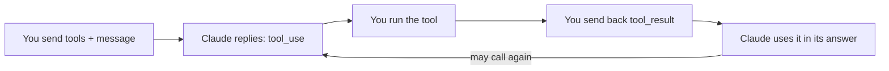

<LevelBadge level="intermediate" />

يتيح **استخدام الأدوات** لـ Claude استدعاء دوال تُعرّفها *أنت* — بحث، أو آلة حاسبة، أو قاعدة بياناتك، أو أي واجهة برمجية — واستخدام النتائج. إنه أساس كل [وكيل](/docs/api/building-agents).

تتوقّف معظم الدروس عن استخدام الأدوات بعد الحلقة المكوّنة من أربع خطوات. والحلقة هي الجزء السهل. أما ما يعطّل فعليًا التكاملات في الإنتاج فهو أضيق من ذلك وأقل تناولًا: أشكال الرسائل التي تعيد الخطأ `400`، وحقل الخطأ الذي يتيح لـ Claude أن يتعافى بدلًا من أن يعتذر، وحقيقة أنّ **فرض استدعاء أداة لم يعد يعمل على أحدث نماذج Claude**. تغطّي هذه الصفحة كل ذلك.

<Callout type="objectives" items={["كيف تعمل الحلقة الوكيلة المكوّنة من أربع خطوات، من تعريفات الأدوات إلى الإجابة النهائية","كيف تكتب تعريف أداة — وأوصافًا توجّه فعليًا متى يستدعيها Claude","قواعد شكل الرسائل الثلاث التي تعيد الخطأ 400، ونصّ الخطأ الذي يخبرك أيّها خالفت","لماذا تُخفق الآن قيمتا tool_choice \"any\" و\"tool\" على أحدث النماذج، وما البديلان","كيف تضمن مدخلات أدوات مطابقة للمخطّط عبر strict: true","لماذا تكون نتائج الأدوات أكثر المواضع احتمالًا لوصول حقن أوامر إلى وكيلك"]} />

<VerifyNote lastVerified="2026-09-29" source="https://platform.claude.com/docs/en/agents-and-tools/tool-use/define-tools">
حقول تعريف الأدوات، وجدول دعم `tool_choice`، وقواعد تنسيق `tool_result`، وسلوك `is_error`،
ودلالات `strict: true` — جميعها مُتحقَّق منها في 29 سبتمبر 2026 مقابل صفحات Anthropic "Define
tools" و"Handle tool calls" و"Strict tool use". يتغيّر دعم النماذج لفرض استخدام الأدوات مع كل
إصدار — أعِد التحقّق من جدول الدعم في صفحة Define tools قبل الاعتماد عليه، وراجع
[النماذج والأسعار الحالية](/docs/whats-new/models-and-pricing) للاطّلاع على التشكيلة الحالية.
</VerifyNote>

## الحلقة

استخدام الأدوات محادثة، وليس استدعاءً واحدًا. أنت تُسلّم Claude قائمة من الأدوات؛ يختار Claude واحدة ويتوقّف؛ تشغّلها أنت وتُبلّغ بالنتيجة؛ يدمج Claude النتيجة في إجابته — مكرّرًا ذلك حسب الحاجة.


```mermaid
flowchart LR
  A[You send tools + message] --> B[Claude replies: tool_use]
  B --> C[You run the tool]
  C --> D[You send back tool_result]
  D --> E[Claude uses it in its answer]
  E -->|may call again| B
```

<Steps items={[{title: "أرسل القائمة", body: "تُضمّن قائمة من تعريفات الأدوات — لكل منها اسم ووصف ومدخل بصيغة JSON-Schema."}, {title: "يختار Claude أداة", body: "إذا قرّر Claude استخدام إحداها، تعود الاستجابة بقيمة stop_reason تساوي \"tool_use\" ومعها كتلة tool_use واحدة أو أكثر، تحمل كل منها معرّف id واسم name وكائن input."}, {title: "أنت تنفّذ", body: "تشغّل الأداة بنفسك وتعيد المخرجات كـ tool_result يشير إلى معرّف tool_use."}, {title: "يتابع Claude", body: "يتابع Claude، ربما باستدعاء مزيد من الأدوات، حتى يجيب بقيمة stop_reason عادية."}]} />

لاحظ صيغة الجمع في الخطوة 2: يمكن لـ Claude أن يعيد **عدّة كتل `tool_use` في استجابة واحدة**. وزّع التعامل بحسب حقل `type` في كل كتلة بدلًا من افتراض `content[0]` — فالاستجابة تبدأ عادةً بكتلة `text`، وعلى أحدث النماذج قد تبدأ بكتل `thinking` بدلًا من ذلك.

## تعريف أداة

تعريف الأداة هو اسم، ووصف بلغة بسيطة، ومخطّط JSON Schema للمدخل.

| الحقل | مطلوب | ملاحظات |
| --- | --- | --- |
| `name` | نعم | يجب أن يطابق التعبير النمطي `^[a-zA-Z0-9_-]{1,128}$` |
| `description` | نعم | ماذا تفعل، ومتى تُستخدم، ومتى *لا* تُستخدم. استهدف 3–4 جمل كحدّ أدنى |
| `input_schema` | نعم | كائن JSON Schema يصف المعاملات |
| `input_examples` | لا | مصفوفة من كائنات مدخلات نموذجية، كلٌّ منها صالح مقابل المخطّط |
| `strict` | لا | اضبطها على `true` لفرض مدخلات مطابقة للمخطّط — انظر أدناه |
| `cache_control` | لا | خزّن التعريف مؤقتًا عبر الأدوار (راجع [التخزين المؤقت للمطالبات](/docs/api/prompt-caching)) |

<PromptCard title="أداة get_weather + الاستدعاء الأول (Python)">{`tools = [{
    "name": "get_weather",
    "description": (
        "Get the current weather for a city. Use this when the user asks about "
        "present conditions or temperature in a named place. Returns temperature "
        "in the requested unit plus a one-word sky condition. It does NOT return "
        "forecasts — use get_forecast for anything in the future."
    ),
    "input_schema": {
        "type": "object",
        "properties": {
            "city": {"type": "string", "description": "City and region, e.g. 'Rome, IT'"},
            "unit": {"type": "string", "enum": ["celsius", "fahrenheit"]},
        },
        "required": ["city"],
        "additionalProperties": False,
    },
}]

msg = client.messages.create(
    model="claude-opus-5-5", max_tokens=1024,
    tools=tools,
    messages=[{"role": "user", "content": "What's the weather in Rome?"}],
)

if msg.stop_reason == "tool_use":
    for block in msg.content:            # iterate — never index content[0]
        if block.type == "tool_use":
            result = run_tool(block.name, block.input)
            # send back a tool_result carrying block.id`}</PromptCard>

### الأوصاف مطالبات

حقل `description` هو إلى حدّ بعيد أقوى رافعة لجودة استخدام الأدوات — فالنموذج هو من يقرأه، لا أعضاء فريقك. وتوجيهات Anthropic نفسها لا لبس فيها بشأن ما يميّز الوصف الجيّد:

- **قل متى *لا* تُستخدم.** معظم حالات الاختيار الخطأ هي أداة تُستدعى لمهمة تملكها أداة مجاورة.
- **وحِّد بدلًا من أن تُكثّر.** بدلًا من `create_pr` و`review_pr` و`merge_pr`، اطرح أداة واحدة بمعامل `action`. فالأدوات الأقل والأوسع تقلّل التباس الاختيار.
- **استخدم أسماء نطاقات عبر الخدمات.** تتفوّق `github_list_prs` و`slack_send_message` على `list_prs` و`send_message` بمجرد أن تتوسّع مساحة أدواتك.
- **أعِد نتائج عالية الإشارة.** معرّفات مستقرة ودلالية (slugs، UUIDs)، والحقول التي يحتاجها Claude فقط لاختيار خطوته التالية. فمخرجات الأدوات المتضخّمة تستهلك السياق وتُغرق الإشارة.
- **للمدخلات الشائكة، أضِف `input_examples`.** تكلّف الأمثلة المُتحقَّق منها مقابل المخطّط نحو 20–50 رمزًا (token) لكلٍّ منها في الكائنات البسيطة و100–200 في الكائنات المتشعّبة المعقّدة، والمثال غير الصالح يعيد الخطأ 400.

## التعامل مع الاستجابة: القواعد الثلاث التي تعيد الخطأ 400

هنا تتعطّل الشيفرة العاملة عادةً. إنّ `tool_result` هو رسالة `user` عادية، لكن الواجهة البرمجية تفرض ثلاث قواعد لموضعها.

<Steps items={[{title: "يجب أن تأتي النتائج مباشرةً بعد tool_use الخاص بها", body: "لا يجوز أن تتوسّط أي رسالة بين رسالة tool_use الصادرة من المساعد ورسالة tool_result الصادرة منك. إن خالفت ذلك، أبلغت الواجهة البرمجية: tool_use ids were found without tool_result blocks immediately after."}, {title: "تأتي كتل tool_result أولًا في مصفوفة content", body: "أي نصّ تضيفه يجب أن يأتي بعد كل كتل tool_result. وكتلة text قبل tool_result تعني الخطأ 400."}, {title: "إذا كان استدعاء أداة من جهة الخادم لم يُحسم بعد، فأرسل كتل tool_result فقط", body: "عندما يكون دور المساعد نفسه قد استدعى أيضًا أداة من جهة الخادم لا نتيجة لها بعد، فإنّ إضافة نصّ في النهاية تُنهي الدور مبكرًا ويُخفق الطلب بالخطأ 400 مع تسمية أداة الخادم التي لم تُحسم."}]} />

```json
// ❌ 400 — text before tool_result
{"role": "user", "content": [
  {"type": "text", "text": "Here are the results:"},
  {"type": "tool_result", "tool_use_id": "toolu_01", "content": "15 degrees"}
]}

// ✅ correct — results first, text after (client tools only)
{"role": "user", "content": [
  {"type": "tool_result", "tool_use_id": "toolu_01", "content": "15 degrees"},
  {"type": "text", "text": "What should I do next?"}
]}
```

يمكن أن يكون `content` الخاص بـ `tool_result` سلسلة نصية عادية، أو قائمة من كتل `text` أو `image` أو `document` أو `search_result`. ويمكن كذلك حذفه بالكامل لأداة لا تعيد شيئًا.

### أعِد حالات الإخفاق كنتائج، لا كاستثناءات

عندما تطلق أداة استثناءً، لا تُجهض الحلقة — سلّم الإخفاق عائدًا عبر `is_error`:

```json
{"role": "user", "content": [{
  "type": "tool_result",
  "tool_use_id": "toolu_01A09q90qw90lq917835lq9",
  "content": "Rate limit exceeded. Retry after 60 seconds.",
  "is_error": true
}]}
```

اكتب الرسالة لقارئ عليه أن يقرّر ما يفعله بعد ذلك. فـ `"failed"` لا تخبر Claude بشيء؛ أما `"Rate limit exceeded. Retry after 60 seconds."` فتخبره بأن ينتظر بدلًا من إعادة المحاولة فورًا. وعندما يكون استدعاء أداة غير صالح أو يفتقد معاملًا، فإن Claude عادةً يعيد المحاولة مرّتين إلى ثلاث مرّات مع تصحيحات قبل أن يستسلم ويعتذر للمستخدم — لذا فإن خطأً تعليميًا كثيرًا ما يكون الفارق بين التعافي والطريق المسدود.

## ضمان مدخلات مطابقة للمخطّط: `strict: true`

ضبط `strict: true` في تعريف أداة يقيّد أخذ النموذج لعيّنات الرموز (tokens) على مخرجات مطابقة للمخطّط (أخذ عيّنات مقيّد بقواعد نحوية). وحينها يطابق `input` في كل كتلة `tool_use` مخطّط `input_schema` الخاص بك مطابقةً قابلة للإثبات، ويكون `name` دائمًا أداة حقيقية — لا `"2"` حيث احتجت `2`، ولا حقل مطلوب مفقود، ولا طبقة تحقّق وإعادة محاولة.

<PromptCard title="تعريف أداة صارم">{`{
  "name": "search_flights",
  "description": "Search bookable flights for a route and date.",
  "strict": true,
  "input_schema": {
    "type": "object",
    "properties": {
      "destination": {"type": "string"},
      "departure_date": {"type": "string", "format": "date"},
      "passengers": {"type": "integer", "enum": [1, 2, 3, 4, 5, 6]}
    },
    "required": ["destination", "departure_date"],
    "additionalProperties": false
  }
}`}</PromptCard>

ثلاثة تحفّظات يجدر معرفتها قبل أن تشغّلها في كل مكان:

- يجب أن يبقى المخطّط داخل المجموعة الفرعية المدعومة من JSON Schema — المجموعة نفسها التي تستخدمها [المخرجات المنظَّمة](/docs/api/structured-output).
- ترفض مدخلات **مجموعة الأدوات** الخاصة باستخدام الحاسوب واستخدام المتصفّح قيمة `strict: true`؛ وأي طلب يضبطها على أيٍّ منهما يُرفض.
- تُخزَّن المخطّطات المُصرَّفة مؤقتًا بشكل منفصل عن محتوى الرسائل لمدة تصل إلى 24 ساعة. وتوجيهات Anthropic صريحة: **لا تضع معلومات صحية محمية داخل المخطّطات** — لا في أسماء الخصائص، ولا في قيم `enum`، ولا في قيم `const`، ولا في تعبيرات `pattern` النمطية. فالمعلومات الصحية المحمية (PHI) موضعها محتوى الرسائل، الذي يحمل ضمانات HIPAA التي لا تحملها المخطّطات المخزَّنة مؤقتًا.

## `tool_choice` — ولماذا يُخفق فرض الأداة الآن

يتحكّم `tool_choice` في ما إذا كان Claude *يجوز له* أو *يجب عليه* أو *لا يجوز له* استدعاء أداة. ويأخذ أربع قيم:

| القيمة | المعنى |
| --- | --- |
| `auto` | يقرّر Claude. وهي القيمة الافتراضية كلما كان `tools` موجودًا |
| `any` | يجب على Claude أن يستدعي إحدى أدواتك، لكنه يختار أيّها |
| `tool` | يجب على Claude أن يستدعي الأداة المُسمّاة |
| `none` | لا يجوز لـ Claude استدعاء أي أداة. وهي القيمة الافتراضية عند عدم وجود `tools` |

وهذا هو الجزء الذي يفوّته حاليًا كل دليل آخر عن استخدام الأدوات. **`any` و`tool` ليستا مدعومتين دعمًا شاملًا، وعلى أحدث النماذج تعيدان الخطأ 400.**

| النموذج أو الإعداد | التقييد | استخدم بدلًا منه |
| --- | --- | --- |
| التفكير الموسَّع اليدوي (`thinking` بنوع `enabled`) | `any` و`tool` تُخفقان | `auto` أو `none`. والتفكير التكيّفي بحدّ ذاته *لا* يمنع فرض استخدام الأدوات |
| Claude Opus 5.5 وSonnet 5.5 وFable 5.1 وMythos 5.1 | `any` و`tool` تعيدان الخطأ 400، بغضّ النظر عن إعدادات التفكير | `auto` مع `strict: true`، أو [المخرجات المنظَّمة](/docs/api/structured-output). و`none` لا تزال تعمل |

والخطأ صريح:

```text
tool_choice: type "tool" and "any" are not supported for this model.
```

ويسري التحقّق نفسه على نقطة نهاية عدّ الرموز (tokens)، لذا فإن طلبًا يمرّ من عدّ الرموز لن يفاجئك لاحقًا.

### ما تفعله بدلًا من ذلك

يُظهر الفصل بين الدافعين أنّ الترحيل بديهي، لأنّ فرض استخدام الأدوات كان يؤدّي مهمّتين غير مترابطتين:

- **"أحتاج إلى JSON مطابق للمخطّط."** لم يكن ذلك في الحقيقة متعلّقًا بفرض الاستدعاء قطّ. أبقِ `tool_choice` على `auto` واضبط `strict: true`، أو انقل المخطّط إلى [المخرجات المنظَّمة](/docs/api/structured-output) إن أردت استجابة لا استدعاءً.
- **"أحتاج إليه أن يستدعي الأداة، لا أن يحاورني."** قل ذلك في المطالبة. فتسمية الحالات التي تنطبق فيها الأداة — "استخدم `get_weather` لأي سؤال عن الظروف الحالية" — لا تزال توجّه أي أداة يختارها `auto`.

وهناك مكافأة في التخلّي عن فرض استخدام الأدوات: كانت `any` و`tool` تعملان بتعبئة رسالة المساعد مسبقًا، وهو ما كان يكبت أي تمهيد بلغة طبيعية قبل كتل `tool_use`. أما في ظلّ `auto`، فيستطيع Claude أن يشرح ما هو على وشك فعله — وهو غالبًا ما تريده في وكيل يواجه المستخدم.

:::tip مَزلق التخزين المؤقت
تغيير `tool_choice` في منتصف المحادثة **يُبطل كتل الرسائل المخزَّنة مؤقتًا**. تبقى تعريفات الأدوات ومطالبات النظام مخزَّنة مؤقتًا، لكن محتوى الرسائل يجب إعادة معالجته. فإن كنت تبدّل `tool_choice` في كل دور، فقد كان ذلك يكلّفك بصمت — راجع [التخزين المؤقت للمطالبات](/docs/api/prompt-caching).
:::

## أدوات العميل مقابل أدوات الخادم

ليست كل أداة تحتاج إلى معالِج في شيفرتك.

- **أدوات العميل** — أدواتك. أنت تعرّف المخطّط، وأنت تنفّذ، وأنت تعيد `tool_result`. وهي الحلقة أعلاه.
- **أدوات عميل بمخطّط من Anthropic** — bash، ومحرّر النصوص، والذاكرة. المخطّط مُعرَّف مسبقًا، لكن تطبيقك *أنت* هو الذي ينفّذها.
- **أدوات الخادم** — البحث على الويب، والجلب من الويب، وتنفيذ الشيفرة، والبحث في الأدوات. تعمل على بنية Anthropic التحتية دون شيفرة معالِج من جهتك، وتُعالَج الأخطاء بشفافية: فأنت لا تعيد `is_error` أبدًا لأداة خادم.
- **مجموعات أدوات العميل** — استخدام الحاسوب واستخدام المتصفّح هما مدخل واحد بلا `name` يعلن مجموعة ثابتة من الأدوات الأعضاء. وتحمل كتل `tool_use` الخاصة بهما حقلًا إضافيًا هو `toolset_name` (`"computer"` أو `"browser"`)، ويكون `name` هو العضو المُستدعى، مثل `screenshot` أو `navigate`. **وزّع التعامل بحسب الحقلين كليهما**، وأعِد `toolset_name` في النتيجة — فنتيجة عضو تحذفه تُرفض.

## أخطاء شائعة

- **فهرسة `content[0]`** بدلًا من التكرار والتفريع بحسب `type`. فالاستجابات تبدأ عادةً بكتلة `text`، وعلى أحدث النماذج بكتل `thinking`.
- **التعامل مع `tool_use` واحد فقط في كل استجابة.** يمكن لـ Claude أن يستدعي عدّة أدوات في دور واحد؛ والحلقة التي تجيب عن الأولى وتُسقط البقية تترك معرّفات `tool_use` بلا نتائج، وهو ما يعني الخطأ 400 في الطلب التالي.
- **وضع تعليقك قبل النتائج.** كتل `tool_result` تأتي أولًا، دائمًا.
- **ابتلاع استثناءات الأدوات.** الاستثناء في معالِجك يُنهي الحلقة؛ أما نتيجة `is_error` فتتيح لـ Claude أن يتكيّف.
- **اللجوء إلى `tool_choice: "any"` بحكم العادة.** على نماذج الصدارة الحالية يعني ذلك الخطأ 400 — وكانت `strict: true` هي الإجابة الأفضل على أي حال.
- **التعامل مع مخرجات الأدوات كأنها موثوقة.** انظر أدناه.

:::warning نتائج الأدوات هي أكبر سطح حقن في وكيلك
تحمل نتائج الأدوات بشكل روتيني محتوى لا تتحكّم فيه: صفحات ويب، وبريدًا واردًا، ورفعات المستخدمين، وواجهات برمجية من أطراف ثالثة. وأي مهاجم يستطيع التأثير في أيٍّ منها يمكنه تضمين تعليمات موجّهة إلى نموذجك — وهذا حقن أوامر غير مباشر. أبقِ المحتوى غير الموثوق **داخل كتل `tool_result`**، ولا تدسّه أبدًا في مطالبة `system` أو في كتلة `text` عادية من المستخدم، واقرأ [حقن الأوامر](/docs/security/prompt-injection) و[تأمين الوكلاء والأدوات](/docs/security/securing-agents). وأي أداة تتّخذ إجراءات حقيقية ترث كذلك نموذجًا أمنيًا: الامتياز الأدنى، وإنسان ضمن الحلقة لكل ما لا يمكن الرجوع عنه.
:::

<Flashcards title="مفردات استخدام الأدوات" cards={[{front: "كتلة tool_use", back: "ما يعيده Claude عندما يقرّر استدعاء أداة — تحمل id وname وinput — وبعدها يتوقّف وينتظرك. ويمكن أن تحتوي الاستجابة على عدّة كتل."}, {front: "tool_result", back: "كتلة في رسالة المستخدم تحمل مخرجات أداة، مرتبطة بمعرّف tool_use. يجب أن تأتي أولًا في مصفوفة content، ومباشرةً بعد رسالة tool_use الصادرة من المساعد."}, {front: "is_error", back: "قيمة منطقية اختيارية في tool_result تُعلّم الاستدعاء بأنه أخفق. يقرأ Claude الرسالة ويتكيّف — وعادةً يعيد المحاولة مرّتين إلى ثلاث مرّات قبل أن يعتذر."}, {front: "strict: true", back: "أخذ عيّنات مقيّد بقواعد نحوية على تعريف أداة: مدخل الأداة يطابق input_schema الخاص بك مطابقةً قابلة للإثبات. يتطلّب additionalProperties false؛ ومرفوض في مدخلات مجموعتَي أدوات الحاسوب/المتصفّح؛ وأبقِ المعلومات الصحية المحمية (PHI) خارج المخطّط."}, {front: "tool_choice", back: "auto | any | tool | none. القيمة auto هي الافتراضية عند وجود tools، وnone عند عدم وجودها. وتعيد any وtool الخطأ 400 على Opus 5.5 وSonnet 5.5 وFable 5.1 وMythos 5.1."}, {front: "toolset_name", back: "حقل إضافي في كتل أعضاء استخدام الحاسوب واستخدام المتصفّح (\"computer\" أو \"browser\"). وزّع التعامل بحسبه إلى جانب name، وأعِده في النتيجة وإلا رُفضت النتيجة."}]} />

<Quiz title="اختبر نفسك" questions={[{q: "ضبطت tool_choice على {\"type\": \"tool\", \"name\": \"get_weather\"} في claude-opus-5-5. ماذا يحدث؟", options: ["يُفرض على Claude استدعاء get_weather", "يعيد الطلب الخطأ 400 — فرض استخدام الأدوات غير مدعوم على ذلك النموذج", "يتجاهل Claude قيمة tool_choice ويجيب بنصّ"], answer: 1, explain: "على Opus 5.5 وSonnet 5.5 وFable 5.1 وMythos 5.1، يعيد النوعان \"any\" و\"tool\" من tool_choice الخطأ 400 بغضّ النظر عن إعدادات التفكير. استخدم auto مع strict: true، أو المخرجات المنظَّمة."}, {q: "تحتوي رسالة المستخدم الخاصة بك على كتلة text تشرح النتائج، يتبعها كتلتا tool_result. ماذا تفعل الواجهة البرمجية؟", options: ["تقبلها — فالترتيب لا يهمّ", "تعيد الخطأ 400: كتل tool_result يجب أن تأتي أولًا، والنصّ بعدها", "تُسقط كتلة text بصمت"], answer: 1, explain: "يجب أن تأتي كتل tool_result أولًا في مصفوفة content؛ وأي نصّ يجب أن يأتي بعدها جميعًا."}, {q: "أداة عرّفتها تطلق خطأ اتصال أثناء التشغيل. ما الإجراء المُوصى به؟", options: ["إطلاق الاستثناء وإنهاء المحادثة", "إعادة المحاولة بصمت حتى تنجح", "إرسال tool_result بقيمة is_error تساوي true ورسالة تعليمية مثل 'Rate limit exceeded. Retry after 60 seconds.'"], answer: 2, explain: "أعِد الإخفاق كـ tool_result بقيمة is_error تساوي true. الرسالة التعليمية تخبر Claude بما يفعله بعد ذلك؛ أما 'failed' العامة فلا تخبره بشيء."}, {q: "لماذا ينبغي أن يبقى محتوى الويب غير الموثوق داخل كتلة tool_result بدلًا من لصقه في مطالبة النظام؟", options: ["كتل tool_result أرخص في الرموز (tokens)", "لأن ذلك يحدّ من حقن الأوامر غير المباشر — فالمحتوى داخل tool_result يُقدَّم كبيانات، لا كتعليمات", "مطالبة النظام لها حدّ أقصى للطول"], answer: 1, explain: "تحمل نتائج الأدوات محتوى لا تتحكّم فيه. وإبقاؤه في كتل tool_result بدلًا من مطالبة النظام أو نصّ المستخدم العادي هو الاحتواء الذي توصي به Anthropic لحقن الأوامر غير المباشر."}]} />

<Callout type="takeaways" items={["استخدام الأدوات حلقة: أرسل تعريفات الأدوات، يعيد Claude كتلة tool_use واحدة أو أكثر ويتوقّف، أنت تنفّذ وتعيد نتائج tool_result، ثم يتابع Claude. كرِّر على كتل content بحسب type — ولا تفهرس content[0] أبدًا.","ثلاث قواعد للموضع تسبّب معظم أخطاء 400: يجب أن تأتي النتائج مباشرةً بعد tool_use الخاص بها، وتأتي كتل tool_result أولًا في مصفوفة content، واستدعاء أداة خادم لم يُحسم يعني نتائج فقط.","فرض استخدام الأدوات اختفى على أحدث النماذج: تعيد قيمتا tool_choice \"any\" و\"tool\" الخطأ 400 على Opus 5.5 وSonnet 5.5 وFable 5.1 وMythos 5.1. استخدم auto مع strict: true، أو المخرجات المنظَّمة، ووجّه اختيار الأداة من المطالبة.","تضمن strict: true مدخلات مطابقة للمخطّط عبر أخذ عيّنات مقيّد بقواعد نحوية — لكن أبقِ المعلومات الصحية المحمية (PHI) خارج المخطّطات ولا تضبطها في مدخلات مجموعتَي أدوات الحاسوب/المتصفّح.","أعِد حالات الإخفاق كنتائج tool_result مع is_error ورسالة تعليمية كي يتمكّن Claude من التكيّف بدلًا من الاعتذار.","نتائج الأدوات هي المسار الأكثر احتمالًا لوصول حقن أوامر غير مباشر إلى وكيلك — أبقِ المحتوى غير الموثوق داخلها، وطبّق الامتياز الأدنى، واجعل الإجراءات التي لا رجعة فيها مشروطة بموافقة إنسان."]} />

## التالي

- [استدعاء الأدوات برمجيًا](/docs/api/programmatic-tool-calling) — دع Claude يستدعي هذه الأدوات نفسها من Python داخل صندوق رملي، فتقلّ الرحلات ذهابًا وإيابًا وتبقى النتائج الوسيطة خارج السياق
- [المخرجات المنظَّمة](/docs/api/structured-output) — النصف الآخر من بديل فرض استخدام الأدوات، عندما تريد استجابة JSON لا استدعاءً
- [بناء الوكلاء على الـ API](/docs/api/building-agents) — غلّف الحلقة في وكيل حقيقي
- [Claude Opus 5.5: الدليل الميداني](/docs/models/opus-5-5-field-guide) — قصة الترحيل الكاملة خلف إزالة فرض استخدام الأدوات
- [MCP والاتصال بالأدوات](/docs/api/mcp) — احصل على الأدوات من خادم بدلًا من تعريفها بنفسك
