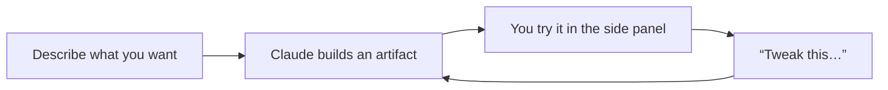

<LevelBadge level="beginner" />

<VerifyNote lastVerified="2026-06-20" source="https://www.anthropic.com">
تتطور قدرات Artifacts (التفاعلية، والثبات، وما يمكنها استدعاؤه) بسرعة — تحقق من السلوك الحالي في التطبيق/مركز المساعدة.
</VerifyNote>

**Artifacts** هي مخرجات يعرضها Claude في **لوحة جانبية** بجوار الدردشة — مستند، أو رسم بياني، أو تطبيق يعمل، أو مخطط — يمكنك رؤيتها واستخدامها والتكرار عليها، منفصلةً عن نص المحادثة.

## ما يمكنك صنعه

- **تطبيقات وأدوات ويب مصغّرة** — آلة حاسبة، أو اختبار، أو نموذج، أو عرض تفاعلي صغير.
- **مستندات** — كتابات منظّمة يمكنك تنقيحها وتصديرها.
- **عناصر مرئية** — رسوم بيانية، ومخططات، ولوحات بيانات بسيطة.
- **شيفرة برمجية** يمكنك قراءتها وتشغيلها.

## لماذا هي قوية لغير المطورين

يمكنك بناء شيء *قابل للاستخدام* — "اصنع لي آلة حاسبة للبقشيش لعشاء جماعي"، "لوحة معلومات من ملف CSV هذا" — بمجرد وصفه، ثم تنقيحه عبر المحادثة ("أضف حقلًا لرسوم الخدمة"، "كبّر الأزرار"). إنه أوضح مثال على **البناء بالذكاء الاصطناعي دون كتابة شيفرة برمجية بنفسك**.

## كيفية العمل مع Artifacts

1. **اطلب الشيء**، مع تحديد التفاصيل (الغرض، المدخلات، الشكل).
2. **كرّر بلغة بسيطة** — يحدّث Claude الـ artifact نفسه.
3. **استخدمه** في اللوحة؛ **صدّره/شاركه** حيثما كان مدعومًا.

## نصائح

- **كن محددًا** بشأن المدخلات/المخرجات والجمهور — كما هو الحال في [الكتابة الجيدة للتعليمات](/docs/prompting/basics).
- **كرّر بخطوات صغيرة.** تغيير واحد في كل مرة أسهل لتحقيق الصواب.
- **تحقّق من أي منطق/أرقام** يحسبها الـ artifact في الاستخدامات المهمة ([الهلوسة](/docs/foundations/hallucinations)).

## التالي

- [إنشاء ملفات حقيقية (docx/pptx/xlsx/pdf)](/docs/claude-app/generating-files)
- [البدء مع Claude.ai](/docs/claude-app/getting-started)
- [دليل تحليل البيانات](/docs/playbooks/data-analysis)
