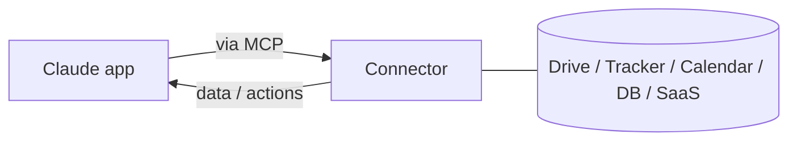

<LevelBadge level="intermediate" />

<VerifyNote lastVerified="2026-06-20" source="https://platform.claude.com/docs">
تتغير الموصِّلات المتوفرة وإمكانية الوصول حسب الخطة بشكل متكرر — تحقق من الخيارات الحالية في التطبيق/مركز المساعدة.
</VerifyNote>

تتيح **الموصِّلات** لتطبيقات Claude الوصول إلى ما هو **خارج الدردشة** — إلى أدواتك وبياناتك (محركات الأقراص، ومتعقّبات المشكلات، والتقويمات، وقواعد البيانات، والمزيد) — بحيث يمكن لـ Claude الإجابة من أنظمة حقيقية والتصرّف عليها. وهي تعمل خلف الكواليس بواسطة **[بروتوكول سياق النموذج (Model Context Protocol - MCP)](/docs/claude-code/mcp)** المفتوح.

## ما تفعله

بدون الموصِّلات، لا يعرف Claude سوى ما هو موجود في المحادثة. ومع الموصِّل، يمكنه (بإذنك) سحب المعلومات ذات الصلة من خدمة متصلة — مثل العثور على مستند، أو قراءة المشكلات الأخيرة، أو فحص التقويم — واستخدامها في إجابته.

## المعيار نفسه، في كل مكان

الموصِّلات هي الصورة **الموجّهة للتطبيقات** من MCP. والبروتوكول نفسه تمامًا هو ما يشغّل [MCP في Claude Code](/docs/claude-code/mcp) و[في واجهة برمجة التطبيقات (API)](/docs/api/mcp). تعلّم المفهوم مرة واحدة؛ فهو ينطبق عبر جميع الواجهات.

## الإعداد والاستخدام

1. **اتصل** بالخدمة (صرّح عبر OAuth، حيثما كان مدعومًا).
2. **امنح أقل قدر من الامتيازات** — فقط الوصول الذي تحتاجه المهمة.
3. **اطلب بطريقة طبيعية** — "اعثر على مستند التخطيط للربع الثالث ولخّص المخاطر."

## الأمان

:::warning الموصِّل هو وصول + (أحيانًا) إجراءات
- صرّح فقط للخدمات والنطاقات التي تثق بها.
- يمكن أن يحمل المحتوى المسحوب من مصادر خارجية [حقن تعليمات (prompt injection)](/docs/security/prompt-injection) — كن حذرًا عندما يقرأ موصِّل مادة غير موثوقة.
- راجع ما يمكن أن يفعله موصِّل من طرف ثالث قبل تفعيله ([مراجعة شيفرة الطرف الثالث](/docs/security/reviewing-third-party-code)).
:::

## التالي

- [خوادم MCP في Claude Code](/docs/claude-code/mcp)
- [MCP والاتصال بالأدوات (API)](/docs/api/mcp)
- [الذكاء الاصطناعي داخل أدواتك الحالية](/docs/claude-app/ai-in-your-tools)
