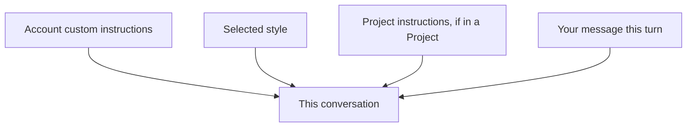

<LevelBadge level="beginner" />

<VerifyNote lastVerified="2026-06-20" source="https://www.anthropic.com">
تتغير الأسماء والمواقع الدقيقة للتعليمات المخصّصة والأنماط في تطبيقات Claude — تحقق منها في التطبيق/مركز المساعدة.
</VerifyNote>

سئمت من تكرار "كن مختصرًا" أو "أنا ممرّض، اشرح وفقًا لذلك" في كل دردشة؟ تتيح لك **التعليمات المخصّصة** و**الأنماط** ضبط إعداداتك الافتراضية مرة واحدة وتطبيقها في كل مكان.

## التعليمات المخصّصة = مطالبة النظام الشخصية الخاصة بك

اضبط الحقائق والتفضيلات الثابتة — من أنت، وماذا تعمل، وكيف تحب الإجابات — ويطبّقها Claude عبر المحادثات. إنها نسخة تطبيق المستهلك من [مطالبة النظام (system prompt)](/docs/foundations/roles) (وهي ابنة عمّ [CLAUDE.md](/docs/claude-code/claude-md) للمطورين).

أشياء جيدة لتضمينها:
- **سياق عنك** ("أدير مخبزًا صغيرًا"؛ "أبرمج بلغة Python").
- **تفضيلات الإخراج** ("افتراضيًا، إجابات قصيرة بنقاط"؛ "أظهِر دائمًا تسلسل تفكيرك").
- **قواعد صارمة** ("لا تستخدم الرموز التعبيرية أبدًا"؛ "الوحدات المترية").

## الأنماط = إعدادات مسبقة للعرض

تغيّر **الأنماط** النبرة/التنسيق (مختصر، رسمي، توضيحي، إلخ) ويمكن تبديلها لكل محادثة. استخدم نمطًا عندما تريد *صوتًا مختلفًا لهذه الدردشة* دون إعادة كتابة تعليماتك الثابتة.

## كيف تتراكم معًا

يميل السياق الأكثر تحديدًا/المتأخر إلى الفوز عند وجود تعارض — فقد تتجاوز تعليمات [مشروع](/docs/claude-app/projects) أو طلب صريح في رسالتك إعداداتك الافتراضية العامة. حافظ على اتساقها لتجنّب المفاجآت.

## نصائح

- **اجعل التعليمات قصيرة وصحيحة** — مثل CLAUDE.md، فالتضخّم والقواعد القديمة يضرّان.
- **لا تضع أسرارًا** في التعليمات المخصّصة.
- **راجعها** بين الحين والآخر مع تغيّر احتياجاتك.

## التالي

- [أدوار النظام والمستخدم والمساعد](/docs/foundations/roles)
- [المشاريع: مساحات عمل دائمة](/docs/claude-app/projects)
- [CLAUDE.md وملفات الذاكرة](/docs/claude-code/claude-md)
