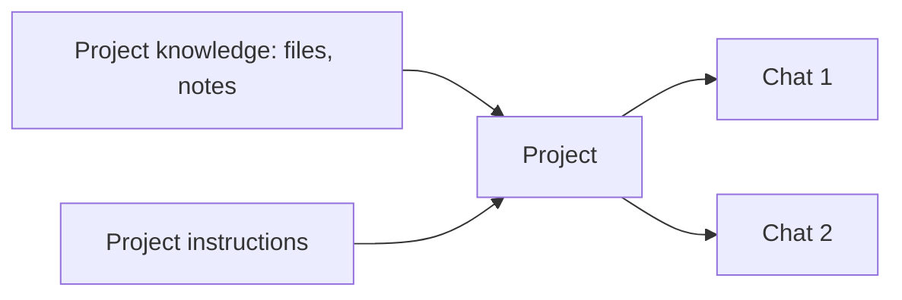

<LevelBadge level="beginner" />

<VerifyNote lastVerified="2026-06-20" source="https://www.anthropic.com">
تختلف ميزات المشاريع وحدودها حسب الخطة وتتغير — تحقق من السلوك الحالي في التطبيق/مركز المساعدة.
</VerifyNote>

**المشروع** هو مساحة عمل مخصّصة في Claude.ai تجمع **ملفاتها ومعرفتها وتعليماتها الخاصة**. بدلًا من إعادة رفع المستندات نفسها وإعادة شرح السياق في كل دردشة، تعدّه مرة واحدة — وتبدأ كل محادثة في المشروع وهي مطّلعة بالفعل.

## لماذا تستخدم مشروعًا

- **إجابات مبنية على مصادر.** أضف مستنداتك (دليل، أو مواصفات، أو ملاحظات) ويجيب Claude *منها* — نكهة مدمجة وبدون شيفرة من [التوليد المعزّز بالاسترجاع (RAG)](/docs/foundations/rag).
- **سياق دائم.** تعمل تعليمات المشروع مثل [مطالبة نظام (system prompt)](/docs/foundations/roles) محصورة بنطاق كل ما بداخله.
- **منظّم.** تعيش جميع الدردشات حول موضوع/عميل/مبادرة واحدة معًا.

## أعِدّ مشروعًا

1. **أنشئ مشروعًا** وامنحه غرضًا واضحًا.
2. **أضف المعرفة** — الملفات/النص الذي يجب أن يعرفه دائمًا.
3. **اكتب تعليمات المشروع** — الدور، والأعراف، وما يجب فعله/تجنّبه.
4. **ابدأ الدردشة** — ترث كل محادثة المعرفة + التعليمات.

## حالات استخدام رائعة

- مساحة عمل **عميل/حساب** (مستنداتهم + ملاحظاتك).
- قاعدة معرفة **قاعدة شيفرة أو منتج** للأسئلة والأجوبة.
- **مشروع كتابة** بدليل أسلوبك وأعمالك السابقة (بحيث تطابق المسودات صوتك).
- **الدراسة** لمقرر دراسي، مع تحميل المنهج والمواد.

## نصائح

- **انتقِ المعرفة** — الملفات ذات الصلة والحديثة أفضل من إغراق كل شيء (الضوضاء تضر بالاسترجاع).
- **اجعل التعليمات محكمة وصحيحة** (القاعدة نفسها مثل [التعليمات المخصّصة](/docs/claude-app/custom-instructions)).
- **لا تضف بيانات حساسة** لا تشعر بالراحة لتخزينها — راجع [الخصوصية](/docs/foundations/privacy).

## التالي

- [التعليمات المخصّصة والأنماط](/docs/claude-app/custom-instructions)
- [الذاكرة عبر الدردشات](/docs/claude-app/memory)
- [التوليد المعزّز بالاسترجاع (RAG)](/docs/foundations/rag)
