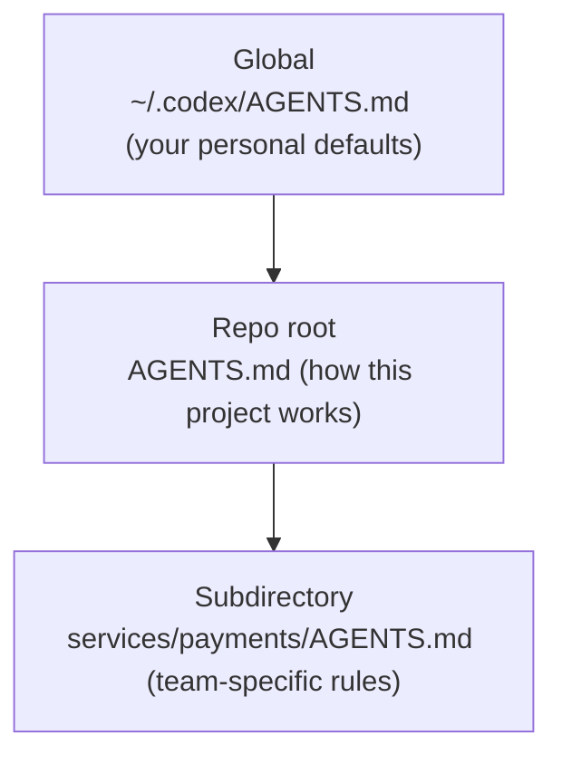

<LevelBadge level="intermediate" />

<VerifyNote lastVerified="2026-06-27" source="https://agents.md/">
تتطور قائمة المتبنّين لملف AGENTS.md وسلوك الاستيراد/الروابط الرمزية في Claude Code بسرعة — تحقق من التفاصيل مقابل موقع AGENTS.md الرسمي ووثائق ذاكرة Claude Code.
</VerifyNote>

أنت تعرف بالفعل [CLAUDE.md](/docs/claude-code/claude-md) — الموجز التعريفي للمشروع في Claude Code. لكن من المرجح أن يلمس مستودعك *أكثر* من وكيل واحد: زميل يشغّل Codex، والـ CI يستخدم روبوت برمجة، وأحدهم يفتح المستودع في Cursor. إن `AGENTS.md` هو المعيار المفتوح الذي تتفق تلك الأدوات على قراءته، بحيث تكتب تعليمات مشروعك **مرة واحدة** بدلًا من صيانة ملف مختلف لكل أداة.

<Callout type="objectives" items={["ما هو AGENTS.md ومن يتولى رعايته", "لماذا يقرأ Claude Code ملف CLAUDE.md وليس AGENTS.md", "ثلاث طرق موثوقة للحفاظ على مصدر حقيقة واحد عبر الأدوات", "كيف تندمج ملفات AGENTS.md المتداخلة والعامة", "ما الذي ينتمي إلى الملف — وما الذي يجب إبقاؤه خارجه"]} />

## ما هو AGENTS.md

إن `AGENTS.md` هو ملف Markdown عادي في جذر مستودعك — اعتبره **ملف README مكتوبًا للوكلاء بدلًا من البشر**. فهو يخبر الوكيل البرمجي كيفية بناء المشروع واختباره والمساهمة فيه. لا يحتوي التنسيق على أي حقول مطلوبة: يقرأ الوكلاء النص ببساطة.

إنه معيار مفتوح ترعاه **مؤسسة الذكاء الاصطناعي الوكيلي (AAIF) تحت مظلة Linux Foundation**، واعتبارًا من منتصف 2026 تستخدمه أكثر من 60 ألف مشروع مفتوح المصدر وتقرأه أكثر من 30 أداة — بما في ذلك OpenAI Codex، وJules وGemini CLI من Google، وCursor، وWindsurf، وDevin، وZed، وWarp، وAider، وgoose، وAmp، والوكيل البرمجي في GitHub Copilot.

<Callout type="info" items={["AGENTS.md هو اتفاقية، وليس بيئة تشغيل: كل أداة تقرر كيف تكتشف الملف وتدمجه وتحقنه.", "لا يُفرض أي مخطط — النص الواضح يتفوق على البنية الصارمة.", "إنه يكمّل ملف README الخاص بك؛ ولا يحل محله."]} />

## مأزق Claude Code

إليك الجزء الذي يتعثر فيه الناس: **يقرأ Claude Code ملف `CLAUDE.md`، وليس `AGENTS.md`.** إذا كان مستودعك يحتوي فقط على `AGENTS.md`، فإن Claude Code يتجاهله افتراضيًا. هذا ليس عيبًا — فهو يسبق المعيار — لكنه يعني أن المستودع متعدد الأدوات يحتاج إلى استراتيجية مزامنة متعمَّدة، وإلا تباعدت تعليماتك بصمت.

<Callout type="warning" items={["لا تفترض أن Claude Code يلجأ إلى AGENTS.md — فهو لا يقرأه تلقائيًا.", "ملفان تتم صيانتهما يدويًا (CLAUDE.md وAGENTS.md) سيتباعدان. اختر مصدر حقيقة واحدًا.", "تحقق من السلوك الحالي في وثائق الذاكرة الرسمية قبل الاعتماد على أي ادعاء بشأن اللجوء الاحتياطي."]} />

## احتفظ بمصدر حقيقة واحد

ثلاثة أنماط تبقي CLAUDE.md وAGENTS.md متزامنين دون تكرار المحتوى. اختر بحسب منصة فريقك.

<Steps items={[{title: "الرابط الرمزي (الأبسط)", body: "اجعل CLAUDE.md رابطًا رمزيًا إلى AGENTS.md. يتبع Claude Code الروابط الرمزية ويقرأ الهدف بايتًا ببايت — ملف حقيقي واحد، وصفر منطق دمج. ملاحظة: على نظام Windows، يتطلب إنشاء رابط رمزي وضع المطوّر أو صلاحيات المسؤول، لذا قد تفضّل الفرق العاملة عبر منصات متعددة طريقة الاستيراد."}, {title: "‏@import‏ (متعدد المنصات)", body: "احتفظ بملف CLAUDE.md صغير وظيفته الوحيدة سحب الملف المعياري عبر استيراد ‎@AGENTS.md‎. يوسّع Claude Code الملف المستورَد إلى السياق عند الإطلاق، فيبقى AGENTS.md المصدر الوحيد ولا يوجد رابط رمزي قد يتعطل على Windows."}, {title: "‏/init‏ (الترحيل)", body: "هل تبدأ تشغيل Claude Code في مستودع يحتوي بالفعل على AGENTS.md (أو ‎.cursorrules / .windsurfrules‎)؟ شغّل ‎/init‎ — فهو يقرأ تلك الملفات ويدمج الأجزاء ذات الصلة في ملف CLAUDE.md مُولّد."}]} />

<PromptCard title="اربط CLAUDE.md رمزيًا بالمعيار المشترك (macOS / Linux)">{`ln -s AGENTS.md CLAUDE.md`}</PromptCard>

<PromptCard title="أو احتفظ بملف CLAUDE.md من سطر واحد يستورده">{`@AGENTS.md`}</PromptCard>

<Callout type="tip" items={["استخدم الرابط الرمزي عندما يكون فريقك بأكمله على macOS/Linux — فهو الأقل صيانةً.", "استخدم ‎@import‎ عندما يكون هناك مساهمون على Windows ضمن المزيج.", "ثبّت أيًا اخترته في الإصدار حتى يحصل الفريق بأكمله على السلوك نفسه."]} />

## كيف تندمج الملفات المتداخلة والعامة

تتعامل الوكلاء الأغنى مع AGENTS.md بشكل هرمي — النموذج الذهني نفسه لـ [التسلسل الهرمي لذاكرة CLAUDE.md](/docs/claude-code/claude-md). فعلى سبيل المثال، يسير Codex من ملف عام في دليلك الرئيسي نزولًا عبر جذر Git إلى مجلدك الحالي، مدمجًا بالتسلسل أثناء سيره:

تفوز الملفات الأقرب إلى العمل، لأنها تُدمج **أخيرًا** وتتجاوز التوجيهات السابقة. لذا فإن `services/payments/AGENTS.md` يرث تعليمات جذر المستودع ويضيف قواعد تنطبق فقط داخل تلك الخدمة — ضع التوجيهات المتخصصة أقرب ما يكون إلى الشيفرة المتخصصة.

<Flashcards title="نظرة سريعة على التشغيل البيني" cards={[{front: "من يقرأ AGENTS.md؟", back: "أكثر من 30 أداة — Codex، وCursor، وWindsurf، وDevin، وZed، وGemini CLI، والوكيل البرمجي في Copilot، وغيرها. وليس Claude Code افتراضيًا."}, {front: "من يقرأ CLAUDE.md؟", back: "Claude Code — وهو وحده. لا يقرأ AGENTS.md تلقائيًا."}, {front: "أفضل مزامنة لفريق Mac/Linux", back: "اربط CLAUDE.md رمزيًا ← AGENTS.md. ملف حقيقي واحد، بلا تباعد."}, {front: "أفضل مزامنة مع مساهمين على Windows", back: "ملف CLAUDE.md من سطر واحد يحتوي على ‎@AGENTS.md‎ — دون حاجة إلى رابط رمزي."}, {front: "ترتيب الدمج للملفات المتداخلة", back: "عام ← جذر المستودع ← المجلد الفرعي. الملفات الأقرب إلى العمل تتجاوز غيرها، لأنها تُدمج أخيرًا."}]} />

## ماذا تضع فيه

الانضباط نفسه كما في ملف CLAUDE.md جيد — يقترح المعيار فقط بعض الأقسام الشائعة:

- **نظرة عامة على المشروع** — ما هذا، في جملتين.
- **أوامر البناء والاختبار** — كيفية التشغيل والاختبار والفحص اللغوي.
- **نمط الشيفرة** — اصطلاحات لا يستطيع الوكيل استنتاجها.
- **تعليمات الاختبار** — ما الذي يعنيه "منجَز".
- **اعتبارات الأمان** — ما الذي يجب عدم لمسه أو إيداعه أبدًا.
- **إرشادات الإيداع / طلب الدمج** — تنسيق الرسائل، وقواعد الفروع.

<Callout type="warning" items={["تتبع الوكلاء الملف حرفيًا — التعليمات القديمة أو الطموحة تضر فعليًا، تمامًا مثل CLAUDE.md.", "أبقِه قصيرًا وصادقًا؛ صف كيف يعمل المشروع اليوم.", "لا تودع الأسرار أبدًا؛ أشِر إلى المستندات الكبيرة بدلًا من لصقها."]} />

## اختبر نفسك

<Quiz title="اختبر نفسك" questions={[{q: "هل يقرأ Claude Code ملف AGENTS.md تلقائيًا؟", options: ["نعم، يلجأ إلى AGENTS.md", "لا — يقرأ CLAUDE.md فقط", "فقط على Windows"], answer: 1, explain: "يقرأ Claude Code ملف CLAUDE.md ويتجاهل ملف AGENTS.md المستقل افتراضيًا، لذا تحتاج المستودعات متعددة الأدوات إلى استراتيجية مزامنة متعمَّدة."}, {q: "فريقك بالكامل على macOS وLinux. ما الطريقة الأقل صيانةً لمشاركة ملف تعليمات واحد عبر Claude Code وCodex؟", options: ["صيانة CLAUDE.md وAGENTS.md يدويًا", "اربط CLAUDE.md رمزيًا بـ AGENTS.md", "الصق AGENTS.md في تعليق"], answer: 1, explain: "يمنحك ربط CLAUDE.md رمزيًا ← AGENTS.md ملفًا حقيقيًا واحدًا؛ يتبع Claude Code الرابط الرمزي ويقرأ الهدف بايتًا ببايت."}, {q: "عندما تدمج الوكلاء ملف AGENTS.md عامًا، وآخر في جذر المستودع، وآخر في مجلد فرعي، أيها يفوز عند التعارض؟", options: ["الملف العام", "ملف جذر المستودع", "ملف المجلد الفرعي الأقرب إلى العمل"], answer: 2, explain: "تُدمج الملفات بالتسلسل عام ← جذر ← مجلد فرعي، لذا يظهر الملف الأقرب إلى العمل أخيرًا ويتجاوز التوجيهات السابقة."}]} />

<Callout type="takeaways" items={["AGENTS.md هو المعيار المفتوح الذي ترعاه Linux Foundation ويقرأه أكثر من 30 وكيلًا برمجيًا — ملف README للوكلاء.", "يقرأ Claude Code ملف CLAUDE.md، وليس AGENTS.md، لذا يجب على المستودعات متعددة الأدوات إبقاؤهما متزامنين.", "اربط CLAUDE.md رمزيًا ← AGENTS.md على Mac/Linux، أو استخدم استيراد ‎@AGENTS.md‎ من سطر واحد للفرق العاملة عبر منصات متعددة.", "تندمج الملفات المتداخلة عام ← جذر ← مجلد فرعي، مع فوز الملف الأقرب.", "املأه مثل ملف CLAUDE.md رائع: نظرة عامة، وأوامر بناء/اختبار، واصطلاحات، وأمان، وحواجز حماية — قصير وصادق."]} />

## التالي

- [CLAUDE.md وملفات الذاكرة](/docs/claude-code/claude-md) — جانب Claude Code من الفكرة نفسها
- [قوالب CLAUDE.md](/docs/templates/claude-md) — بدايات جاهزة يمكنك إعادة استخدامها كملف AGENTS.md
- [الأوامر المائلة](/docs/claude-code/slash-commands) — بما في ذلك /init لترحيل ملفات التعليمات الموجودة

## المصادر والقراءة الإضافية

- [AGENTS.md — الموقع الرسمي والمواصفات](https://agents.md/)
- [OpenAI Codex — تعليمات مخصصة مع AGENTS.md](https://developers.openai.com/codex/guides/agents-md)
- [وثائق ذاكرة Claude Code](https://code.claude.com/docs/en/memory)
