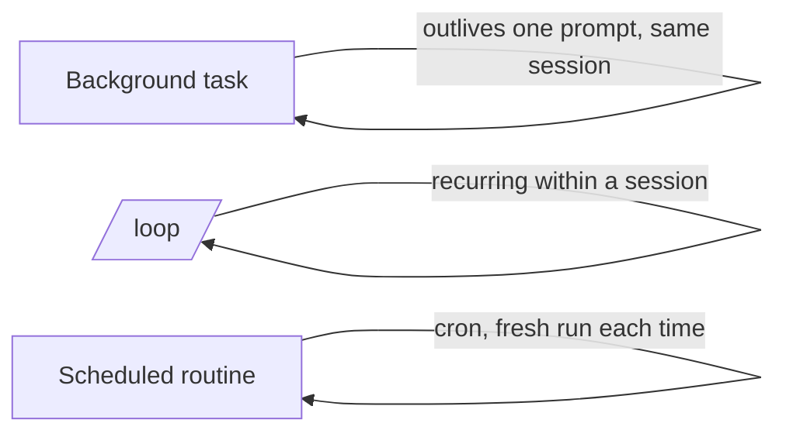

<LevelBadge level="advanced" />

<VerifyNote lastVerified="2026-06-20" source="https://code.claude.com/docs/en">
الأوامر المحددة وتوفّر المهام الخلفية و/loop والجدولة تتغير بين الإصدارات — تأكد من ذلك في الوثائق الرسمية.
</VerifyNote>

ليس كل شيء تعديلًا سريعًا. يمكن لـ Claude Code تشغيل عمل **يتجاوز عمر مطالبة واحدة**: أوامر طويلة في الخلفية، وحلقات متكررة، وعمليات تشغيل مجدولة.

## المهام الخلفية

ابدأ أمرًا طويل التشغيل (خادم تطوير، مراقب اختبارات، بناء) **دون حجب** الجلسة. يواصل Claude العمل ويُخطَر عندما تنتج المهمة مخرجات أو تنتهي. استخدمها لأي شيء تشغّله عادةً في الخلفية بـ `&` — لكن مُدار، حتى يتمكن Claude من قراءة المخرجات لاحقًا.

:::tip لا تنتظر بانشغال
ابدأ المهمة في الخلفية وتابع؛ دع إشعار الإكمال يعيدك، بدلًا من الاستطلاع (polling) في حلقة محكمة.
:::

## الحلقات المتكررة (`/loop`)

يشغّل `/loop` مطالبة أو أمرًا على **فاصل زمني متكرر** ضمن جلسة — مثلًا "كل 5 دقائق، تحقق من حالة النشر." أعطه فاصلًا، أو دع Claude يضبط وتيرته بنفسه. رائع لمراقبة عملية تشغيل CI أو استطلاع مهمة خارجية لا يستطيع الإطار (harness) إخطارك بها بطريقة أخرى.

## الوكلاء السحابيون المجدولون

للعمل الذي ينبغي أن يحدث **وفق ساعة، بشكل مستمر** — "كل صباح لخّص المشكلات الجديدة"، "كل ساعة، تحقق من الأخبار وحدّث الوثائق" — استخدم **المهام المجدولة / الروتينات** (نمط cron). يبدأ كل تشغيل من جديد، لذا يجب أن تكون تعليماته **مكتفية ذاتيًا**.

## الاختيار بينها

| الحاجة | استخدم |
|---|---|
| تشغيل أمر طويل، مع مواصلة العمل | مهمة خلفية |
| استطلاع شيء كل N دقيقة في هذه الجلسة | `/loop` |
| فعل شيء وفق جدول، إلى أجل غير مسمى | روتين مجدول |

:::warning الاستقلالية تحتاج حواجز واقية
أي شيء يعمل دون إشراف وفق جدول يجب أن يكون محدد النطاق بإحكام وقابلًا للعكس. اقرنه بـ[أذونات](/docs/claude-code/permissions) صارمة واقرأ [تحصين عمليات التشغيل المستقلة](/docs/security/hardening-autonomous-runs).
:::

## التالي

- [الوضع بلا واجهة (Headless) وحزمة تطوير الوكلاء (Agent SDK)](/docs/claude-code/headless-and-agent-sdk)
- [الأذونات والأوضاع](/docs/claude-code/permissions)
- [تحصين عمليات التشغيل المستقلة](/docs/security/hardening-autonomous-runs)
