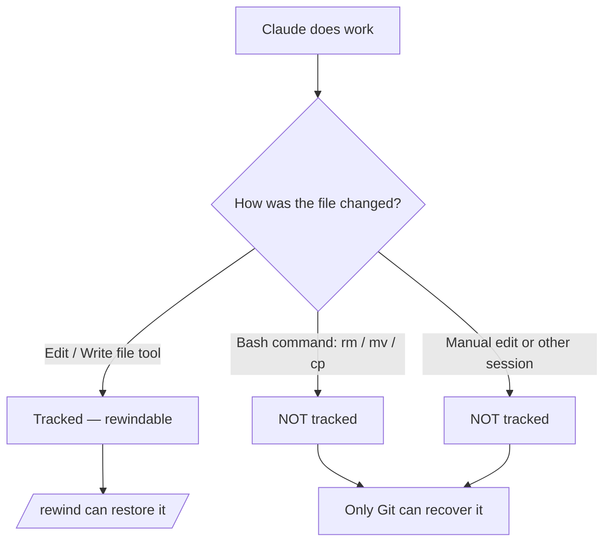

<LevelBadge level="intermediate" />

<Callout type="objectives" items={["افهم ما تلتقطه نقطة التحقّق — وما لا تلتقطه في صمت", "افتح قائمة التراجع بطريقتين واختر إجراء الاستعادة الصحيح في كل مرة", "ميّز بين 'الاستعادة' (التراجع عن الحالة) و'التلخيص' (ضغط السياق)", "اعرف بالضبط لماذا تُكمّل نقاط التحقّق Git لكنها لا تحلّ محلّه أبدًا"]} />

<VerifyNote lastVerified="2026-07-09" source="https://code.claude.com/docs/en/checkpointing">
سلوك نقاط التحقّق، وإجراءات قائمة التراجع، والاحتفاظ، ومتطلبات الإصدار (مثل الرجوع إلى ما قبل `/clear` الذي يحتاج Claude Code v2.1.191+) تتغيّر بين الإصدارات — تأكّد من ذلك في الوثائق الرسمية.
</VerifyNote>

## الفكرة الكبرى

عندما تُطلق Claude في تغيير طموح وواسع النطاق، يكون السؤال الأكثر إثارة للقلق هو "ماذا لو ساءت الأمور بعد ثلاثة تعديلات؟" **نقاط التحقّق (Checkpointing)** هي الإجابة: يلتقط Claude Code تلقائيًا لقطة لشِفرتك قبل كل تعديل، بحيث يمكنك التراجع إلى أي حالة سابقة بدلًا من فكّ تشابك إعادة هيكلة نصف مكتملة يدويًا.

فكّر فيها بوصفها **تراجعًا محليًا للجلسة بأكملها** — شبكة أمان تتيح لك أن تقول "نعم، جرّب النهج الجريء" دون خوف.

## كيف تُنشأ نقاط التحقّق

أنت لا تُنشئ نقاط التحقّق — إنها تحدث تلقائيًا.

<Steps items={[{title: "كل مطالبة = نقطة تحقّق", body: "تلتقط كل مطالبة من المستخدم حالة شِفرتك قبل أن تعمل أدوات تحرير الملفات لدى Claude. لا أمر، ولا إعداد، ولا مراسم."}, {title: "تدوم عبر الجلسات", body: "تنجو نقاط التحقّق من إنهاء المحادثة واستئنافها، بحيث يمكنك التراجع في جلسة مستأنَفة، وليس فقط في الجلسة الحية."}, {title: "تنظّف نفسها بنفسها", body: "تُزال نقاط التحقّق جنبًا إلى جنب مع جلستها بعد 30 يومًا (قابل للتهيئة). إنها استرداد على مستوى الجلسة، وليست أرشيفًا."}]} />

## فتح قائمة التراجع

هناك طريقتان للدخول:

<Steps items={[{title: "شغّل /rewind", body: "اكتب الأمر المائل من موجّه الإدخال. يعمل دائمًا."}, {title: "اضغط Esc مرتين — لكن فقط على إدخال فارغ", body: "الضغط المزدوج على Esc يفتح قائمة التراجع عندما يكون مربع الإدخال فارغًا. إذا كان فيه نص، فإن الضغط المزدوج على Esc يمسح ذلك النص بدلًا من ذلك (يُحفظ النص الممسوح في سجل الإدخال، فاضغط للأعلى لاستعادته بعد ذلك)."}]} />

<PromptCard title="Open the rewind menu">{`/rewind`}</PromptCard>

تُدرج القائمة **كل مطالبة أرسلتها في هذه الجلسة**. اختر النقطة التي تريد التصرّف عندها، ثم اختر إجراءً واحدًا.

## الاستعادة مقابل التلخيص: التمييز الأساسي

هنا يقع الناس في الالتباس. تقدّم القائمة *نوعين* من الإجراءات:

- إجراءات **الاستعادة** تغيّر الحالة على القرص و/أو في المحادثة — إنها تتراجع.
- إجراءات **التلخيص** لا تمسّ ملفاتك أبدًا — إنها تضغط المحادثة لتحرير مساحة في نافذة السياق.

<Callout type="warning" items={["الاستعادة = تراجع (يعيد الشِفرة أو المحادثة أو كليهما). التلخيص = ضغط السياق (الملفات على القرص تبقى دون مساس).", "لجأ إلى الاستعادة عندما يعطّل تعديل شيئًا ما. لجأ إلى التلخيص عندما تكون الجلسة متضخّمة لكن الشِفرة سليمة."]} />

### إجراءات الاستعادة

<Steps items={[{title: "استعادة الشِفرة والمحادثة", body: "أعِد كلًّا من ملفاتك وسجلّ الدردشة إلى النقطة المختارة — 'عودة نظيفة بالزمن' إلى تلك اللحظة."}, {title: "استعادة المحادثة", body: "أرجِع الدردشة إلى تلك الرسالة لكن أبقِ شِفرتك الحالية. مفيدة لإعادة طرح سؤال دون فقدان تعديلات تريد الاحتفاظ بها."}, {title: "استعادة الشِفرة", body: "أعِد تغييرات الملفات لكن أبقِ المحادثة. تراجَع عن التعديلات، واحتفظ بالنقاش حولها."}]} />

بعد استعادة المحادثة (أو اختيار "التلخيص من هنا")، تُعاد المطالبة الأصلية من الرسالة المختارة إلى حقل الإدخال بحيث يمكنك إعادة إرسالها أو تحريرها.

### إجراءات التلخيص

كلاهما يضغط جزءًا من المحادثة إلى ملخّص مولَّد بالذكاء الاصطناعي — مثل **`/compact` موجَّه** حيث تختار أيّ جانب من الرسالة المختارة تُعصره.

<Steps items={[{title: "التلخيص من هنا", body: "تبقى الرسائل التي قبل الرسالة المختارة سليمة. تصبح الرسالة المختارة وكل ما بعدها ملخّصًا. استخدمها لطرح نقاش جانبي مع الاحتفاظ بالسياق المبكر بكامل التفاصيل."}, {title: "التلخيص حتى هنا", body: "تصبح الرسائل التي قبل الرسالة المختارة ملخّصًا؛ وتبقى الرسالة المختارة وكل ما بعدها سليمة. تظل في نهاية المحادثة. استخدمها لضغط ثرثرة الإعداد المبكرة مع الاحتفاظ بالعمل الأخير حرفيًا."}]} />

تبقى الرسائل الأصلية في نصّ الجلسة في كلتا الحالتين، بحيث لا يزال بإمكان Claude الرجوع إلى التفاصيل. يمكنك كتابة تعليمات اختيارية لتوجيه ما يركّز عليه الملخّص.

للاطلاع على التدفّق بأكمله، راجع [إدارة السياق](/docs/claude-code/context-management) — إجراءات التلخيص في `/rewind` مِبضع حيث يكون `/compact` فرشاة عريضة.

## التراجع إلى ما قبل `/clear`

إذا شغّلت `/clear` سابقًا في نفس عملية Claude Code، تُظهر قائمة التراجع مدخلًا إضافيًا في الأعلى: `/resume <session-id> (previous session)`. اختره للقفز إلى المحادثة التي كانت نشطة قبل `/clear`.

<VerifyNote lastVerified="2026-07-09" source="https://code.claude.com/docs/en/checkpointing">
يتطلّب الرجوع إلى ما قبل `/clear` من قائمة التراجع Claude Code v2.1.191 أو أحدث. في الإصدارات الأقدم، شغّل `/resume` واختر الجلسة السابقة من القائمة بدلًا من ذلك.
</VerifyNote>

## أين تتوقّف نقاط التحقّق — الحدود التي تؤذي

تبدو نقاط التحقّق سحرية حتى تتوقّف عن ذلك. ثلاث فجوات مهمّة:

<Steps items={[{title: "تغييرات bash غير مرئية", body: "الملفات التي تمسّها أوامر الصدفة التي يشغّلها Claude — rm، mv، cp، ومولّدات الشِفرة، والمنسّقات — ليست متتبَّعة. تُحفظ نقاط تحقّق فقط للتعديلات المباشرة عبر أدوات تحرير الملفات لدى Claude. الملف المحذوف بـ rm يُعدّ ضائعًا فيما يخصّ التراجع."}, {title: "التغييرات الخارجية والمتزامنة غير مرئية", body: "التعديلات اليدوية التي تجريها خارج Claude Code، والتعديلات من جلسات متزامنة أخرى، لا تُلتقط عادةً — ما لم تصادف أن تمسّ نفس الملفات التي عدّلتها الجلسة الحالية."}, {title: "إنها على مستوى الجلسة، لا التاريخ", body: "نقاط التحقّق هي استرداد محلي سريع. إنها ليست تثبيتات (commits)، ولا فروعًا (branches)، ولا قابلة للمشاركة مع فريقك."}]} />

## نقاط التحقّق مقابل Git: استخدم كليهما

إنهما يحلّان مشكلات مختلفة، لذا اقرِنهما.

| | نقاط التحقّق (`/rewind`) | Git |
|---|---|---|
| النطاق | جلسة واحدة | تاريخ المشروع بأكمله |
| الدقّة | لكل مطالبة، تلقائي | لكل تثبيت، متعمَّد |
| هل يتتبّع التغييرات المصنوعة بـ bash؟ | لا | نعم (بمجرد التجهيز/التثبيت) |
| العمر | ~30 يومًا، ثم تزول | دائم |
| قابل للمشاركة / تعاوني | لا | نعم |
| النموذج الذهني | "تراجع محلي" | "تاريخ دائم" |

<Callout type="tip" items={["ثبّت الحالات العاملة بـ Git قبل تشغيلة محفوفة بالمخاطر وواسعة النطاق — تلك أرضيتك المتينة.", "استخدم /rewind للاسترداد السريع داخل الجلسة بين التثبيتات دون تلويث تاريخ Git لديك.", "إذا كان Claude سيشغّل bash مدمّرًا (rm/mv) أو مولّدات، فاعتمِد على Git — التراجع لن ينقذ تلك الملفات."]} />

## متى تلجأ إليها

<Steps items={[{title: "استكشاف البدائل", body: "جرّب تطبيقًا جريئًا، وإذا لم يعجبك، استعِد الشِفرة والمحادثة إلى نقطة التفرّع وجرّب آخر."}, {title: "التعافي من تعديل سيّئ", body: "أدخل تعديلٌ عِلّةً قبل ثلاث مطالبات؟ استعِد الشِفرة إلى ما قبله مباشرةً بدلًا من تنقيح الركام."}, {title: "التكرار على ميزة", body: "جرّب تنويعات، وأنت تعلم دائمًا أن حالة سليمة معروفة تبعد /rewind واحدًا."}, {title: "تحرير مساحة السياق", body: "أكل انعطافُ تنقيح مُطنَب نافذةَ سياقك؟ لخّص من نقطة المنتصف فصاعدًا واحتفظ بتعليماتك الأصلية بكامل التفاصيل."}]} />

<Quiz title="اختبر نفسك" questions={[{q: "شغّل Claude `rm config.old.json` عبر أمر bash وتريد استعادته. هل يمكن لـ `/rewind` استعادته؟", options: ["نعم — يُحفظ لكل تغيير يجريه Claude نقطة تحقّق", "لا — التغييرات المصنوعة بـ bash ليست متتبَّعة؛ التعديلات المباشرة بأداة الملفات فقط هي كذلك", "فقط إذا شغّلت /rewind خلال 30 ثانية"], answer: 1, explain: "لا تلتقط نقاط التحقّق سوى التعديلات المصنوعة عبر أدوات تحرير الملفات لدى Claude. الملفات المتغيّرة بأوامر bash (rm، mv، cp) ليست متتبَّعة — وذلك بالضبط ما وُجد Git من أجله."}, {q: "شِفرتك سليمة، لكن انعطافًا طويلًا للتنقيح ملأ نافذة السياق. أيّ إجراء يناسب؟", options: ["استعادة الشِفرة والمحادثة إلى ما قبل الانعطاف", "استعادة الشِفرة", "التلخيص من هنا عند بداية الانعطاف"], answer: 2, explain: "إجراءات التلخيص تضغط المحادثة دون مسّ الملفات. 'التلخيص من هنا' يحوّل الانعطاف إلى ملخّص مع الاحتفاظ بسياقك الأسبق سليمًا — محرّرًا مساحة السياق بلا أي تغييرات في الشِفرة."}, {q: "كيف تُنشأ نقطة التحقّق؟", options: ["تشغّل /checkpoint يدويًا", "تلقائيًا، قبل كل تعديل — كل مطالبة تصنع واحدة", "فقط عندما تثبّت في Git"], answer: 1, explain: "إنشاء نقاط التحقّق تلقائي: كل مطالبة من المستخدم تلتقط حالة شِفرتك قبل التعديل. لا خطوة يدوية."}]} />

<Flashcards title="مفردات نقاط التحقّق والتراجع" cards={[{front: "نقطة التحقّق (Checkpoint)", back: "لقطة تلقائية لشِفرتك تُلتقط قبل كل تعديل، مرة لكل مطالبة. نطاقها الجلسة، وتُحفظ ~30 يومًا."}, {front: "/rewind", back: "يفتح قائمة التراجع التي تُدرج كل مطالبة في هذه الجلسة، بحيث يمكنك الاستعادة أو التلخيص من أي نقطة. يمكن الوصول إليه أيضًا عبر الضغط المزدوج على Esc على إدخال فارغ."}, {front: "إجراء الاستعادة", back: "يعيد الحالة — الشِفرة أو المحادثة أو كليهما — إلى النقطة المختارة. هذا هو 'التراجع'."}, {front: "إجراء التلخيص", back: "يضغط جزءًا من المحادثة إلى ملخّص بالذكاء الاصطناعي لتحرير السياق. الملفات على القرص لا تُمسّ أبدًا."}, {front: "بقعة bash العمياء", back: "الملفات المتغيّرة بأوامر الصدفة (rm/mv/cp) لا تُحفظ لها نقاط تحقّق — التعديلات المباشرة بأداة الملفات فقط هي كذلك. استخدم Git لتلك."}]} />

<Callout type="takeaways" items={["نقاط التحقّق هي لقطات تلقائية، لكل مطالبة، لشِفرتك — تراجع محلي للجلسة بأكملها، تُحفظ نحو 30 يومًا.", "افتح قائمة التراجع بـ /rewind أو الضغط المزدوج على Esc على إدخال فارغ؛ إنها تُدرج كل مطالبة أرسلتها.", "إجراءات الاستعادة تتراجع عن الحالة (الشِفرة أو المحادثة أو كليهما)؛ إجراءات التلخيص تضغط السياق ولا تمسّ الملفات أبدًا.", "التغييرات المصنوعة بـ bash والخارجية والمتزامنة ليست متتبَّعة — التعديلات المباشرة بأداة الملفات فقط هي كذلك.", "نقاط التحقّق تُكمّل Git، ولا تحلّ محلّه: فكّر 'تراجع محلي' مقابل 'تاريخ دائم وقابل للمشاركة'."]} />

## التالي

- [إدارة السياق](/docs/claude-code/context-management) — `/compact`، و`/clear`، وكيف يتناسب التلخيص مع الصورة الأكبر
- [وضع التخطيط](/docs/claude-code/plan-mode) — تحقّق من خطة ووافق عليها قبل تشغيل التعديلات، لتتراجع أقل تكرارًا
- [الأذونات](/docs/claude-code/permissions) — النصف الآخر من تشغيل المهام الطموحة بأمان
