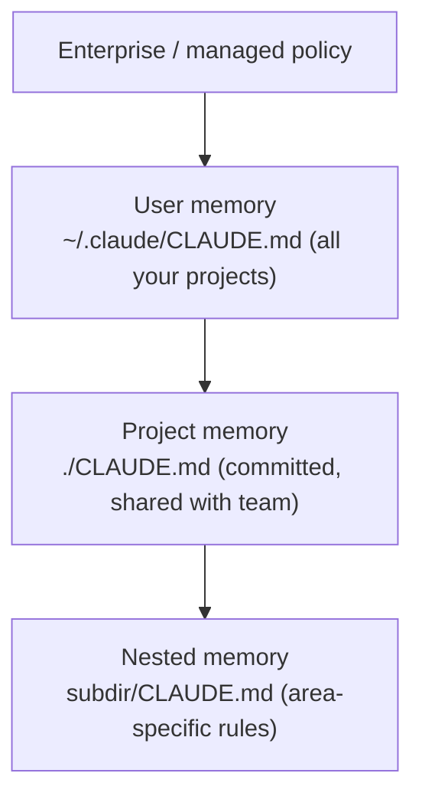

<LevelBadge level="beginner" />

<VerifyNote lastVerified="2026-06-20" source="https://docs.anthropic.com/en/docs/claude-code/memory">
يمكن أن تتغير مواقع ملفات الذاكرة وصياغة الاستيراد — تأكد من التفاصيل المحددة في وثائق ذاكرة Claude Code الرسمية.
</VerifyNote>

إذا كنت ستفعل **شيئًا واحدًا** لتحسين [Claude Code](/docs/claude-code/what-is-claude-code)، فافعل هذا. `CLAUDE.md` هو ملف نصي عادي يقرؤه Claude في بداية كل جلسة — الإحاطة الدائمة لمشروعك.

## لماذا هو الإعداد الأعلى أثرًا

بدونه، تشرح مشروعك من جديد في كل جلسة ("نحن نستخدم pnpm، الاختبارات في `__tests__`، لا تلمس `/generated`…"). به، يعرف Claude ذلك مسبقًا. التعليمات الجيدة هنا تحسّن *كل* تفاعل مستقبلي دفعةً واحدة.

## التسلسل الهرمي للذاكرة

يقرأ Claude Code الذاكرة من عدة أماكن ويدمجها، بترتيب يتدرج تقريبًا من الأكثر عمومية إلى الأكثر تحديدًا:

- **ذاكرة المستخدم** — تفضيلاتك الشخصية عبر كل مشروع.
- **ذاكرة المشروع** (`./CLAUDE.md`، مُودَع في المستودع) — كيف يعمل *هذا* المستودع. مشتركة مع فريقك.
- **المتداخلة** — ضع ملف `CLAUDE.md` في مجلد فرعي لقواعد تنطبق هناك فقط.

## ولّد نقطة انطلاق

شغّل `/init` في مشروع وسيصوغ Claude ملف `CLAUDE.md` عبر فحص الشيفرة. ثم **اختصره بالتحرير** — المسودة نقطة انطلاق، لا خط النهاية.

## ماذا تضع فيه

- ما هو المشروع، في جملتين.
- المكدّس التقني وكيفية **التشغيل / الاختبار / الفحص (lint)**.
- الأعراف التي لا يستطيع Claude استنتاجها (التسمية، البنية، أسلوب الـ commit).
- **الحواجز الواقية**: "شغّل الاختبارات قبل إعلان الانتهاء"، "لا تحرّر `/vendor` أبدًا"، "لا تودِع الأسرار أبدًا".

احصل على نقطة انطلاق جاهزة من [قوالب CLAUDE.md](/docs/templates/claude-md).

## ماذا لا تضع فيه

:::warning القصير والصادق يتفوق على الطويل والطموح
يتبع Claude ملف `CLAUDE.md` *حرفيًا*. التعليمات القديمة أو الغامضة أو المتمنّاة تضرّ فعليًا. صِف كيف يعمل المشروع **فعليًا** اليوم، وأبقِه موجزًا، وراجعه دوريًا.
:::

تجنّب: المستندات الكبيرة الملصوقة (استخدم `@imports` للإشارة إلى الملفات بدلًا منها)، والأسرار، والقواعد التي لا تتبعها فعلًا.

## الاستيرادات

اسحب المستندات الموجودة بدلًا من تكرارها — مثلًا أشِر إلى دليل التنسيق الخاص بك عبر استيراد `@path/to/file` ليكون هناك مصدر موثوق واحد. راجع [وثائق الذاكرة الرسمية](https://docs.anthropic.com/en/docs/claude-code/memory) للصياغة المحددة.

## التالي

- [وضع التخطيط](/docs/claude-code/plan-mode) — أول تغييرات آمنة
- [الأذونات والأوضاع](/docs/claude-code/permissions) — ما الذي يُسمح لـ Claude بفعله دون إشراف
- [الدليل التطبيقي: تخصيص Claude Code لمستودع حقيقي](/docs/walkthroughs/customize-claude-code)
