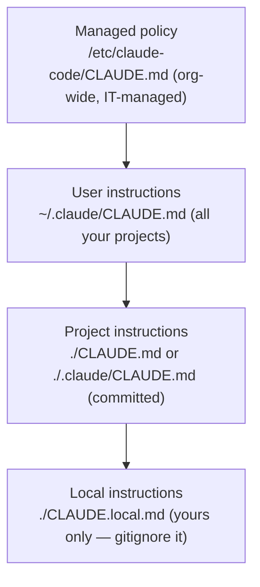

<LevelBadge level="beginner" />

<VerifyNote lastVerified="2026-10-06" source="https://code.claude.com/docs/en/memory">
المواقع وترتيب التحميل وصياغة الاستيراد مأخوذة من وثائق الذاكرة الرسمية («كيف يتذكر Claude مشروعك»)، التي تصف الآن **آليتين**: ملفات CLAUDE.md التي تكتبها أنت، و**الذاكرة التلقائية** التي يكتبها Claude بنفسه. وتُحَلّ الاستيرادات حتى عمق أقصاه أربع قفزات. تأكد من التفاصيل المحددة هناك — فهذه التفاصيل تتغير.
</VerifyNote>

إذا كنت ستفعل **شيئًا واحدًا** لتحسين [Claude Code](/docs/claude-code/what-is-claude-code)، فافعل هذا. `CLAUDE.md` هو ملف نصي عادي يقرؤه Claude في بداية كل جلسة — الإحاطة الدائمة لمشروعك.

<Callout type="objectives" items={["لماذا يُعد CLAUDE.md الإعداد الأعلى أثرًا في Claude Code", "كيف يُحمَّل التسلسل الهرمي للذاكرة، من السياسة المُدارة نزولًا إلى CLAUDE.local.md", "كيف تختلف الذاكرة التلقائية عن ملف CLAUDE.md الذي تكتبه أنت", "كيف تولّد ملف انطلاق باستخدام /init ثم تختصره", "ما الذي ينتمي إلى CLAUDE.md — وما الذي يجب إبقاؤه خارجه", "كيف تتيح لك الاستيرادات @imports الإشارة إلى المستندات دون تكرارها"]} />

## لماذا هو الإعداد الأعلى أثرًا

بدونه، تشرح مشروعك من جديد في كل جلسة ("نحن نستخدم pnpm، الاختبارات في `__tests__`، لا تلمس `/generated`…"). به، يعرف Claude ذلك مسبقًا. التعليمات الجيدة هنا تحسّن *كل* تفاعل مستقبلي دفعةً واحدة.

## التسلسل الهرمي للذاكرة

يُحمّل Claude Code الذاكرة من عدة مواقع ويدمجها بترتيب التحميل، الأوسع نطاقًا أولًا — ولذلك تصل تعليمات المشروع إلى السياق *بعد* تعليمات المستخدم:

```mermaid
flowchart TD
  A["Managed policy<br/>/etc/claude-code/CLAUDE.md (org-wide, IT-managed)"] --> B["User instructions<br/>~/.claude/CLAUDE.md (all your projects)"]
  B --> C["Project instructions<br/>./CLAUDE.md or ./.claude/CLAUDE.md (committed)"]
  C --> D["Local instructions<br/>./CLAUDE.local.md (yours only — gitignore it)"]
```

- **السياسة المُدارة** — تعليمات على مستوى المؤسسة يوزّعها فريق تقنية المعلومات/DevOps لديك. والمسار يختلف بحسب نظام التشغيل: `/Library/Application Support/ClaudeCode/CLAUDE.md` على macOS، و`/etc/claude-code/CLAUDE.md` على Linux وWSL، و`C:\Program Files\ClaudeCode\CLAUDE.md` على Windows.
- **تعليمات المستخدم** (`~/.claude/CLAUDE.md`) — تفضيلاتك الشخصية عبر كل مشروع.
- **تعليمات المشروع** (`./CLAUDE.md` *أو* `./.claude/CLAUDE.md`، مُودَعة في المستودع) — كيف يعمل *هذا* المستودع. مشتركة مع فريقك. وإذا كان مستودعك يستخدم [`AGENTS.md`](/docs/claude-code/agents-md)، فقد يُحمَّل بدلًا من هذه الملفات أو إلى جانبها.
- **التعليمات المحلية** (`./CLAUDE.local.md`) — ملاحظات خاصة بالمشروع لك وحدك، مثل عنوان URL لبيئة اختبار. أضفه إلى `.gitignore`.

تُحمَّل الملفات الموجودة في التسلسل الهرمي *فوق* دليل عملك عند الإطلاق؛ أما الملفات في **المجلدات الفرعية فتُحمَّل عند الطلب**، عندما يلمس Claude شيئًا في تلك المنطقة.

<Callout type="tip" items={["هل تجاوزت حدود ملف واحد؟ قسّم التعليمات إلى .claude/rules/*.md — موضوع واحد لكل ملف، ويتم اكتشافها بشكل متكرر. القواعد التي لا تحتوي على حقل paths في الواجهة الأمامية تُحمَّل عند الإطلاق بالأولوية نفسها لملف .claude/CLAUDE.md؛ أضف حقل paths إلى الواجهة الأمامية لتحميل قاعدة فقط عندما يعمل Claude على ملفات مطابقة، وهذا يوفّر السياق."]} />

<Flashcards title="اعرف طبقات ذاكرتك" cards={[{front: "السياسة المُدارة", back: "ملف CLAUDE.md على مستوى المؤسسة يديره فريق تقنية المعلومات — الطبقة الأوسع، ويُحمَّل قبل تعليمات المستخدم والمشروع."}, {front: "تعليمات المستخدم", back: "~/.claude/CLAUDE.md — تفضيلاتك الشخصية التي تنطبق عبر كل مشروع."}, {front: "تعليمات المشروع", back: "./CLAUDE.md أو ./.claude/CLAUDE.md — مُودَع ومشترك مع الفريق؛ يصف كيف يعمل هذا المستودع."}, {front: "التعليمات المحلية", back: "./CLAUDE.local.md — تفضيلات شخصية خاصة بالمشروع. أضفه إلى gitignore."}, {front: ".claude/rules/*.md", back: "تعليمات بموضوع واحد لكل ملف للمشاريع الأكبر. وبوجود حقل paths في الواجهة الأمامية تُحمَّل فقط للملفات المطابقة."}, {front: "ملف CLAUDE.md في مجلد فرعي", back: "يُحمَّل عند الطلب — عندما يعمل Claude في ذلك الجزء من الشجرة — وليس عند الإطلاق."}]} />

## النصف الآخر: الذاكرة التلقائية

ملف CLAUDE.md هو نصف الذاكرة الذي تكتبه *أنت*. ويحتفظ Claude Code أيضًا بما يُسمى **الذاكرة التلقائية** — ملاحظات يكتبها Claude بنفسه انطلاقًا من تصحيحاتك وتفضيلاتك، تُخزَّن لكل مستودع وتُحمَّل في كل جلسة إلى جانب ملفات CLAUDE.md الخاصة بك.

| | ملفات CLAUDE.md | الذاكرة التلقائية |
| --- | --- | --- |
| **من يكتبها** | أنت | Claude |
| **ما تحتويه** | تعليمات وقواعد | دروس مستفادة وأنماط |
| **النطاق** | المشروع أو المستخدم أو المؤسسة | لكل مستودع، ومشتركة عبر أشجار العمل |

وكلتاهما *سياق*، لا إلزام: يتعامل Claude معهما كتوجيه يمكنه الموازنة بينه وبين غيره، لا كإعداد يجب أن يطيعه. ولمنع إجراء منعًا قاطعًا بغضّ النظر عما يقرره Claude، استخدم [خطّاف PreToolUse](/docs/claude-code/hooks) بدلًا من ذلك.

<Callout type="warning" items={["لا تُحمِّل الذاكرة التلقائية سوى أول 200 سطر أو 25 كيلوبايت — فملف MEMORY.md المتضخم يُقتطع بصمت. راجع تدقيق ميزانية السياق للحصول على التفصيل الكامل لتكلفة بدء التشغيل."]} />

## ولّد نقطة انطلاق

<Steps items={[{title: "شغّل /init في المشروع", body: "يفحص Claude الشيفرة ويصوغ لك ملف CLAUDE.md تلقائيًا."}, {title: "اختصره بالتحرير", body: "المسودة نقطة انطلاق، لا خط النهاية. اختصرها إلى ما هو صحيح ومفيد."}, {title: "استعِر قالبًا", body: "خذ نقطة انطلاق جاهزة من صفحة قوالب CLAUDE.md وكيّفها مع مستودعك."}]} />

<PromptCard title="ولّد مسودة CLAUDE.md">{`/init`}</PromptCard>

احصل على نقطة انطلاق جاهزة من [قوالب CLAUDE.md](/docs/templates/claude-md).

## ماذا تضع فيه

- ما هو المشروع، في جملتين.
- المكدّس التقني وكيفية **التشغيل / الاختبار / الفحص (lint)**.
- الأعراف التي لا يستطيع Claude استنتاجها (التسمية، البنية، أسلوب الـ commit).
- **الحواجز الواقية**: "شغّل الاختبارات قبل إعلان الانتهاء"، "لا تحرّر `/vendor` أبدًا"، "لا تودِع الأسرار أبدًا".

## ماذا لا تضع فيه

<Callout type="warning" items={["يتبع Claude ملف CLAUDE.md حرفيًا — التعليمات القديمة أو الغامضة أو المتمنّاة تضرّ فعليًا.", "صِف كيف يعمل المشروع فعليًا اليوم؛ القصير والصادق يتفوق على الطويل والطموح.", "تجنّب المستندات الكبيرة الملصوقة (استخدم @imports بدلًا منها)، والأسرار، والقواعد التي لا تتبعها فعلًا.", "راجعه دوريًا ليبقى دقيقًا مع تطور المشروع."]} />

## الاستيرادات

اسحب المستندات الموجودة بدلًا من تكرارها — مثلًا أشِر إلى دليل التنسيق الخاص بك عبر استيراد `@path/to/file` ليكون هناك مصدر موثوق واحد. المسارات النسبية والمطلقة تعمل كلتاهما؛ وتُحَلّ المسارات النسبية بالنسبة إلى الملف الذي يحتوي على الاستيراد، **لا** بالنسبة إلى دليل عملك. ويمكن للملفات المستوردة أن تستورد غيرها، حتى عمق أقصاه **أربع قفزات**.

مأزقان في الصياغة يستحقان أن تعرفهما قبل أن يوقعا بك:

- **المسافات تحتاج إلى شرطات مائلة عكسية.** `@Design\ Docs/api-conventions.md` يعمل؛ وبدون الشرطة المائلة العكسية يتوقف المسار عند أول مسافة. أما تغليفه بعلامات تنصيص فلا يستورد الملف على الإطلاق.
- **العلامات الخلفية تعني الانسحاب.** يتخطى تحليل الاستيراد مقاطع الشيفرة والكتل المسوّرة، لذا يبقى `` `@README` `` نصًا حرفيًا، بينما يستورد `@README` وحده الملف. هكذا *تذكر* مسارًا دون تحميله.

راجع [وثائق الذاكرة الرسمية](https://code.claude.com/docs/en/memory) للمرجع الكامل.

<Callout type="tip" items={["مصدر موثوق واحد: أشِر إلى ملف عبر @imports بدلًا من لصق محتوياته داخل CLAUDE.md.", "إذا كان المستند موجودًا بالفعل، اربطه — لا تنسخه. النسخ تتقادم مع الوقت."]} />

## اختبر نفسك

<Quiz title="اختبر نفسك" questions={[{q: "أي ملف يقرؤه Claude Code في بداية كل جلسة بوصفه الإحاطة الدائمة لمشروعك؟", options: ["README.md", "CLAUDE.md", "package.json"], answer: 1, explain: "CLAUDE.md هو ملف الذاكرة النصي الذي يقرؤه Claude في بداية كل جلسة."}, {q: "ماذا يفعل تشغيل /init في مشروع؟", options: ["يُودِع CLAUDE.md في مستودع فريقك", "يصوغ ملف CLAUDE.md عبر فحص الشيفرة، ثم تختصره أنت", "يحذف ملفات الذاكرة القديمة"], answer: 1, explain: "يصوغ /init ملف CLAUDE.md ابتدائيًا من الشيفرة — المسودة نقطة انطلاق، لذا تختصرها بعد ذلك."}, {q: "ما الطريقة الموصى بها لتضمين مستند كبير موجود مثل دليل التنسيق؟", options: ["لصق المستند كاملًا داخل CLAUDE.md", "الإشارة إليه عبر استيراد @path/to/file", "تخزينه كسرّ (secret)"], answer: 1, explain: "استخدم @imports للإشارة إلى الملف ليكون هناك مصدر موثوق واحد بدلًا من نسخة مكررة تتقادم."}, {q: "أين تذهب الملاحظات الشخصية الخاصة بمشروع معين — تلك التي لا تريد إيداعها في المستودع؟", options: ["~/.claude/CLAUDE.md", "./CLAUDE.local.md", "./.claude/CLAUDE.md"], answer: 1, explain: "الملف ./CLAUDE.local.md هو الطبقة المحلية: خاص بالمشروع لكنه لك وحدك. أضفه إلى gitignore. أما ~/.claude/CLAUDE.md فينطبق على كل مشاريعك، و./.claude/CLAUDE.md هو تعليمات الفريق المُودَعة في المستودع."}, {q: "من يكتب الذاكرة التلقائية؟", options: ["أنت، يدويًا", "Claude، انطلاقًا من تصحيحاتك وتفضيلاتك", "مسؤول تقنية المعلومات لديك"], answer: 1, explain: "الذاكرة التلقائية هي النصف الذي يكتبه Claude بنفسه — دروس مستفادة وأنماط، مخزَّنة لكل مستودع. أما CLAUDE.md فهو النصف الذي تكتبه أنت."}, {q: "متى يُحمَّل ملف CLAUDE.md الموجود في مجلد فرعي؟", options: ["عند الإطلاق، مع كل ملفات الذاكرة الأخرى", "عند الطلب، عندما يعمل Claude في ذلك الجزء من الشجرة", "فقط إذا استوردته عبر @import"], answer: 1, explain: "تُحمَّل الملفات الموجودة فوق دليل عملك عند الإطلاق؛ أما الملفات في المجلدات الفرعية فتُحمَّل عند الطلب، عندما يلمس Claude شيئًا في تلك المنطقة."}]} />

<Callout type="takeaways" items={["CLAUDE.md هو الإعداد الأعلى أثرًا: يحسّن كل جلسة مستقبلية دفعةً واحدة.", "تُحمَّل الذاكرة من الأوسع أولًا: السياسة المُدارة، ثم المستخدم (~/.claude/CLAUDE.md)، ثم المشروع (./CLAUDE.md أو ./.claude/CLAUDE.md)، ثم المحلية (./CLAUDE.local.md). وملفات المجلدات الفرعية تُحمَّل عند الطلب.", "الذاكرة التلقائية هي النصف الآخر — ملاحظات Claude نفسه، لكل مستودع، وتُحمَّل في كل جلسة. وكلتاهما سياق لا إلزام: استخدم خطّافًا لمنع شيء منعًا قاطعًا.", "هل تجاوزت حدود ملف واحد؟ قسّمه إلى .claude/rules/*.md وحدّد نطاق القواعد عبر حقل paths في الواجهة الأمامية.", "ابدأ بـ /init، ثم اختصر المسودة إلى ما هو صحيح فعلًا.", "أبقِه قصيرًا وصادقًا — استخدم @imports (بحد أقصى أربع قفزات) للمستندات الكبيرة، ولا تودِع الأسرار أبدًا."]} />

## التالي

- [ملف AGENTS.md والتشغيل البيني بين الأدوات](/docs/claude-code/agents-md) — شارك ملف تعليمات واحدًا عبر كل وكيل برمجي
- [وضع التخطيط](/docs/claude-code/plan-mode) — أول تغييرات آمنة
- [الأذونات والأوضاع](/docs/claude-code/permissions) — ما الذي يُسمح لـ Claude بفعله دون إشراف
- [الدليل التطبيقي: تخصيص Claude Code لمستودع حقيقي](/docs/walkthroughs/customize-claude-code)
