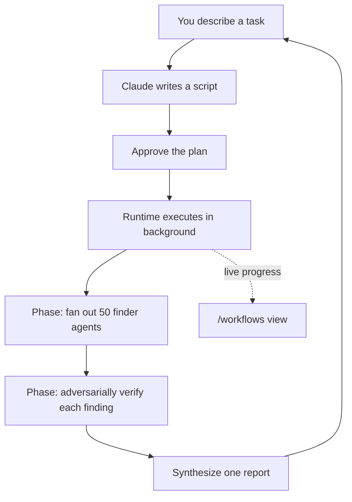

<LevelBadge level="advanced" />

<VerifyNote lastVerified="2026-06-28" source="https://code.claude.com/docs/en/workflows">
سير العمل الديناميكي ميزة سريعة التطور: الكلمة المفتاحية المُشغِّلة، وخيارات الموافقة، وحدود عدد الوكلاء، والتوافر تتغير بين إصدارات Claude Code — تأكّد من التفاصيل في الوثائق الرسمية. تتطلب Claude Code v2.1.154+ وخطة مدفوعة.
</VerifyNote>

<Callout type="objectives" items={["ميّز سير العمل عن الوكلاء الفرعيين والمهارات وفرق الوكلاء من خلال مَن يملك الخطة", "شاهد واحدًا في 30 ثانية باستخدام أمر /deep-research المضمّن", "ابدأ خاصتك بثلاث طرق: الكلمة المفتاحية ultracode، أو /effort ultracode، أو أمر محفوظ", "اعرف مِمَّ تحميك مطالبة الموافقة قبل أن تضغط نعم", "حافظ على التحكم في التكلفة والتشغيل غير المراقَب عبر التقطيع وقائمة السماح"]} />

**سير العمل الديناميكي** هو سكربت JavaScript ينسّق [الوكلاء الفرعيين](/docs/claude-code/subagents) على نطاق واسع. أنت تصف مهمة؛ ويكتب Claude *السكربت*؛ ويُنفّذه وقت التشغيل في الخلفية بينما تبقى جلستك متجاوبة. حيث تعيش المهمة العادية متعددة الخطوات دورًا بدور في نافذة سياق Claude، ينقل سير العمل **الخطة إلى الكود** — الحلقة، والتفرّع، وكل نتيجة وسيطة تعيش في متغيرات السكربت، فلا يحمل سياقك سوى الإجابة النهائية.

تلك النقلة الواحدة هي ما يجعل سير العمل قابلًا للتوسّع إلى *عشرات أو مئات* الوكلاء في تشغيل واحد، حيث يتوقف التفويض العادي عند حفنة قليلة.

## متى تلجأ إلى سير العمل

يمنحك Claude Code أربع طرق لتشغيل العمل متعدد الخطوات. السؤال الحقيقي هو **مَن يملك الخطة**:

| | [الوكلاء الفرعيون](/docs/claude-code/subagents) | [المهارات](/docs/claude-code/skills) | فرق الوكلاء | **سير العمل** |
| :-- | :-- | :-- | :-- | :-- |
| ما هو | عامل يولّده Claude | تعليمات يتبعها Claude | قائد يشرف على جلسات نظيرة | سكربت يُنفّذه وقت التشغيل |
| من يقرر ما يُشغَّل تاليًا | Claude، دورًا بدور | Claude، وفق المطالبة | القائد، دورًا بدور | **السكربت** |
| أين تعيش النتائج | نافذة السياق | نافذة السياق | قائمة مهام مشتركة | **متغيرات السكربت** |
| النطاق | قليل لكل دور | كما الوكلاء الفرعيون | حفنة من النظراء | **عشرات إلى مئات** |
| عند المقاطعة | يعيد تشغيل الدور | يعيد تشغيل الدور | يواصل الزملاء التشغيل | **قابل للاستئناف داخل الجلسة** |

استخدم سير العمل عندما تحتاج مهمة إلى **عدد من الوكلاء أكبر مما يمكن لمحادثة واحدة تنسيقه**، أو عندما تريد التنسيق **مُقَنَّنًا كسكربت يمكنك قراءته وإعادة تشغيله**. الحالات النموذجية:

- **مسح أخطاء على مستوى قاعدة الكود** — انشر باحثًا عبر كل وحدة، ثم اجعل وكلاء مستقلين يتحققون عدائيًا من كل نتيجة قبل الإبلاغ عنها.
- **نقل 500 ملف** — وكيل واحد لكل ملف، كلٌّ في شجرة عمله الخاصة، مع مرحلة تحقق.
- **سؤال بحثي** حيث يجب **التحقق المتقاطع للمصادر بعضها مع بعض**، لا مجرد تلخيصها.
- **خطة صعبة** تستحق الصياغة من عدة زوايا مستقلة، ثم الموازنة بينها قبل أن تلتزم.

تلك النقطة الأخيرة هي المُقلَّلة من شأنها: يمكن لسير العمل تطبيق *نمط جودة قابل للتكرار* (المراجعة العدائية، الصياغة متعددة الزوايا، التحقق بتصويت الأغلبية)، فتحصل على نتيجة أجدر بالثقة من تمريرة واحدة — لا مجرد مزيد من الوكلاء.



## أسرع طريقة لرؤية واحد: /deep-research

يأتي Claude Code بسير عمل مدمج كي لا تضطر إلى كتابة واحد لتجربة النموذج. شغّله على أي سؤال:

<PromptCard title="جرّب سير عمل بأمر واحد">{`/deep-research What changed in the Node.js permission model between v20 and v22?`}</PromptCard>

ينشر عمليات بحث على الويب عبر عدة زوايا، ويجلب المصادر و**يتحقق منها تقاطعيًا**، ويصوّت على كل ادعاء، ويعيد **تقريرًا موثّقًا بالمصادر مع تصفية الادعاءات التي لم تصمد أمام التحقق المتقاطع**. وافق عند المطالبة، ثم راقبه يعمل باستخدام `/workflows`. (يحتاج إلى توفّر أداة WebSearch.)

## ثلاث طرق لبدء خاصتك

**1. اطلب في مطالبة واحدة.** أدرج الكلمة المفتاحية `ultracode`، أو اطلب فقط بكلمات بسيطة ("استخدم سير عمل"، "شغّل سير عمل"). يكتب Claude سكربتًا لتلك المهمة الواحدة دون تغيير مستوى جهد جلستك:

<PromptCard title="شغّل مهمة واحدة كسير عمل">{`ultracode: audit every API endpoint under src/routes/ for missing auth checks`}</PromptCard>

تُبرَز الكلمة المفتاحية في إدخالك. لم تقصدها؟ اضغط `Option+W` (macOS) أو `Alt+W` (Windows/Linux) لإزالة الإبراز لتلك المطالبة.

:::note سجل الكلمة المفتاحية
قبل v2.1.160 كانت الكلمة المُشغِّلة الحرفية هي `workflow`؛ أُعيدت تسميتها إلى `ultracode` كي لا تُشغّل الكلمة الشائعة "workflow" تشغيلًا. تعمل طلبات اللغة الطبيعية ("run a workflow") في **كلا** الإصدارين.
:::

**2. دع Claude يقرر — جهد ultracode.** اضبط الجلسة على ultracode فيخطط Claude لسير عمل لـ*كل* مهمة جوهرية، مقرِّرًا بنفسه متى يكون ذلك مبرَّرًا:

<PromptCard title="فعّل التنسيق التلقائي للجلسة">{`/effort ultracode`}</PromptCard>

يجمع ultracode بين [جهد الاستدلال](/docs/api/thinking-and-effort) `xhigh` والتنسيق التلقائي. قد يصبح طلب واحد عدة عمليات سير عمل متتالية — واحدة لفهم الكود، وواحدة لإجراء التغيير، وواحدة للتحقق منه. عندئذٍ تستخدم كل مهمة المزيد من الرموز وتستغرق وقتًا أطول، فعُد إلى `/effort high` للعمل الروتيني. وهو يستمر فقط للجلسة الحالية.

**3. شغّل أمرًا محفوظًا أو مدمجًا.** يظهر `/deep-research`، أو أي سير عمل حفظته (أدناه)، في الإكمال التلقائي لـ `/` مثل أي أمر شَرطة.

## وافِق قبل أن يُشغَّل

يمكن لسير العمل توليد عدد كبير من الوكلاء، لذا تعرض لك واجهة سطر الأوامر المراحل المخطط لها وتسأل أولًا:

- **نعم، شغّله** — ابدأ التشغيل
- **نعم، ولا تسأل مرة أخرى عن `[name]` في `[path]`** — ابدأ وتخطَّ المطالبة لسير العمل هذا في هذا المشروع
- **عرض السكربت الخام** (`Ctrl+G` يفتحه في محرّرك) — اقرأه قبل أن تقرر
- **لا** — إلغاء (`Tab` يتيح لك تعديل المطالبة أولًا)

ما إذا كنت ستُطالَب يعتمد على [وضع الأذونات](/docs/claude-code/permissions) لديك: **Default / accept-edits** يطالب في كل تشغيل (ما لم تنسحب من ذلك لسير العمل هذا)؛ **Auto** يطالب عند الإطلاق الأول فقط؛ **bypass / `claude -p` / Agent SDK** لا يطالب أبدًا — يبدأ التشغيل فورًا.

:::warning الوكلاء الفرعيون لا يرثون وضع جلستك
أيًّا كان وضع أذونات جلستك، يعمل الوكلاء الذين يولّدهم سير العمل دائمًا في **`acceptEdits`** ويرثون [قائمة سماح الأدوات](/docs/claude-code/permissions) لديك — تُعتمَد تعديلات الملفات تلقائيًا. أوامر الصدفة، وجلب الويب، وأدوات MCP غير المدرجة في قائمة السماح لديك يمكن أن تُوقِف التشغيل مؤقتًا لمطالبتك. في تشغيل طويل غير مراقَب، **أضف الأوامر التي يحتاجها الوكلاء إلى قائمة السماح لديك قبل البدء** كي لا يتوقف منتظرًا منك. راجع [تحصين عمليات التشغيل المستقلة](/docs/security/hardening-autonomous-runs).
:::

## كيف يُنفَّذ التشغيل

يُشغّل وقت التشغيل السكربت في **بيئة معزولة**، منفصلة عن محادثتك — تبقى النتائج الوسيطة في متغيرات السكربت، ولا تلمس سياق Claude أبدًا. السكربت نفسه **لا يملك وصولًا مباشرًا إلى نظام الملفات أو الصدفة**: *الوكلاء* يقرؤون ويكتبون ويشغّلون الأوامر؛ والسكربت ينسّقهم فقط.

كل تشغيل يكتب سكربته إلى ملف ضمن دليل جلستك في `~/.claude/projects/`، ويحصل Claude على المسار. فيمكنك أن تطلب من Claude السكربت، أو تقرأ التنسيق الذي كتبه، أو تقارنه بتشغيل سابق، أو تعدّله وتطلب من Claude إعادة الإطلاق من نسختك المعدّلة.

يفرض وقت التشغيل بضعة حدود كي لا يفلت سكربت سيّئ من السيطرة:

| القيد | لماذا |
| :-- | :-- |
| لا إدخال مستخدم في منتصف التشغيل (مطالبات أذونات الوكلاء فقط توقفه مؤقتًا) | للتوقيع بين المراحل، شغّل كل مرحلة كسير عمل خاص بها |
| السكربت لا يملك وصولًا مباشرًا إلى نظام الملفات/الصدفة | الوكلاء يؤدون العمل؛ والسكربت ينسّق |
| حتى **16 وكيلًا متزامنًا** (أقل على الأجهزة قليلة الأنوية) | يحدّ من استهلاك الموارد المحلية |
| **1,000 وكيل إجمالًا** لكل تشغيل | يمنع الحلقات المنفلتة |

## راقب عمليات التشغيل وأدِرها

شغّل `/workflows` لإدراج عمليات التشغيل الجارية والمكتملة، ثم اختر واحدة لفتح عرض تقدّمها — كل مرحلة مع عدد وكلائها، وإجمالي الرموز، والوقت المنقضي. تعمّق في مرحلة، ثم في وكيل، لقراءة مطالبته، واستدعاءات الأدوات الأخيرة، والنتيجة. عناصر التحكم الرئيسية:

| المفتاح | الإجراء |
| :-- | :-- |
| `↑` / `↓` | اختر مرحلة أو وكيلًا |
| `Enter` / `→` | تعمّق؛ `Esc` يتراجع |
| `f` | صفِّ الوكلاء حسب الحالة (v2.1.186+) |
| `p` | أوقِف التشغيل مؤقتًا أو استأنفه |
| `x` | أوقِف الوكيل المحدد — أو التشغيل كله عندما يكون التركيز عليه |
| `r` | أعِد تشغيل الوكيل الجاري المحدد |
| `s` | **احفظ** سكربت هذا التشغيل كأمر |

يظهر أيضًا ملخص تقدّم من سطر واحد في لوحة المهام أسفل صندوق إدخالك؛ اضغط السهم لأسفل للتركيز عليه، وEnter لتوسيعه.

**الاستئناف:** أوقِف تشغيلًا واستأنفه لاحقًا (`p`) — الوكلاء الذين انتهوا بالفعل يعيدون نتائج مخزّنة مؤقتًا، والبقية تعمل مباشرة. يعمل الاستئناف **داخل الجلسة ذاتها**؛ اخرج من Claude Code في منتصف التشغيل وستبدأه الجلسة التالية من جديد.

## احفظ سير عمل لإعادة الاستخدام

عندما يكتب Claude تنسيقًا جيدًا لشيء ستكرّره — مراجعة تشغّلها على كل فرع — اضغط `s` في `/workflows` لحفظ سكربت ذلك التشغيل. `Tab` يبدّل المكان:

- `.claude/workflows/` في مشروعك — مشترَك مع كل من يستنسخ المستودع
- `~/.claude/workflows/` في مجلدك الرئيسي — متاح في كل مكان، أنت وحدك تراه

عندها يعمل كـ `/[name]` في الجلسات المستقبلية. يمكن لسير عمل محفوظ أن يأخذ إدخالًا عبر متغير عام `args`، فتعطيه المعاملات وقت الاستدعاء بدل تعديل السكربت:

```text
> Run /triage-issues on issues 1024, 1025, and 1030
```

يمرّر Claude القائمة كبيانات مهيكلة، فيستدعي السكربت دوال المصفوفة/الكائن على `args` مباشرة.

## انتبه للتكلفة

يولّد سير العمل وكلاء كثيرين، لذا يمكن لتشغيل واحد أن يستخدم **رموزًا أكثر بشكل ملموس** من أداء المهمة ذاتها في محادثة، ويُحتسب ضمن استخدام خطتك وحدود معدّلها. عادتان تُبقيان هذا معقولًا:

- **قطّع أولًا.** شغّل على دليل واحد (لا المستودع كله) أو سؤال ضيق أولًا لتقدير الإنفاق؛ يعرض `/workflows` استخدام الرموز لكل وكيل مباشرة، ويمكنك التوقف في أي وقت دون فقدان العمل المكتمل.
- **اختر حجم النموذج المناسب.** يستخدم كل وكيل نموذج جلستك ما لم يوجّه السكربت مرحلة إلى مكان آخر. تحقق من `/model` قبل تشغيل كبير، وعندما تصف المهمة، اطلب من Claude استخدام **نموذج أصغر للمراحل التي لا تحتاج الأقوى**. راجع [التكلفة والكُمون](/docs/foundations/cost-and-latency) و[اختيار نموذج](/docs/api/choosing-a-model).

## أخطاء شائعة

- **توقّع وجود إنسان في الحلقة في منتصف التشغيل.** لا يوجد إدخال في منتصف التشغيل. إذا احتاجت مهمة إلى توقيعك بين المراحل، قسّمها إلى عمليات سير عمل منفصلة.
- **نسيان قائمة السماح في عمليات التشغيل غير المراقَبة.** يتوقف سير عمل طويل لحظة ما يصطدم وكيل بأمر صدفة غير مدرج في قائمة السماح. صرّح مسبقًا بما يحتاجه الوكلاء.
- **اللجوء إلى سير عمل بينما يكفي وكيل فرعي.** بضع مهام مفوّضة لكل دور هي ما وُجد لأجله [الوكلاء الفرعيون](/docs/claude-code/subagents). يستحق سير العمل تكاليفه الإضافية على نطاق *الأسطول* أو عندما تريد التنسيق محفوظًا كسكربت قابل لإعادة التشغيل.
- **تشغيل جهد ultracode طوال الجلسة لتعديلات روتينية.** يخطط لسير عمل لكل شيء — رائع للعمل الصعب، مهدر لإصلاح من سطر واحد. اهبط إلى `/effort high`.

<Quiz title="اختبر نفسك" questions={[{q: "ما الفرق الجوهري بين سير العمل والوكلاء الفرعيين أو المهارات أو فرق الوكلاء؟", options: ["يمكن لسير العمل توليد وكلاء؛ والآخرون لا يمكنهم", "تعيش الخطة في سكربت يُنفّذه وقت التشغيل، لا دورًا بدور في سياق Claude", "سير العمل هو الوحيد الذي يعمل في الخلفية"], answer: 1, explain: "يمكن للأربعة جميعًا تشغيل عمل متعدد الخطوات. في سير العمل تعيش الحلقة والتفرّع والنتائج الوسيطة في متغيرات السكربت — ولا يحمل سياق Claude سوى الإجابة النهائية — وهذا ما يتيح له التوسّع إلى عشرات أو مئات الوكلاء."}, {q: "تشغّل سير عمل طويلًا غير مراقَب ويحتاج الوكلاء إلى أمر صدفة غير مدرج في قائمة السماح لديك. ماذا يحدث؟", options: ["يعتمده الوكلاء تلقائيًا لأنهم يعملون في acceptEdits", "يتوقف التشغيل منتظرًا موافقتك", "يتخطى التشغيل ذلك الأمر ويواصل"], answer: 1, explain: "يعمل وكلاء سير العمل في acceptEdits فتُعتمَد تعديلات الملفات تلقائيًا، لكن أوامر الصدفة وجلب الويب وأدوات MCP غير المدرجة في قائمة السماح لديك ما زالت توقف التشغيل مؤقتًا لمطالبتك. صرّح مسبقًا بما يحتاجه الوكلاء قبل تشغيل غير مراقَب."}, {q: "أيٌّ هو أرخص طريقة لتقدير ما سيكلّفه سير عمل كبير قبل الالتزام؟", options: ["اقرأ السكربت المحفوظ أولًا", "شغّله على شريحة ضيقة — دليل واحد أو سؤال واحد — وراقب رموز كل وكيل في /workflows", "حوّل الجلسة كلها إلى نموذج أصغر"], answer: 1, explain: "قطّع أولًا: شغّل على دليل واحد أو سؤال ضيق، وراقب استخدام الرموز لكل وكيل مباشرة في /workflows، وتوقف في أي وقت دون فقدان العمل المكتمل."}]} />

<Callout type="takeaways" items={["ينقل سير العمل الخطة إلى الكود — يحمل السكربت الحلقة والنتائج الوسيطة، فتتوسّع عمليات التشغيل إلى عشرات أو مئات الوكلاء.", "جرّب واحدًا فورًا باستخدام /deep-research؛ وابدأ خاصتك بالكلمة المفتاحية ultracode، أو /effort ultracode، أو أمر /command محفوظ.", "توجد مطالبة الموافقة لأن التشغيل يمكن أن يولّد وكلاء كثيرين — Default وaccept-edits يطالبان في كل تشغيل؛ وAuto يطالب مرة واحدة؛ وbypass والوضع بلا واجهة لا يطالبان أبدًا.", "يعمل الوكلاء المولَّدون في acceptEdits بقائمة السماح لديك، فصرّح مسبقًا بالأوامر التي يحتاجونها قبل تشغيل غير مراقَب.", "يكلّف سير العمل رموزًا أكثر بشكل ملموس — قطّع أولًا، واختر حجم النموذج المناسب لكل مرحلة، واهبط بجهد ultracode إلى /effort high للتعديلات الروتينية."]} />

## أوقِف سير العمل

بدّل **سير العمل الديناميكي** إلى إيقاف في `/config`، أو اضبط `"disableWorkflows": true` في `~/.claude/settings.json`، أو اضبط متغير البيئة `CLAUDE_CODE_DISABLE_WORKFLOWS=1`. يمكن للمؤسسات تعطيله في [الإعدادات المُدارة](/docs/claude-code/settings). عند الإيقاف، تختفي أوامر سير العمل المدمجة ولا يعود `ultracode` يُشغّل تشغيلًا أو يظهر في قائمة `/effort`.

## التالي

- [الوكلاء الفرعيون والوكلاء المتوازون](/docs/claude-code/subagents) — البِنية الأساسية للعامل التي ينسّقها سير العمل
- [صمّم سير عمل متعدد الوكلاء الفرعيين (إرشاد تفصيلي)](/docs/walkthroughs/multi-subagent-workflow)
- [أُطُر الوكلاء طويلة التشغيل](/docs/frontiers/long-running-agent-harnesses) — مبادئ التصميم وراء عمليات التشغيل متعددة الوكلاء المتينة
- [تحصين عمليات التشغيل المستقلة](/docs/security/hardening-autonomous-runs)
