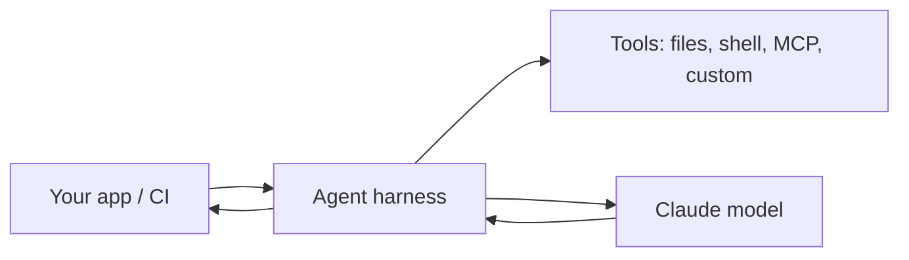

<LevelBadge level="advanced" />

<VerifyNote lastVerified="2026-06-20" source="https://docs.anthropic.com/en/docs/claude-code/sdk">
أسماء الـ SDK، وأسماء الحزم، وأعلام الوضع بلا واجهة تتطور — تأكد منها في وثائق Claude Agent SDK / Claude Code الرسمية.
</VerifyNote>

Claude Code ليس تفاعليًا فقط. يمكنك تشغيله **بلا واجهة (headless)** (غير تفاعلي، قابل للبرمجة بالسكربتات) ويمكنك بناء **وكلائك الخاصين** على الإطار (harness) الأساسي نفسه عبر **Agent SDK**.

## الوضع بلا واجهة

شغّل مطالبة واحدة بشكل غير تفاعلي والتقط المخرَج — مثالي للسكربتات، وخطافات ما قبل الـ commit، وCI:

```bash
claude -p "Review the staged diff and list any bugs as a Markdown checklist"
```

مرّر الإدخال، واحصل على نتيجة. اقرنه بـ[أذونات](/docs/claude-code/permissions) مضبوطة على وضع آمن وغير تفاعلي حتى لا يتعلق منتظرًا الموافقة أبدًا — و**أحكم إغلاقه** حتى لا يستطيع تشغيل مؤتمَت لمس الأسرار (راجع [تحصين عمليات التشغيل المستقلة](/docs/security/hardening-autonomous-runs)).

استخدام كلاسيكي: مهمة CI تجعل Claude يراجع كل طلب سحب (pull request) — راجع [الدليل التطبيقي لمراجعة طلبات السحب](/docs/walkthroughs/pr-review-action).

## حزمة تطوير الوكلاء (Agent SDK)

تتيح لك **Claude Agent SDK** (لـ Python و TypeScript) بناء وكلاء إنتاجيين على الحلقة نفسها التي تشغّل Claude Code — استخدام الأدوات، والوصول إلى الملفات/الصدفة، والأذونات، وإدارة السياق — لكن موصولة بتطبيقك *أنت*.



الجأ إليها عندما تتجاوز نداء API واحدًا أو حلقة مكتوبة يدويًا وتريد بيئة تشغيل وكيل متكاملة جاهزة. للاطلاع على طيف الخيارات — نداء واحد ← سير عمل ← وكيل مخصص ← مُدار — راجع [بناء الوكلاء على الـ API](/docs/api/building-agents).

## بلا واجهة/SDK مقابل التفاعلي

| الوضع | لِـ |
|---|---|
| Claude Code التفاعلي | التطوير اليومي مع وجود إنسان في الحلقة |
| بلا واجهة (`claude -p`) | السكربتات، وما قبل الـ commit، ومهام CI لمرة واحدة |
| Agent SDK | وكلاء إنتاجيون مدمجون في برمجياتك |

## التالي

- [GitHub Action يراجع كل طلب سحب (دليل تطبيقي)](/docs/walkthroughs/pr-review-action)
- [بناء الوكلاء على الـ API](/docs/api/building-agents)
- [تحصين عمليات التشغيل المستقلة](/docs/security/hardening-autonomous-runs)
