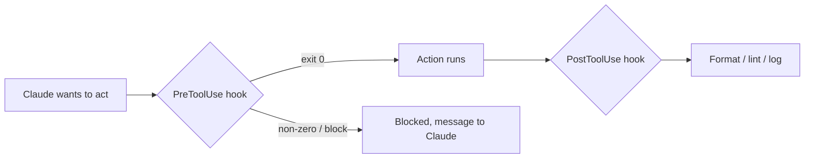

<LevelBadge level="advanced" />

<VerifyNote lastVerified="2026-06-23" source="https://code.claude.com/docs/en/hooks">
أسماء أحداث الخطافات الدقيقة، وحمولة stdin، وبروتوكول الحجب تتطور — تأكد منها مقابل وثائق الخطافات الرسمية قبل الاعتماد على حدث أو حقل محدد.
</VerifyNote>

الخطافات هي **أوامر صدفة (shell) يشغّلها Claude Code تلقائيًا** عند نقاط محددة في دورة حياته. وحيث تقرر [الأذونات](/docs/claude-code/permissions) *ما إذا كان* الإجراء مسموحًا، تتيح لك الخطافات تشغيل منطق حتمي حوله — تنسيق، وتحقق، وتسجيل، وبوابات. إنها الطريقة التي تجعل بها السلوك مضمونًا بدلًا من "من فضلك تذكّر أن تفعل".

## متى تلجأ إلى خطاف

- **تنسيق / فحص تلقائي** بعد كل تعديل ملف (`PostToolUse`).
- **حجب** إجراء يخالف قاعدة قبل تشغيله (`PreToolUse`).
- **إشعار أو تسجيل** عند انتهاء جلسة أو إنجاز مهمة (`Stop`).
- **حقن سياق** عند بدء الجلسة.

## كيف تعمل

تسجّل الخطافات في [`settings.json`](/docs/claude-code/settings)، مطابقًا **حدثًا** (وغالبًا مطابِق أداة). عندما يُطلق الحدث، يشغّل Claude أمرك، ممرِّرًا **حمولة JSON على stdin** (اسم الأداة ومدخلاتها والجلسة). رمز خروج أمرك ومخرجاته يقرران ما يحدث بعد ذلك.

```json
{
  "hooks": {
    "PostToolUse": [
      {
        "matcher": "Edit|Write",
        "hooks": [
          { "type": "command", "command": "jq -r '.tool_input.file_path' | xargs npx prettier --write" }
        ]
      }
    ]
  }
}
```

الخطاف أعلاه يقرأ مسار الملف المعدَّل من JSON الخاص بـ stdin (`.tool_input.file_path`) وينسّقه. لا تفترض أن متغير بيئة يحمل المسار — **اقرأه من stdin.** عناصر نائبة مفيدة للمسارات مثل `${CLAUDE_PROJECT_DIR}` *متوفرة* لتحديد مواقع السكربتات.

## كيف يحجب الخطاف

طريقتان، حسب الحدث:

- **رمز الخروج 2** — يُفشل الخطاف الإجراء، وما كتبه إلى **stderr** يصبح الرسالة التي يراها Claude. بسيط ويعمل مع خطافات الأوامر.
- **JSON على stdout (خروج 0)** — أعِد قرارًا منظمًا. بالنسبة لـ `PreToolUse`، يكون ذلك `permissionDecision` بقيمة `deny`؛ وبالنسبة لـ `PostToolUse`/`Stop`/إلخ يكون `{"decision": "block", "reason": "…"}`.

```bash
#!/usr/bin/env bash
# PreToolUse hook on the Bash tool: refuse to delete things.
command=$(jq -r '.tool_input.command' < /dev/stdin)
if [[ "$command" == rm\ * || "$command" == *"rm -rf"* ]]; then
  echo "Blocked: destructive 'rm' is not allowed by policy." >&2
  exit 2
fi
exit 0
```

## النموذج الذهني



## ممارسات جيدة

- **اجعل الخطافات سريعة ومتكافئة الأثر (idempotent)** — فهي تعمل كثيرًا.
- **افشل بصوت عالٍ عند المشكلات الحقيقية**، لكن لا تحجب على المسائل التجميلية.
- **عامل مخرجات الخطاف كملاحظات لـ Claude** — رسالة واضحة تساعده على التصحيح الذاتي.
- تعمل الخطافات بصلاحيات صدفتك — راجع أي خطاف لم تكتبه أنت ([مراجعة شيفرة الطرف الثالث](/docs/security/reviewing-third-party-code)).

## أخطاء شائعة

- **قراءة مسار الملف من متغير بيئة.** المسار موجود في JSON الخاص بـ stdin (`.tool_input.file_path`)، لا في `$CLAUDE_FILE_PATH`. مرّر stdin عبر `jq`.
- **حجب صامت.** إذا خرج خطاف `PreToolUse` بالرمز 2 دون شيء على stderr، فإن Claude محجوب لكنه لا يعرف *لماذا* ولا يستطيع التكيف. اكتب دائمًا سببًا واضحًا.
- **خطافات بطيئة.** يعمل خطاف `PostToolUse` بعد *كل* تعديل مطابق. مدقّق فحص يستغرق 3 ثوانٍ يجعل الجلسة كلها تبدو بطيئة — اجعل الخطافات سريعة، ومن الأفضل أن تعمل فقط على ما تغيّر.
- **مطابِقات واسعة أكثر من اللازم.** `matcher: ".*"` يُطلق على كل أداة. ضيّق بنطاق باسم دقيق، أو قائمة `Edit|Write`، أو حقل `if` لكل معالج (مثلًا `"if": "Bash(git push *)"`).
- **الوثوق بخطافات لم تكتبها.** يشغّل الخطاف صدفة تعسفية بصلاحياتك. راجع أي خطاف من إضافة أو قالب أولًا — انظر [مراجعة شيفرة الطرف الثالث](/docs/security/reviewing-third-party-code).

نقاط انطلاق جاهزة للنسخ واللصق في [وصفات الخطافات و settings.json](/docs/templates/hooks-settings).

## التالي

- [settings.json](/docs/claude-code/settings) · [الأذونات](/docs/claude-code/permissions)
- [المهارات](/docs/claude-code/skills) — الخبرة مقابل الأتمتة
- [تحصين عمليات التشغيل الذاتية](/docs/security/hardening-autonomous-runs)
