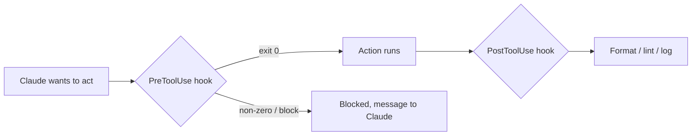

<LevelBadge level="advanced" />

<VerifyNote lastVerified="2026-06-20" source="https://docs.anthropic.com/en/docs/claude-code/hooks">
أسماء أحداث الخطافات المحددة ومخطط الإعداد يتطوران — تأكد من ذلك مقابل وثائق الخطافات الرسمية قبل الاعتماد على حدث محدد.
</VerifyNote>

الخطافات (hooks) هي **أوامر صدفة (shell) يشغّلها Claude Code تلقائيًا** عند نقاط محددة في دورة حياته. وحيث تقرر [الأذونات](/docs/claude-code/permissions) *ما إذا كان* الإجراء مسموحًا، تتيح الخطافات *لك* تشغيل منطق حتمي حوله — تنسيق، وتحقق، وتسجيل، وبوابات. إنها الطريقة التي تجعل بها السلوك مضمونًا بدلًا من "أرجو أن تتذكر."

## متى تلجأ إلى خطّاف

- **التنسيق / الفحص (lint) التلقائي** بعد كل تحرير ملف (`PostToolUse`).
- **منع** إجراء يخالف قاعدة قبل أن يعمل (`PreToolUse`).
- **الإشعار أو التسجيل** عند انتهاء جلسة أو إنجاز مهمة (`Stop`).
- **حقن سياق** عند بدء الجلسة.

## كيف تعمل

تسجّل الخطافات في [`settings.json`](/docs/claude-code/settings)، مطابقًا لـ**حدث** (وغالبًا مطابِق أداة matcher). عندما يُطلَق الحدث، يشغّل Claude أمرك ويقرأ نتيجته — يمكن لرمز خروج غير صفري أو مخرَج محدد أن **يمنع** الإجراء ويعيد رسالة إلى Claude.

```json
{
  "hooks": {
    "PostToolUse": [
      {
        "matcher": "Edit|Write",
        "hooks": [
          { "type": "command", "command": "npx prettier --write \"$CLAUDE_FILE_PATH\"" }
        ]
      }
    ]
  }
}
```

يستقبل الخطّاف السياق (مثل مسار الملف، واسم الأداة) عبر البيئة/الإدخال القياسي (stdin) — راجع الوثائق للحمولة المحددة، التي تختلف حسب الحدث.

## النموذج الذهني



## ممارسات جيدة

- **أبقِ الخطافات سريعة وعديمة الأثر الجانبي (idempotent)** — فهي تعمل كثيرًا.
- **أعلِن الفشل بصوت عالٍ عند المشكلات الحقيقية**، لكن لا تمنع بسبب مشكلات تجميلية.
- **عامل مخرَج الخطّاف كتغذية راجعة لـ Claude** — رسالة واضحة تساعده على التصحيح الذاتي.
- تعمل الخطافات بصلاحيات صدفتك — راجع أي خطّاف لم تكتبه ([مراجعة شيفرة الطرف الثالث](/docs/security/reviewing-third-party-code)).

نقاط البدء الجاهزة للنسخ واللصق في [وصفات Hooks وsettings.json](/docs/templates/hooks-settings).

## التالي

- [settings.json](/docs/claude-code/settings) · [الأذونات](/docs/claude-code/permissions)
- [المهارات](/docs/claude-code/skills) — الخبرة مقابل الأتمتة
- [تحصين عمليات التشغيل المستقلة](/docs/security/hardening-autonomous-runs)
