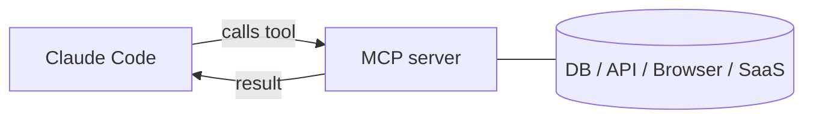

<LevelBadge level="advanced" />

<VerifyNote lastVerified="2026-06-23" source="https://code.claude.com/docs/en/mcp">
تتطور أوامر `claude mcp`، ونطاقات الإعداد، ووسائط النقل — تأكد من ذلك في وثائق MCP لـ Claude Code الرسمية وعلى modelcontextprotocol.io.
</VerifyNote>

**بروتوكول سياق النموذج (Model Context Protocol — MCP)** معيار مفتوح لربط الذكاء الاصطناعي بالأدوات والبيانات الخارجية. يكشف **خادم MCP** قدرات (الاستعلام من قاعدة بيانات، فتح طلب سحب على GitHub، قيادة متصفح)؛ ويتصل به Claude Code فيستطيع **استدعاء تلك الأدوات** أثناء الجلسة. إنها الطريقة التي تمدّ بها Claude إلى ما وراء نظام ملفاتك وصدفتك.

## الشكل العام



تعلن عن الخوادم التي يجوز لـ Claude استخدامها؛ وينشر كل خادم مجموعة من الأدوات مع مخططاتها؛ ويختارها Claude ويستدعيها مثل أي أداة أخرى.

## وسائط النقل

- **stdio** — عملية محلية يطلقها Claude (رائعة للأدوات/الـ CLIs المحلية).
- **عن بُعد (HTTP/SSE)** — خادم مستضاف، غالبًا مع OAuth.

## إعداد الخوادم

أسرع طريق هو أمر `claude mcp add` — فهو يكتب الإعداد نيابةً عنك:

```bash
# A local stdio server (everything after -- is the launch command)
claude mcp add github -- npx -y @modelcontextprotocol/server-github

# A remote HTTP server, shared with everyone on the project
claude mcp add --transport http --scope project linear https://mcp.linear.app/mcp
```

تحت الغطاء، هذا مجرد JSON. الخادم ذو النطاق **project** يستقر في ملف `.mcp.json` في جذر المستودع — أدرجه في نظام التحكم بالإصدارات فيحصل فريقك كله على الأدوات نفسها:

```json
{
  "mcpServers": {
    "github": { "command": "npx", "args": ["-y", "@modelcontextprotocol/server-github"] }
  }
}
```

**النطاق يحدّد من يرى الخادم:**

| النطاق | يوجد في | استخدمه لـ |
|---|---|---|
| `local` (الافتراضي) | إعداداتك الشخصية، هذا المشروع فقط | التجارب الشخصية، الأسرار |
| `project` | `.mcp.json` في المستودع (مُلتزَم به) | الأدوات التي ينبغي أن يتشاركها الفريق كله |
| `user` | إعداداتك الشخصية، كل المشاريع | الخوادم التي تريدها في كل مكان |

شغّل `claude mcp list` لمعرفة ما هو متصل، و`/mcp` داخل الجلسة لفحص الأدوات والمصادقة على الخوادم البعيدة. راجع [إعداد MCP وهياكل الخوادم](/docs/templates/mcp-config) لنقاط بدء جاهزة للنسخ واللصق.

## مثال عملي: امنح Claude قاعدة بياناتك

لنفترض أنك تريد أن يجيب Claude عن الأسئلة بالاعتماد على قاعدة Postgres محلية بدلاً من أن تلصق أنت نتائج الاستعلامات. أضف الخادم (بنطاق المشروع، حتى يرثه زملاؤك):

```bash
claude mcp add --scope project db -- npx -y @modelcontextprotocol/server-postgres "postgresql://localhost/app"
```

الآن يمكنك في الجلسة أن تسأل: *"كم عدد المستخدمين الذين سجّلوا الأسبوع الماضي؟ تحقّق من قاعدة البيانات."* يستدعي Claude أداة `query` الخاصة بالخادم، ويستعيد الصفوف، ويُجيب — دون حلقة نسخ ولصق. ولأنه بنطاق المشروع، فإن أي زميل يسحب المستودع يحصل على القدرة نفسها لحظة فتحه Claude Code. أبقِ سلسلة الاتصال للقراءة فقط إن كنت تريد عمليات القراءة فحسب.

## الثقة والأمان

:::warning عامل خوادم MCP كتثبيت برنامج
يشغّل خادم MCP شيفرة ويمكنه قراءة البيانات واتخاذ إجراءات. لا تصل إلا بالخوادم التي تثق بها، وامنحها **أقل صلاحية** لازمة، وتذكّر أن أي محتوى خارجي تعيده يمكن أن يحمل [حقن المطالبات (prompt injection)](/docs/security/prompt-injection). راجع خوادم الطرف الثالث أولًا — راجع [مراجعة شيفرة الطرف الثالث](/docs/security/reviewing-third-party-code).
:::

## MCP في التطبيقات أيضًا

يشغّل MCP أيضًا **الموصلات (Connectors)** في تطبيقات Claude — المعيار نفسه، سطح مختلف. راجع [الموصلات (MCP) في التطبيقات](/docs/claude-app/connectors)، وبالنسبة للـ API، [MCP والاتصال بالأدوات](/docs/api/mcp).

## الأخطاء الشائعة

- **النطاق الخاطئ.** الخادم المُضاف بنطاق `local` لن يظهر للزملاء؛ وما أردته لنفسك فقط لا ينبغي الالتزام به بنطاق `project`. اختر بقصد ووعي.
- **خوادم كثيرة جدًا، أدوات كثيرة جدًا.** يضيف كل خادم متصل مخططات أدواته إلى السياق. اتصل بما تحتاجه المهمة، لا بكامل فهرسك.
- **اتصالات مُفرطة الصلاحيات.** امنح خادم قاعدة البيانات دورًا للقراءة فقط ما لم يكن Claude بحاجة فعلية للكتابة. يجعل MCP القدرات حقيقية — فقلّص نطاقها.
- **نسيان خطر الحقن.** أي شيء يعيده الخادم (صفحة ويب، نص مشكلة، صف بيانات) هو نص غير موثوق قد يحمل [حقن المطالبات (prompt injection)](/docs/security/prompt-injection). لا تربط خادمًا قويًا قادرًا على الكتابة بجوار خادم غير موثوق قادر على القراءة دون تفكير متأنٍّ.

## التالي

- [ابنِ واربط خادم MCP الأول (دليل تطبيقي)](/docs/walkthroughs/first-mcp-server)
- [إعداد MCP وهياكل الخوادم](/docs/templates/mcp-config)
- [تأمين الوكلاء والأدوات](/docs/security/securing-agents)
