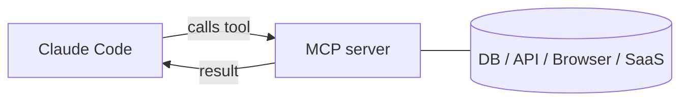

<LevelBadge level="advanced" />

<VerifyNote lastVerified="2026-06-20" source="https://code.claude.com/docs/en/mcp">
صياغة إعداد MCP، والنطاقات، ووسائط النقل تتطور — تأكد من ذلك في وثائق MCP لـ Claude Code الرسمية وعلى modelcontextprotocol.io.
</VerifyNote>

**بروتوكول سياق النموذج (Model Context Protocol — MCP)** معيار مفتوح لربط الذكاء الاصطناعي بالأدوات والبيانات الخارجية. يكشف **خادم MCP** قدرات (الاستعلام من قاعدة بيانات، فتح طلب سحب على GitHub، قيادة متصفح)؛ ويتصل به Claude Code فيستطيع **استدعاء تلك الأدوات** أثناء الجلسة. إنها الطريقة التي تمدّ بها Claude إلى ما وراء نظام ملفاتك وصدفتك.

## الشكل العام



تعلن عن الخوادم التي يجوز لـ Claude استخدامها؛ وينشر كل خادم مجموعة من الأدوات مع مخططاتها؛ ويختارها Claude ويستدعيها مثل أي أداة أخرى.

## وسائط النقل

- **stdio** — عملية محلية يطلقها Claude (رائعة للأدوات/الـ CLIs المحلية).
- **عن بُعد (HTTP/SSE)** — خادم مستضاف، غالبًا مع OAuth.

## إعداد الخوادم

تُعدّ الخوادم (عادةً في `.mcp.json` و/أو عبر الإعدادات) بأمر/عنوان URL وأي مصادقة. تتحكم النطاقات في أين يتوفر الخادم (لك وحدك، أو مشترك مع المشروع). راجع [إعداد MCP وهياكل الخوادم](/docs/templates/mcp-config) لنقاط بدء جاهزة للنسخ واللصق.

```json
{
  "mcpServers": {
    "github": { "command": "npx", "args": ["-y", "@modelcontextprotocol/server-github"] }
  }
}
```

## الثقة والأمان

:::warning عامل خوادم MCP كتثبيت برنامج
يشغّل خادم MCP شيفرة ويمكنه قراءة البيانات واتخاذ إجراءات. لا تصل إلا بالخوادم التي تثق بها، وامنحها **أقل صلاحية** لازمة، وتذكّر أن أي محتوى خارجي تعيده يمكن أن يحمل [حقن المطالبات (prompt injection)](/docs/security/prompt-injection). راجع خوادم الطرف الثالث أولًا — راجع [مراجعة شيفرة الطرف الثالث](/docs/security/reviewing-third-party-code).
:::

## MCP في التطبيقات أيضًا

يشغّل MCP أيضًا **الموصلات (Connectors)** في تطبيقات Claude — المعيار نفسه، سطح مختلف. راجع [الموصلات (MCP) في التطبيقات](/docs/claude-app/connectors)، وبالنسبة للـ API، [MCP والاتصال بالأدوات](/docs/api/mcp).

## التالي

- [ابنِ واربط خادم MCP الأول (دليل تطبيقي)](/docs/walkthroughs/first-mcp-server)
- [إعداد MCP وهياكل الخوادم](/docs/templates/mcp-config)
- [تأمين الوكلاء والأدوات](/docs/security/securing-agents)
