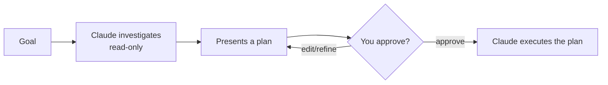

<LevelBadge level="beginner" />

<VerifyNote lastVerified="2026-06-20" source="https://code.claude.com/docs/en">
طريقة دخولك إلى وضع التخطيط (اختصار/علم) قد تتغير بين الإصدارات — راجع وثائق Claude Code الرسمية.
</VerifyNote>

يجعل **وضع التخطيط** Claude Code **قرائيًا فقط**: يمكنه استكشاف قاعدة شيفرتك، وتشغيل عمليات البحث، والاستدلال — لكنه **لن يحرّر الملفات أو يشغّل أوامر مغيّرة للحالة**. بل ينتج خطة وينتظر موافقتك.

## لماذا هي أكثر الطرق أمانًا للبدء

لأي شيء كبير أو محفوف بالمخاطر أو غير مألوف، تريد أن ترى *ما الذي* ينوي Claude فعله قبل أن يمسّ مستودعك. يفصل وضع التخطيط **التفكير** عن **التنفيذ**:

تكتشف الافتراضات الخاطئة *قبل* أن تصبح شيفرة خاطئة.

## متى تستخدمه

- **دائمًا** للتغييرات الكبيرة أو متعددة الملفات، أو عمليات النقل (migrations)، أو إعادة الهيكلة (refactors).
- عند العمل في قاعدة شيفرة لا تعرفها بالكامل بعد.
- عندما تريد خطة قابلة للمراجعة لمشاركتها مع زميل.

بالنسبة للتعديلات الصغيرة الواضحة يمكنك تخطّيه — لكن عند الشك، خطّط أولًا.

## كيف يعمل عمليًا

1. ادخل وضع التخطيط واذكر هدفك.
2. يقرأ Claude الملفات ذات الصلة ويطرح أسئلة توضيحية.
3. يعيد خطة خطوة بخطوة: الملفات المراد تغييرها، والنهج، وكيفية التحقق.
4. توافق (أو تنقّح). عندئذٍ فقط ينتقل إلى إجراء التغييرات.

:::tip اقرنه بـ CLAUDE.md
يجعل [CLAUDE.md](/docs/claude-code/claude-md) الجيد الخطط أكثر دقة — يخطط Claude وأعرافك وحواجزك الواقية حاضرة في ذهنه بالفعل.
:::

## وضع التخطيط مقابل الأذونات

يحلّان مشكلتين مختلفتين ويعملان معًا:

- **وضع التخطيط** = "حقّق واقترح، لا تتصرف بعد." (هذه الصفحة.)
- **[الأذونات](/docs/claude-code/permissions)** = بمجرد التصرف، *أي* الإجراءات مسموح بها دون سؤال.

## التالي

- [الأذونات وأوضاع الأذونات](/docs/claude-code/permissions)
- [إدارة السياق](/docs/claude-code/context-management) — أبقِ الجلسات الطويلة فعّالة
- [الدليل التطبيقي: تخصيص Claude Code لمستودع حقيقي](/docs/walkthroughs/customize-claude-code)
