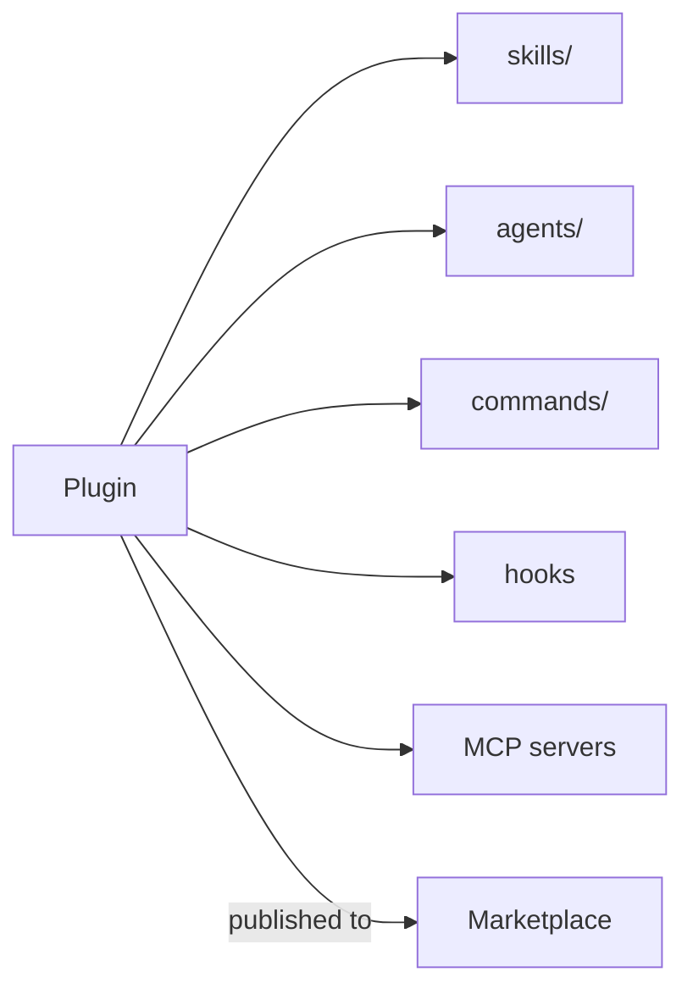

<LevelBadge level="advanced" />

<VerifyNote lastVerified="2026-06-20" source="https://docs.anthropic.com/en/docs/claude-code">
بنية الإضافات وآليات الأسواق تتطور بسرعة — تأكد من التفاصيل في وثائق Claude Code الرسمية.
</VerifyNote>

تجمع **الإضافة (plugin)** عدة تخصيصات — [المهارات](/docs/claude-code/skills)، و[الوكلاء الفرعيين](/docs/claude-code/subagents)، و[الأوامر المائلة](/docs/claude-code/slash-commands)، و[الخطافات](/docs/claude-code/hooks)، و[خوادم MCP](/docs/claude-code/mcp) — في وحدة واحدة مُصدَّرة وقابلة للتثبيت. أما **السوق (marketplace)** فهو فهرس من الإضافات يستطيع الناس اكتشافها وتثبيتها.

## لماذا تهم الإضافات

- **اشحن عُدّة الفريق في خطوة واحدة.** بدلًا من أن تطلب من الجميع نسخ خمسة ملفات، انشر إضافة؛ يثبّتها زملاؤك ويحصلون على الأوامر والخطافات والوكلاء واتصالات MCP نفسها.
- **إدارة الإصدارات.** حدّث الإضافة، ويسحب الجميع الإصدار الجديد.
- **التوزيع.** يجعل السوق عُدّتك (أو عُدّة الآخرين) قابلة للاكتشاف.

## ما الذي يوجد بداخلها عادةً

الإضافة عبارة عن مجلد مهيكل (ملف بيان manifest إضافةً إلى المكونات التي تشحنها). كحد أدنى يمكن أن تحمل المهارات فقط؛ وكحد أقصى، المجموعة الكاملة أعلاه. أبقِ كل إضافة **متماسكة** — إضافة لـ"أعراف الفريق"، وإضافة لـ"عُدّة Python" — بدلًا من خليط غير متجانس.

## الثقة قبل التثبيت

:::warning يمكن للإضافات أن تشحن شيفرة قابلة للتنفيذ
تعمل الخطافات وخوادم MCP في الإضافة بصلاحياتك. ثبّت من مصادر تثق بها وراجع ما تفعله الإضافة أولًا — راجع [مراجعة شيفرة الطرف الثالث](/docs/security/reviewing-third-party-code).
:::

## مسار لتوسيع إعدادك

التدرّج الطبيعي: ملف `CLAUDE.md` ← بضع [مهارات](/docs/claude-code/skills) و[أوامر](/docs/claude-code/slash-commands) ← اجمعها في إضافة ← انشرها في سوق لفريقك أو للمجتمع. تلك الخطوة الأخيرة جزء من الطريقة التي يريد بها AILmanac المساعدة في نمو المنظومة.

## التالي

- [المهارات](/docs/claude-code/skills) · [الوكلاء الفرعيون](/docs/claude-code/subagents) · [MCP](/docs/claude-code/mcp)
- [مراجعة شيفرة الطرف الثالث](/docs/security/reviewing-third-party-code)
- [حزم المهارات](/docs/templates/skills) من AILmanac
