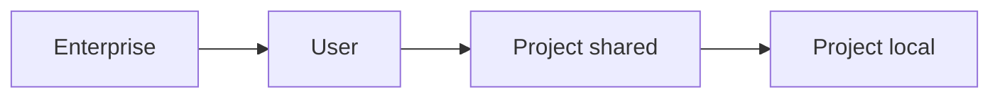

<LevelBadge level="intermediate" />

<VerifyNote lastVerified="2026-06-20" source="https://docs.anthropic.com/en/docs/claude-code/settings">
يُفضَّل التأكد من المفاتيح ومواقع الملفات المحددة في وثائق إعدادات Claude Code الرسمية.
</VerifyNote>

`settings.json` هو المكان الذي يوجد فيه إعداد Claude Code — [الأذونات](/docs/claude-code/permissions)، و[الخطافات](/docs/claude-code/hooks)، ومتغيرات البيئة، والنماذج الافتراضية، والمزيد. وفهم **الطبقات** هو المفتاح.

## الطبقات (من الأكثر عمومية ← إلى الأكثر تحديدًا)

تتجاوز الطبقات اللاحقة (الأكثر تحديدًا) السابقة:

1. **المؤسسة / المُدارة** — سياسة يضبطها مدير المؤسسة. تتفوق على كل شيء.
2. **المستخدم** — `~/.claude/settings.json`. افتراضاتك عبر جميع المشاريع.
3. **المشروع (المشترك)** — `.claude/settings.json`، مُودَع في المستودع. على مستوى الفريق.
4. **المشروع (الشخصي)** — `.claude/settings.local.json`، متجاهَل من git. تجاوزاتك لهذا المستودع.

:::tip أودِع الملف المشترك، وتجاهل الملف المحلي
ضع أعراف الفريق في `.claude/settings.json` (مُودَع). وضع التعديلات الشخصية والمسارات الخاصة بالجهاز في `.claude/settings.local.json` (متجاهَل من git). هذا يبقي الفريق متسقًا دون فرض تفضيلاتك على الآخرين.
:::

## ما الذي ستضبطه عادةً

- **`permissions`** — قواعد السماح/السؤال/الرفض. راجع [الأذونات](/docs/claude-code/permissions).
- **`hooks`** — أوامر تعمل عند أحداث دورة الحياة. راجع [الخطافات](/docs/claude-code/hooks).
- **`env`** — متغيرات البيئة للجلسة.
- **افتراضات النموذج / السلوك** — مثل النموذج المفضّل.

## التحرير بأمان

- أبقِه JSON صالحًا (فاصلة زائدة في النهاية ستُعطّله).
- فضّل قواعد الأذونات **الضيقة** على الواسعة.
- لا تضع أسرارًا أبدًا في ملف مُودَع — استخدم مراجع `env` أو مدير أسرار.

توجد ملفات بدء جاهزة للنسخ في [وصفات Hooks وsettings.json](/docs/templates/hooks-settings).

## التالي

- [الأذونات وأوضاع الأذونات](/docs/claude-code/permissions)
- [الخطافات: أتمتة حتمية](/docs/claude-code/hooks)
- [الأوامر المائلة المخصصة](/docs/claude-code/slash-commands)
