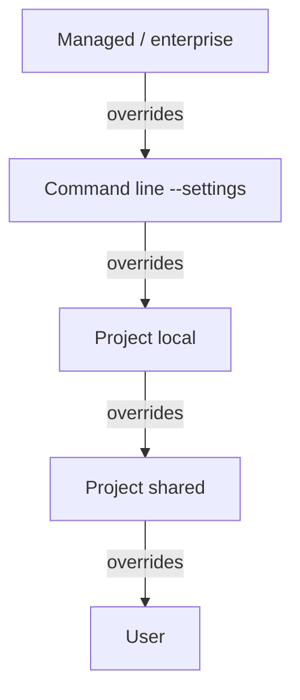

<LevelBadge level="intermediate" />

<VerifyNote lastVerified="2026-09-23" source="https://code.claude.com/docs/en/settings">
مكدس أسبقية من خمسة مستويات (مُدار ← سطر الأوامر ← مشروع محلي ← مشروع مشترك ← مستخدم) وقاعدة "متغيرات البيئة ليست مستوى" من الصفحة الرسمية [Settings files and precedence](https://code.claude.com/docs/en/settings). التجاوزات لكل مفتاح مذكورة في [مرجع الإعدادات](https://code.claude.com/docs/en/settings-reference).
</VerifyNote>

`settings.json` هو المكان الذي يوجد فيه إعداد Claude Code — [الأذونات](/docs/claude-code/permissions)، و[الخطافات](/docs/claude-code/hooks)، ومتغيرات البيئة، والنماذج الافتراضية، والمزيد. وفهم **الطبقات** هو المفتاح.

## الطبقات (الأعلى أسبقية أولًا)

عندما يُضبط المفتاح نفسه في أكثر من مكان، يستخدم Claude Code القيمة من أعلى مستوى يضبطه:

1. **مُدار / مؤسسي** — `managed-settings.json` أو سياسة MDM أو الإعدادات المُدارة من الخادم عبر وحدة تحكم claude.ai. لا شيء تضبطه يتجاوزها (باستثناء حالات قليلة حساسة أمنيًا).
2. **سطر الأوامر** — `claude --settings '<json-or-path>'`، لجلسة واحدة فقط. يأتي فوق كل ملف عدا المُدار، ولا يكتب في أي ملف.
3. **المشروع (شخصي)** — `.claude/settings.local.json`، مستثنى من git. تجاوزاتك لهذا المستودع.
4. **المشروع (مشترك)** — `.claude/settings.json`، مُودع في المستودع. لكل الفريق.
5. **المستخدم** — `~/.claude/settings.json`. إعداداتك الافتراضية في كل المشاريع.

```mermaid
flowchart TB
  M[Managed / enterprise] -->|overrides| C[Command line --settings]
  C -->|overrides| L[Project local]
  L -->|overrides| P[Project shared]
  P -->|overrides| U[User]
```

:::note متغيرات البيئة ليست طبقة
هي خارج هذا المكدس وتُحسم لكل مفتاح على حدة. على سبيل المثال، ينطبق `ANTHROPIC_MODEL` فوق مفتاح `model` من أي ملف، بينما ينطبق `ANTHROPIC_DEFAULT_MODEL` فقط عندما لا يضبط أي ملف `model`.
:::

:::tip أودِع الملف المشترك، وتجاهل الملف المحلي
ضع أعراف الفريق في `.claude/settings.json` (مُودَع). وضع التعديلات الشخصية والمسارات الخاصة بالجهاز في `.claude/settings.local.json` (متجاهَل من git). هذا يبقي الفريق متسقًا دون فرض تفضيلاتك على الآخرين.
:::

## ما الذي ستضبطه عادةً

- **`permissions`** — قواعد السماح/السؤال/الرفض. راجع [الأذونات](/docs/claude-code/permissions).
- **`hooks`** — أوامر تعمل عند أحداث دورة الحياة. راجع [الخطافات](/docs/claude-code/hooks).
- **`env`** — متغيرات البيئة للجلسة.
- **افتراضات النموذج / السلوك** — مثل النموذج المفضّل.

## التحرير بأمان

- أبقِه JSON صالحًا (فاصلة زائدة في النهاية ستُعطّله).
- فضّل قواعد الأذونات **الضيقة** على الواسعة.
- لا تضع أسرارًا أبدًا في ملف مُودَع — استخدم مراجع `env` أو مدير أسرار.

توجد ملفات بدء جاهزة للنسخ في [وصفات Hooks وsettings.json](/docs/templates/hooks-settings).

## التالي

- [الأذونات وأوضاع الأذونات](/docs/claude-code/permissions)
- [الخطافات: أتمتة حتمية](/docs/claude-code/hooks)
- [الأوامر المائلة المخصصة](/docs/claude-code/slash-commands)
