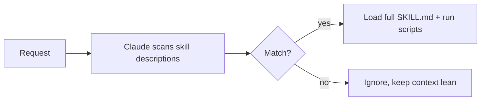

<LevelBadge level="advanced" />

<VerifyNote lastVerified="2026-06-23" source="https://code.claude.com/docs/en/skills">
تخطيط ملف المهارة، والكشف التدريجي، وأين تعمل المهارات (Claude Code، Claude.ai، Cowork) تتطور — تأكد من ذلك في وثائق المهارات الرسمية.
</VerifyNote>

**المهارة** تحزّم خبرة — تعليمات إضافةً إلى سكربتات وموارد اختيارية — يحمّلها Claude **فقط عندما تكون ذات صلة**. فبدلًا من حشو كل شيء في [CLAUDE.md](/docs/claude-code/claude-md)، تمنح Claude مكتبة من القدرات يسحبها عند الطلب.

## التشريح

المهارة هي مجلد به `SKILL.md`: واجهة أمامية YAML + تعليمات.

```markdown
---
name: pdf-forms
description: Use when the user needs to fill, read, or generate PDF forms.
---

# PDF Forms
Steps and rules for working with PDF forms…
(optionally reference scripts/ or resources/ in this folder)
```

**حقل `description` هو المُحفّز** — يقرؤه Claude ليقرر *متى* يفعّل المهارة. اكتبه على هيئة "Use when…"، محددًا بما يكفي ليُحمَّل في الوقت الصحيح ولا يُحمَّل في غيره.

## الكشف التدريجي (لماذا تتوسع المهارات)

لا يحمّل Claude المتن الكامل لكل مهارة مقدمًا — بل يرى `name` + `description` الخفيفين، ولا يسحب التعليمات الكاملة (ويشغّل السكربتات) إلا عندما يطابق طلب ما. هذا يبقي السياق خفيفًا حتى مع تثبيت مهارات كثيرة.



## أين تقيم

- شخصي: `~/.claude/skills/<name>/SKILL.md`
- مشروع (قابل للمشاركة): `.claude/skills/<name>/SKILL.md`
- مُحزّمة في [إضافة](/docs/claude-code/plugins-marketplaces) لتوزيعها على الفريق.

يأتي AILmanac مزوّدًا بـ [7 حزم مهارات جاهزة](/docs/templates/skills) — انسخ واحدة لتجربتها.

## مثال عملي: مهارة تُحفّز نفسها

أنشئ `~/.claude/skills/release-notes/SKILL.md`:

```markdown
---
name: release-notes
description: Use when the user asks to write release notes or a changelog from git history.
---

# Release Notes
1. Run `git log <last-tag>..HEAD --oneline` to get the commits.
2. Group them into Features / Fixes / Breaking changes.
3. Write user-facing notes — what changed for *users*, not commit messages.
4. Output Markdown ready to paste into a GitHub release.
```

لاحقًا تكتب: *"اكتب مسودة ملاحظات إصدار منذ v1.4."* لم يكن لدى Claude هذه الخطوات في السياق إطلاقًا — لكن الطلب يطابق حقل `description`، فيسحب `SKILL.md` الكامل، ويشغّل `git log`، وينتج ملاحظات مجمَّعة. لم تستدعِ شيئًا بالاسم؛ **الوصف هو الذي قام بالتوجيه**. أضف ملف `scripts/` في المجلد نفسه فتستطيع المهارة تشغيله كجزء من الخطوة 1.

## المهارة مقابل الأمر مقابل الوكيل الفرعي مقابل MCP

| الأداة | ما هي | أنت أم Claude يُحفّز |
|---|---|---|
| [أمر شرطة مائلة](/docs/claude-code/slash-commands) | موجّه محفوظ | **أنت** تستدعيه |
| **المهارة** | خبرة عند الطلب + سكربتات | **Claude** يحمّلها عند الصلة |
| [الوكيل الفرعي](/docs/claude-code/subagents) | وكيل مُفوَّض له سياقه الخاص | Claude يفوّض |
| [MCP](/docs/claude-code/mcp) | اتصال بأدوات/بيانات خارجية | يوفّر أدوات للاستدعاء |

قاعدة عامة: **أنت** تريد إطلاقه عند الطلب ← أمر شرطة مائلة. **Claude** ينبغي أن يعرف الإجراء ويطبّقه عند الصلة ← مهارة. العمل ينبغي أن يحدث في سياق منفصل ← وكيل فرعي. تحتاج إلى الوصول إلى نظام خارجي ← MCP.

## أخطاء شائعة

- **وصف لا يُحفّز.** "Helps with PDFs" غامض جدًا؛ أما "Use when the user needs to fill, read, or generate PDF forms" فيخبر Claude بالضبط متى يحمّله. الوصف هو آلية التفعيل بأكملها — اكتبه للمطابقة، لا للبشر.
- **وضع كل شيء في CLAUDE.md بدلًا من ذلك.** [CLAUDE.md](/docs/claude-code/claude-md) يُحمَّل في *كل* جلسة ويكلّف سياقًا دائمًا؛ أما المهارة فتُحمَّل *فقط عند الصلة*. انقل الإجراءات الظرفية إلى مهارات واحتفظ بـ CLAUDE.md لقواعد المشروع الصحيحة دائمًا.
- **مهارة عملاقة واحدة.** مهارات صغيرة كثيرة موصوفة بدقة توجِّه أفضل من مهارة واحدة شاملة — الكشف التدريجي لا يفيد إلا إذا كان كل وصف محددًا.
- **نسيان أنها قابلة للمشاركة.** مهارة مشروع في `.claude/skills/` مُدرَجة في git تمنح الفريق كله القدرة؛ أما المهارة الشخصية في `~/.claude/skills/` فتبقى لك.

## التالي

- [اكتب أول مهارة لك (شرح تفصيلي)](/docs/walkthroughs/first-skill)
- [قوالب SKILL.md](/docs/templates/skills)
- [الإضافات والأسواق](/docs/claude-code/plugins-marketplaces)
