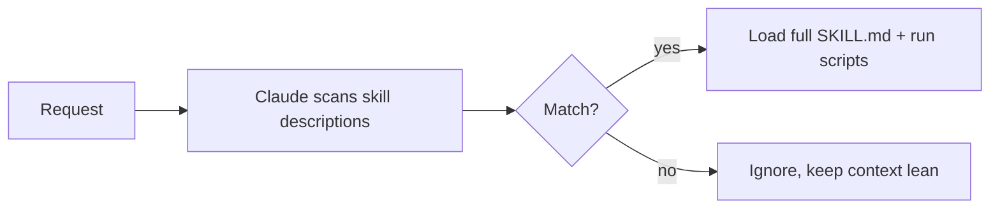

<LevelBadge level="advanced" />

<VerifyNote lastVerified="2026-06-20" source="https://code.claude.com/docs/en/skills">
تخطيط ملفات المهارات وأين تعمل المهارات (Claude Code، Claude.ai، Cowork) يتطوران — تأكد من ذلك في وثائق المهارات الرسمية.
</VerifyNote>

تحزّم **المهارة (Skill)** خبرةً — تعليمات إضافةً إلى سكربتات وموارد اختيارية — يحمّلها Claude **فقط عندما تكون ذات صلة**. بدلًا من حشو كل شيء في [CLAUDE.md](/docs/claude-code/claude-md)، تعطي Claude مكتبة من القدرات يسحبها عند الطلب.

## التشريح

المهارة عبارة عن مجلد يحوي ملف `SKILL.md`: واجهة YAML أمامية (frontmatter) + تعليمات.

```markdown
---
name: pdf-forms
description: Use when the user needs to fill, read, or generate PDF forms.
---

# PDF Forms
Steps and rules for working with PDF forms…
(optionally reference scripts/ or resources/ in this folder)
```

**`description` هو المُحفِّز** — يقرؤه Claude ليقرر *متى* يفعّل المهارة. اكتبه على هيئة "Use when…"، محددًا بما يكفي ليُحمَّل في الوقت المناسب وليس في غيره.

## الكشف التدريجي (لماذا تتوسع المهارات)

لا يحمّل Claude متن كل مهارة كاملًا مقدمًا — فهو يرى الـ `name` + `description` خفيفي الوزن، ولا يسحب التعليمات الكاملة (ويشغّل السكربتات) إلا عندما يطابق طلبٌ ما. هذا يبقي السياق رشيقًا حتى مع تثبيت العديد من المهارات.



## أين توجد

- شخصية: `~/.claude/skills/<name>/SKILL.md`
- المشروع (قابلة للمشاركة): `.claude/skills/<name>/SKILL.md`
- مُحزَّمة في [إضافة](/docs/claude-code/plugins-marketplaces) للتوزيع على الفريق.

يشحن AILmanac [7 حزم مهارات جاهزة](/docs/templates/skills) — انسخ واحدة لتجربتها.

## المهارة مقابل الأمر مقابل الوكيل الفرعي مقابل MCP

| الأداة | ما هي | مَن يحفّزها: أنت أم Claude |
|---|---|---|
| [الأمر المائل](/docs/claude-code/slash-commands) | مطالبة محفوظة | **أنت** تستدعيه |
| **المهارة** | خبرة عند الطلب + سكربتات | **Claude** يحمّلها عند الصلة |
| [الوكيل الفرعي](/docs/claude-code/subagents) | وكيل مُفوَّض بسياقه الخاص | Claude يفوّض |
| [MCP](/docs/claude-code/mcp) | اتصال بأدوات/بيانات خارجية | يوفّر أدوات للاستدعاء |

## التالي

- [اكتب مهارتك الأولى (دليل تطبيقي)](/docs/walkthroughs/first-skill)
- [قوالب SKILL.md](/docs/templates/skills)
- [الإضافات والأسواق](/docs/claude-code/plugins-marketplaces)
