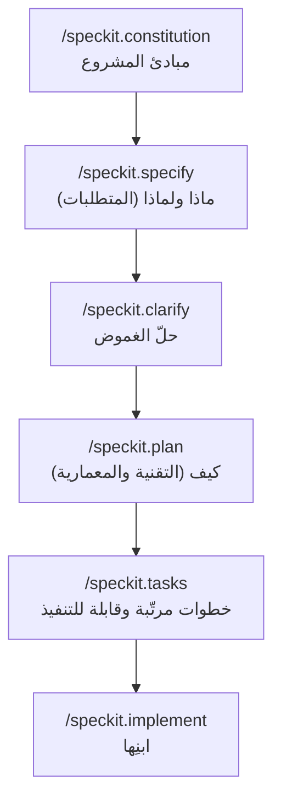

<LevelBadge level="intermediate" />

# التطوير المبني على المواصفات مع Spec Kit

البرمجة الارتجالية — "ابنِ لي لوحة تحكم"، وتقبّل أيًّا كان ما يُعاد إليك — تعمل بشكل رائع حتى تكبر الميزة. عندها ينحرف الوكيل: ينسى قرارًا سابقًا، أو يعيد اختراع دالة، أو يطرح شيئًا يعمل تقنيًا لكنه ليس ما قصدته. **التطوير المبني على المواصفات (SDD)** هو الحلّ الذي انتشر بين أوساط البرمجة الوكيلية في 2026: بدلًا من التعامل مع الموجّه باعتباره قابلًا للرمي، تجعل **مواصفة مكتوبة وقابلة للمراجعة هي مصدر الحقيقة** وتدع الوكيل يولّد الشيفرة *انطلاقًا* منها.

تحوّل **[Spec Kit](https://github.com/github/spec-kit)** مفتوح المصدر من GitHub هذه الفكرة إلى سير عمل ملموس يمكنك تشغيله داخل Claude Code اليوم.

<Callout type="objectives" items={["فهم ما هو التطوير المبني على المواصفات والمشكلة التي يحلّها", "اجتياز مراحل Spec Kit: الدستور ← التحديد ← التخطيط ← المهام ← التنفيذ", "تثبيت أداة Specify CLI وربطها داخل Claude Code", "معرفة بوّابات الجودة الاختيارية (التوضيح، التحليل، قائمة التحقق)", "تحديد متى يستحق SDD العبء الإضافي ومتى تتخطّاه"]} />

<VerifyNote lastVerified="2026-06-28" source="https://github.com/github/spec-kit">
يتحرك Spec Kit بسرعة (~116k★، مرخّص بموجب MIT). تتغيّر أسماء الأوامر، وراية اختيار الوكيل في `specify init`، والأدوات المدعومة بين الإصدارات — تأكّد من دليل البدء السريع الحالي في ملف README الخاص بالمستودع قبل الاعتماد على بنية محدّدة. تستخدم أسماء أوامر الشرطة المائلة أدناه فضاء الأسماء `/speckit.*` المُقدَّم في الإصدارات الأخيرة.
</VerifyNote>

## لماذا المواصفات وليس مجرّد موجّهات

الموجّه يختفي لحظة انتهاء الدور. أما **المواصفة فهي مُنتَج**: يمكن قراءتها ومراجعتها في طلب سحب وتصحيحها وإعادة تشغيلها. هذا التحوّل الوحيد يصلح الطرق الثلاث التي تنحرف بها عمليات البناء الوكيلية الكبيرة:

- **الانحراف** — يناقض الوكيل قرارًا سابقًا لأن لا شيء دوّنه. المواصفة هي الذاكرة.
- **الغموض** — "اجعله لطيفًا" يعني عشرة أشياء مختلفة. إجبار المتطلبات على هيئة نثر يُبرز الثغرات *قبل* وجود الشيفرة، حيث يكون إصلاحها رخيصًا.
- **الفروق غير القابلة للمراجعة** — من الصعب الحكم على طلب سحب مُولَّد من 2000 سطر. المواصفة + الخطة المراجَعتان تجعلان الفرق *متوقّعًا* بدلًا من أن يكون مفاجئًا.

النموذج الذهني: **النيّة هي الشيء عالي القيمة والدائم؛ والشيفرة مُنتَج لاحق وقابل لإعادة التوليد.** SDD هو ابن العمّ المنضبط لـ[Plan Mode](/docs/claude-code/plan-mode) الخاص بـ Claude Code — خطّط أولًا، ثم ابنِ — موسّعًا إلى ميزة كاملة ومحفوظًا في ملفات داخل مستودعك.

## سير عمل Spec Kit

ينظّم Spec Kit الميزة كخطّ أنابيب قصير من أوامر الشرطة المائلة. كل واحد منها يكتب مُنتَجات Markdown داخل مستودعك (تحت `.specify/`)، فتكون كل مرحلة قابلة للفحص وخاضعة للتحكم بالإصدارات.

<Steps items={[{title: "Constitution", body: "شغّل /speckit.constitution مرة واحدة لكل مشروع. يكتب المبادئ الحاكمة — نمط الشيفرة، حدّ الاختبارات، الثوابت المعمارية غير القابلة للتفاوض — في .specify/memory/constitution.md. تُفحَص كل مرحلة لاحقة مقابله، فهو حاجز الحماية الدائم لديك (اعتبره ملف CLAUDE.md مركّزًا على المبادئ)."}, {title: "Specify", body: "شغّل /speckit.specify وصِف ماذا تبني ولماذا — قصص المستخدمين، المتطلبات، معايير النجاح. وعمدًا ليس مكدّس التقنيات. يُنتج الوكيل مواصفة منظّمة تقرؤها وتصحّحها قبل المضيّ قُدمًا."}, {title: "Plan", body: "شغّل /speckit.plan مع خياراتك التقنية — إطار العمل، مخزن البيانات، القيود. الآن يُكتب الكيف: المعمارية، المكوّنات، وكيف تلبّي المواصفة. تعيش القرارات التقنية هنا، لا في المواصفة، فتبقى المواصفة محايدة عن التنفيذ."}, {title: "Tasks", body: "شغّل /speckit.tasks لتفكيك الخطة إلى قائمة مرقّمة ومرتّبة من خطوات صغيرة قابلة للمراجعة فرديًا. هذا ما يجعل البناء قابلًا للتدقيق — يمكنك رؤية التسلسل قبل كتابة أي شيفرة."}, {title: "Implement", body: "شغّل /speckit.implement فينفّذ الوكيل قائمة المهام، بانيًا الميزة مقابل الخطة والدستور. ولأن كل مرحلة سابقة قد روجعت، يكون الفرق الناتج متوقّعًا لا مفاجئًا."}]} />

### بوّابات الجودة الاختيارية

ثلاثة أوامر إضافية تُحكم الحلقة عندما تكون الميزة عالية المخاطر:

- **`/speckit.clarify`** — يستجوب المواصفة بحثًا عن المناطق غير المحدّدة بدقّة ويطرح عليك أسئلة موجّهة *قبل* التخطيط. الأفضل تشغيله مباشرة بعد `specify`.
- **`/speckit.analyze`** — يتحقق متقاطعًا من المواصفة والخطة والمهام بحثًا عن الاتساق وثغرات التغطية.
- **`/speckit.checklist`** — يولّد قائمة تحقق للتحقق بحيث يكون "المُنجَز" مُعرَّفًا وقابلًا للاختبار.

<Callout type="tip" items={["شغّل /speckit.clarify قبل /speckit.plan — إصلاح الغموض أرخص ما يكون قبل تثبيت المعمارية.", "تعامل مع كل مُنتَج مُولَّد كأنه طلب سحب: اقرأه، صحّحه، وعندئذٍ فقط انتقل إلى المرحلة التالية.", "أودِع مُنتَجات .specify/ — فهي السجلّ القابل للمراجعة للنيّة الكامنة وراء الشيفرة."]} />

## شغّله مع Claude Code

يأتي Spec Kit مع أداة سطر أوامر، **Specify**، تُنشئ سقالة أوامر الشرطة المائلة داخل مشروعك. وهو يدعم أكثر من 30 وكيل برمجة، ومن بينها Claude Code.

<Steps items={[{title: "ثبّت أداة Specify CLI", body: "استخدم uv لتثبيتها من المستودع. (مطلوب Python + uv.)"}, {title: "هيّئ مشروعًا", body: "أنشئ سقالة بنية .specify/ وأوامر الوكيل. شغّل init في مستودع جديد أو قائم؛ وعند المطالبة، اختر Claude Code كوكيلك (أو مرّر راية التكامل الحالية من README)."}, {title: "افتح Claude Code وتحقق من الأوامر", body: "أطلق claude في مجلد المشروع. ستعرف أنه مربوط عندما تظهر /speckit.constitution و /speckit.specify و /speckit.plan و /speckit.tasks و /speckit.implement كأوامر شرطة مائلة."}]} />

<PromptCard title="Install the Specify CLI (uv)">{`uv tool install specify-cli --from git+https://github.com/github/spec-kit.git`}</PromptCard>

<PromptCard title="Scaffold spec-driven workflow into a project">{`# new project
specify init my-feature

# or in the current repo
specify init --here`}</PromptCard>

<PromptCard title="Then, inside Claude Code, run the pipeline">{`/speckit.constitution Establish principles: TypeScript strict, tests for every public function, no secrets in code.
/speckit.specify Build a CSV export for the reports page: users pick a date range and download a CSV of matching rows.
/speckit.clarify
/speckit.plan Next.js App Router, server action for the query, stream the CSV; no new dependencies.
/speckit.tasks
/speckit.implement`}</PromptCard>

<Callout type="warning" items={["تتغيّر راية اختيار الوكيل الدقيقة لـ specify init بين الإصدارات — راجع دليل البدء السريع في README بدلًا من نسخ راية بشكل أعمى.", "لا يلغي SDD الحاجة إلى التحقق: اقرأ الشيفرة المُولَّدة وشغّلها. المواصفة تجعل الفرق قابلًا للمراجعة، لا صحيحًا تلقائيًا.", "لا تضع أبدًا أسرارًا أو بيانات اعتماد في المواصفة أو الخطة أو الدستور — فهي تُودَع كأي ملف آخر."]} />

## متى تستخدمه (ومتى لا)

يبادل SDD المراسم المسبقة بالتحكّم. تلك المبادلة تستحق العناء حين يكون العمل كبيرًا أو غامضًا أو يجب أن يراجعه آخرون — وعبءٌ صرف حين لا يكون كذلك.

<Callout type="info" items={["لجأ إلى SDD: الميزات الحديثة من الصفر، عمليات البناء متعددة الملفات، أي شيء يجب أن يراجعه زميل، أو عمل ستسلّمه لأسطول من الوكلاء الفرعيين.", "تخطَّ SDD: السكربتات لمرة واحدة، الإصلاحات الصغيرة، الشيفرة الاستكشافية القابلة للرمي — موجّه بسيط أو Plan Mode أسرع.", "العمل على الشيفرة القائمة يصلح أيضًا: وجّه /speckit.specify نحو تحسين لقاعدة شيفرة قائمة، لا للمشاريع الجديدة فقط."]} />

<Flashcards title="SDD at a glance" cards={[{front: "ما مصدر الحقيقة في SDD؟", back: "المواصفة المكتوبة. والشيفرة مُنتَج قابل لإعادة التوليد لاحق لها."}, {front: "ماذا يفعل /speckit.constitution؟", back: "يكتب مبادئ مشروع دائمة (النمط، حدّ الاختبارات، قواعد المعمارية) تُفحَص كل مرحلة لاحقة مقابلها."}, {front: "أين تنتمي قرارات مكدّس التقنيات؟", back: "في /speckit.plan — لا في المواصفة. تبقى المواصفة محايدة عن التنفيذ (ماذا ولماذا)؛ والخطة هي الكيف."}, {front: "ما الذي يجعل بناء Spec Kit قابلًا للتدقيق؟", back: "ينتج /speckit.tasks قائمة مهام مرتّبة وقابلة للمراجعة قبل كتابة أي شيفرة، وتكتب كل مرحلة مُنتَجات Markdown قابلة للفحص."}, {front: "متى يجب ألّا تستخدم SDD؟", back: "السكربتات لمرة واحدة، الإصلاحات الصغيرة، أو الاستكشاف القابل للرمي — المراسم تكلّف أكثر مما توفّره."}]} />

## اختبر نفسك

<Quiz title="Check yourself" questions={[{q: "ما الفكرة الجوهرية للتطوير المبني على المواصفات؟", options: ["كتابة موجّهات أكثر تفصيلًا لمرة واحدة", "جعل مواصفة قابلة للمراجعة مصدر الحقيقة وتوليد الشيفرة منها", "تخطّي التخطيط ودع الوكيل يرتجل"], answer: 1, explain: "يعامل SDD النيّة باعتبارها المُنتَج الدائم عالي القيمة والشيفرة كمخرَج لاحق قابل لإعادة التوليد — عكس البرمجة الارتجالية بموجّه قابل للرمي."}, {q: "أي مرحلة من Spec Kit يجب أن تلتقط مكدّس التقنيات والمعمارية؟", options: ["/speckit.specify", "/speckit.plan", "/speckit.constitution"], answer: 1, explain: "تصف specify ماذا ولماذا (محايدة عن التنفيذ)؛ وplan هي المكان الذي يُحسم فيه الكيف — إطار العمل، مخزن البيانات، المعمارية."}, {q: "متى لا يستحق التطوير المبني على المواصفات العبء الإضافي؟", options: ["ميزة حديثة من الصفر متعددة الملفات يجب أن يراجعها زميل", "سكربت من سطر واحد قابل للرمي أو إصلاح صغير", "أي عمل ستسلّمه للوكلاء الفرعيين"], answer: 1, explain: "تؤتي مراسم SDD المسبقة ثمارها في العمل الكبير أو الغامض أو المراجَع. أما لإصلاح تافه، فموجّه بسيط أو Plan Mode أسرع."}]} />

<Callout type="takeaways" items={["يجعل التطوير المبني على المواصفات مواصفةً قابلة للمراجعة — لا الموجّه — مصدر الحقيقة، قاتلًا الانحراف والغموض والفروق غير القابلة للمراجعة.", "يجلب Spec Kit من GitHub (أداة Specify CLI) نهج SDD إلى Claude Code كأوامر شرطة مائلة /speckit.*.", "خطّ الأنابيب هو constitution ← specify ← (clarify) ← plan ← (analyze) ← tasks ← (checklist) ← implement، وكل منها يكتب مُنتَجات قابلة للفحص.", "أبقِ الماذا/اللماذا في المواصفة والكيف في الخطة؛ وراجع كل مُنتَج كأنه طلب سحب قبل المضيّ.", "استخدمه للميزات الكبيرة أو الغامضة أو المراجَعة؛ وتخطّاه للعمل القابل للرمي — ودائمًا تحقّق مع ذلك من الشيفرة المُولَّدة."]} />

## التالي

- [Plan Mode](/docs/claude-code/plan-mode) — الحلقة المدمجة الأخفّ "خطّط قبل أن تبني"
- [Slash Commands](/docs/claude-code/slash-commands) — كيف تتوافق أوامر /speckit.* مع نظام أوامر Claude Code
- [CLAUDE.md & Memory Files](/docs/claude-code/claude-md) — فكرة المبادئ-كذاكرة الكامنة وراء الدستور
- [Subagents](/docs/claude-code/subagents) — سلّم قائمة مهام مراجَعة إلى أسطول من الوكلاء
- [Coding & Software Development](/docs/playbooks/coding) — عقلية تحقّق-من-كل-شيء التي يعتمد عليها SDD

## المصادر وقراءات إضافية

- [github/spec-kit — Toolkit for Spec-Driven Development](https://github.com/github/spec-kit) (MIT)
- [Spec Kit README & quickstart](https://github.com/github/spec-kit/blob/main/README.md)
- [Anthropic — Plan Mode in Claude Code](https://code.claude.com/docs/en/interactive-mode)
