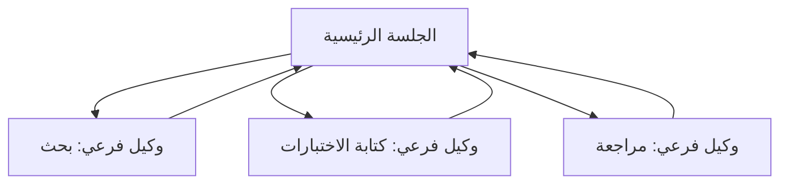

<LevelBadge level="advanced" />

<VerifyNote lastVerified="2026-06-23" source="https://code.claude.com/docs/en/sub-agents">
حقول الواجهة الأمامية للوكيل الفرعي، ومجموعة الوكلاء المدمجة، وواجهة `/agents` تتغير بمرور الوقت — تأكد من ذلك في الوثائق الرسمية.
</VerifyNote>

**الوكيل الفرعي** هو نسخة منفصلة من Claude لها **نافذة سياق خاصة بها** و**مجموعة أدوات محددة النطاق**، تفوّض إليها جلستك الرئيسية جزءًا من العمل. وهو يبلّغ عن نتيجة، لا عن نصّه الكامل — لذا تبقى الجلسة الرئيسية مركّزة وغير مزدحمة.

## لماذا التفويض

- **احمِ السياق الرئيسي.** يمكن أن يستهلك بحث معمّق أو مسح ملفات كبير آلاف الرموز؛ نفّذه في وكيل فرعي ولن يعود إلا الاستنتاج.
- **التخصص.** امنح الوكيل الفرعي موجّه نظام مخصصًا والأدوات التي يحتاجها فقط (مثلًا مراجِع للقراءة فقط).
- **التوازي.** نفّذ مهام فرعية مستقلة في آن واحد — مثلًا استكشف ثلاث وحدات في وقت واحد.



## المدمجون الذين تملكهم بالفعل

قبل أن تعرّف وكلاءك الخاصين، اعلم أن Claude Code يأتي مزوّدًا بوكلاء فرعيين يفوّض إليهم تلقائيًا:

- **Explore** — وكيل سريع للقراءة فقط (يعمل على نموذج أرخص) للبحث وفهم قاعدة الشيفرة دون المساس بها.
- **Plan** — يجمع السياق أثناء وضع التخطيط بحيث يبقى البحث خارج المحادثة الرئيسية المخصصة للقراءة فقط.
- **General-purpose** — وكيل كامل الأدوات للعمل المعقّد متعدد الخطوات الذي يمزج بين الاستكشاف والتغييرات.

نادرًا ما تستدعي هؤلاء بالاسم؛ يلجأ Claude إليهم عندما تناسبهم مهمة. الوكلاء الفرعيون المخصصون مخصصون للعمّال الذين تعيد *أنت* إنشاءهم بالتعليمات نفسها.

## تعريف وكلائك الخاصين

الوكيل الفرعي هو ملف Markdown به واجهة أمامية YAML (يصبح المتن موجّه نظامه). فقط `name` و`description` مطلوبان؛ وكل شيء آخر اختياري. خزّنه لكل مشروع في `.claude/agents/` (أدرجه في git ليشاركه الفريق) أو لكل مستخدم في `~/.claude/agents/`. أنشئ واحدًا بأمر `/agents` أو يدويًا:

```markdown
---
name: code-reviewer
description: Expert code reviewer. Use proactively after code changes.
tools: Read, Glob, Grep
model: sonnet
---

You are a senior reviewer. Read the changed files, then report only
high-confidence issues: correctness bugs, security risks, and missing
tests. For each, show the file:line, the problem, and a concrete fix.
Do not restate what the code does. Never edit files.
```

شيئان يجعلان الوكيل الفرعي جيدًا:

- **حقل `description` هو إشارة التوجيه.** يقرؤه Claude ليقرر *متى* يفوّض، فاكتبه كمُحفّز — "Use proactively after code changes" يجلبه تلقائيًا؛ أما "helps with code" الغامضة فلا. هذا هو السطر الأعلى تأثيرًا في الملف.
- **حدّد نطاق الأدوات بإحكام.** حقل `tools` هو قائمة سماح (أو استخدم `disallowedTools` كقائمة منع). فالمراجِع الذي يستطيع فقط `Read, Glob, Grep` *لا يمكنه* تعديل شيفرتك بالخطأ — القيد ضمانة، لا تلميح. احذف `tools` فيرث الوكيل الفرعي كل ما تملكه الجلسة الرئيسية.

## مثال عملي: توزيع مراجعة متوازٍ

أنهيت ميزة تمسّ ثلاث وحدات وتريد فحصًا سريعًا ومستقلًا لكل منها. في جلستك الرئيسية:

> "راجع التغييرات في `auth/` و`billing/` و`api/` — استخدم الوكيل الفرعي code-reviewer على كل منها، بالتوازي."

يطلق Claude ثلاث نسخ من `code-reviewer` في آن واحد. تقرأ كل نسخة وحدتها فقط، وتستهلك سياقها الخاص على محتوى الملفات، وتعيد قائمة نتائج قصيرة. لا ترى جلستك الرئيسية الفروق الخام إطلاقًا — بل ثلاثة تقارير مرتبة فقط — وينتهي كل ذلك تقريبًا في زمن أبطأ نسخة مراجعة منفردة بدلًا من مجموع النسخ الثلاث. وبما أن المراجِع للقراءة فقط، فلا يمكن لثلاثة وكلاء يعملون في آن واحد أن يتصادموا على عملية كتابة.

## متى لا توازي

:::warning التوازي ليس مجانيًا
- **الخطوات المترابطة** يجب أن تكون متسلسلة — لا توزّع عملًا تحتاج فيه الخطوة B إلى مخرجات الخطوة A.
- **عمليات الكتابة على ملفات مشتركة** قد تتعارض؛ اعزلها (انظر [أشجار عمل Git](/docs/claude-code/worktrees)) أو سلسلها.
- **حِمل التنسيق** قد يتجاوز الفائدة في المهام الصغيرة. فوّض عندما تكون المهمة الفرعية كبيرة ومستقلة.
:::

## الوكيل الفرعي مقابل "الوكلاء" في API/SDK

تتناول هذه الصفحة التفويض المدمج في Claude Code. أما بناء وكلائك *الخاصين* برمجيًا فهو [بناء الوكلاء على API](/docs/api/building-agents). النموذج الذهني — هدف، وحلقة أدوات، وسياق معزول — هو نفسه.

## أخطاء شائعة

- **حقل `description` غامض.** إن لم يذكر *متى* يُستخدم الوكيل الفرعي، فلن يفوّض Claude في اللحظة الصحيحة (أو لن يفوّض إطلاقًا). ابدأ بـ "Use when…" / "Use proactively after…".
- **ترك الأدوات مفتوحة على مصراعيها.** الوكيل الفرعي المخصص للمراجعة ينبغي ألا يستطيع الكتابة. قائمة السماح تحوّل النية إلى ضمانة.
- **توقّع ذاكرة مشتركة.** يحصل الوكيل الفرعي على حقل `description` الخاص به، وموجّه نظامه، والمهمة التي تسلّمها إياه — لا محادثتك الرئيسية. مرّر السياق الذي يحتاجه ضمن التفويض.
- **توزيع عمل مترابط.** التوازي لا يفيد إلا في المهام الفرعية *المستقلة*؛ إذا احتاجت B إلى مخرجات A، فنفّذهما بالتسلسل.

## التالي

- [صمّم سير عمل متعدد الوكلاء الفرعيين (شرح تفصيلي)](/docs/walkthroughs/multi-subagent-workflow)
- [إدارة السياق](/docs/claude-code/context-management)
- [أشجار عمل Git](/docs/claude-code/worktrees)
