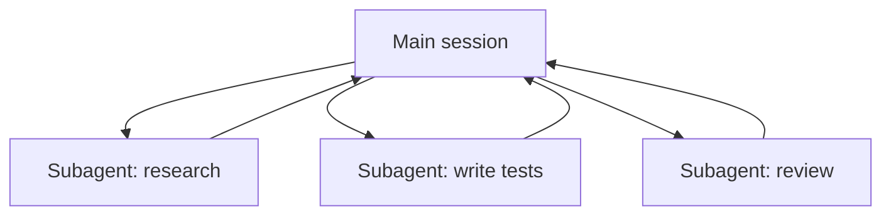

<LevelBadge level="advanced" />

<VerifyNote lastVerified="2026-06-20" source="https://code.claude.com/docs/en/sub-agents">
إعداد الوكلاء الفرعيين وواجهة `/agents` تتغير بمرور الوقت — تأكد من ذلك في الوثائق الرسمية.
</VerifyNote>

**الوكيل الفرعي (subagent)** هو نسخة Claude منفصلة لها **نافذة سياقها الخاصة** و**مجموعة أدوات محددة النطاق**، تفوّض إليها جلستك الرئيسية جزءًا من العمل. يبلّغ بنتيجة، لا بكامل نصّه — فتبقى الجلسة الرئيسية مركّزة وغير مزدحمة.

## لماذا تفوّض

- **احمِ السياق الرئيسي.** غوصة بحثية أو مسح ملف كبير يمكن أن يحرق آلاف الرموز؛ نفّذها في وكيل فرعي ولا تعود سوى الخلاصة.
- **التخصص.** أعطِ وكيلًا فرعيًا مطالبة نظام مفصّلة والأدوات التي يحتاجها فقط (مثل مراجِع قرائي فقط).
- **التوازي.** شغّل مهامًا فرعية مستقلة دفعةً واحدة — مثلًا استكشف ثلاث وحدات في وقت واحد.

## تعريفهم

يُعدّ الوكلاء الفرعيون كملفات Markdown بواجهة أمامية (frontmatter) (اسم، وصف، الأدوات المسموحة، وأحيانًا نموذج)، تُدار عبر واجهة `/agents`. يخبر `description` الوكيلَ الرئيسي *متى* يفوّض إليه. حدّد نطاق الأدوات بإحكام — نادرًا ما يحتاج المراجِع إلى صلاحية الكتابة.

## متى لا تُوازي

:::warning التوازي ليس مجانيًا
- **الخطوات المترابطة** يجب أن تكون تسلسلية — لا توزّع عملًا حيث تحتاج الخطوة ب إلى مخرَج الخطوة أ.
- **الكتابات على ملفات مشتركة** يمكن أن تتعارض؛ اعزلها (راجع [أشجار عمل Git](/docs/claude-code/worktrees)) أو سلسلها.
- **عبء التنسيق** يمكن أن يتجاوز الفائدة في المهام الصغيرة. فوّض عندما تكون المهمة الفرعية كبيرة الحجم ومستقلة.
:::

## الوكيل الفرعي مقابل "الوكلاء" في الـ API/SDK

تتناول هذه الصفحة التفويض المدمج في Claude Code. أما بناء وكلائك *أنت* برمجيًا فهو [بناء الوكلاء على الـ API](/docs/api/building-agents). والنموذج الذهني — هدف، وحلقة أدوات، وسياق معزول — هو نفسه.

## التالي

- [صمّم سير عمل متعدد الوكلاء الفرعيين (دليل تطبيقي)](/docs/walkthroughs/multi-subagent-workflow)
- [إدارة السياق](/docs/claude-code/context-management)
- [أشجار عمل Git](/docs/claude-code/worktrees)
