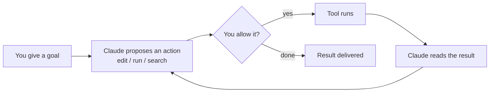

<LevelBadge level="beginner" />

<VerifyNote lastVerified="2026-06-20" source="https://docs.anthropic.com/en/docs/claude-code/overview">
تتغير أوامر التثبيت ومجموعة الميزات المحددة بشكل متكرر. اعتبر وثائق Claude Code الرسمية المصدر الموثوق للإعداد.
</VerifyNote>

**Claude Code** هو أداة البرمجة *الوكيلة* من Anthropic. بخلاف نافذة الدردشة، يمكنه فعليًا أن **ينجز أشياء في مشروعك**: قراءة الملفات وتحريرها، وتنفيذ أوامر الصدفة (shell)، والبحث في قاعدة الشيفرة، واستدعاء الأدوات الخارجية — كل ذلك بإذنك.

## النموذج الذهني: حلقة وكيلة

هذه هي الفكرة الواحدة التي تجعل كل شيء آخر مفهومًا:

تقدّم هدفًا بلغة بسيطة ("أضف اختبارات لوحدة المصادقة وأصلح ما يفشل"). يقوم Claude بـ**التخطيط والتنفيذ ومراقبة النتيجة والتكرار** حتى يتحقق الهدف. تبقى أنت المتحكم عبر [الأذونات](/docs/claude-code) و[وضع التخطيط](/docs/claude-code).

## أين يمكنك تشغيله

- **الطرفية (CLI)** — السطح الأصلي؛ يعمل في أي صدفة (shell).
- **إضافات الـ IDE** — VS Code و JetBrains، مع عرض الفروقات (diffs) المضمّنة.
- **سطح المكتب والويب** — ويشارك إعداداتك وخطافاتك (hooks) وأذوناتك عبر جميع الأسطح.

## ما الذي ستضبطه (بترتيب تقريبي للأثر)

1. **[CLAUDE.md](/docs/claude-code)** — تعليمات المشروع الدائمة. أعلى أثر، وأقل جهد.
2. **[وضع التخطيط](/docs/claude-code)** — التحقيق والاقتراح *قبل* تنفيذ أي تعديلات.
3. **[الأذونات](/docs/claude-code)** — ما الذي يُسمح لـ Claude بفعله دون سؤال.
4. **[settings.json](/docs/claude-code)** — نظام الإعداد الكامل.
5. **[الأوامر المائلة (Slash commands)](/docs/claude-code)**، و**[الخطافات (hooks)](/docs/claude-code)**، و**[المهارات (skills)](/docs/claude-code)**، و**[الوكلاء الفرعيون (subagents)](/docs/claude-code)**، و**[خوادم MCP](/docs/claude-code)** — ميزات قوية، تُضاف طبقة فوق طبقة حسب حاجتك.

## جلستك الأولى (الشكل العام لها)

1. ثبّت وصادِق (راجع [الوثائق الرسمية](https://docs.anthropic.com/en/docs/claude-code/overview) للأوامر الحالية).
2. انتقل بـ `cd` إلى مشروع وابدأ Claude Code.
3. شغّل `/init` لتوليد ملف **CLAUDE.md** مبدئي.
4. اطلب شيئًا صغيرًا وملموسًا: *"اشرح كيف يعمل التوجيه (routing) في هذا التطبيق."*
5. ثم جرّب تغييرًا في **وضع التخطيط** أولًا، وراجع الخطة، ودعه ينفّذها.

:::tip ابدأ بالوضع القرائي فقط
لمهمتك الفعلية الأولى، استخدم [وضع التخطيط](/docs/claude-code) — يحقق Claude ويعرض عليك خطة دون أن يمسّ الملفات. إنها أكثر الطرق أمانًا لبناء الثقة.
:::

## التالي

- أعلى إعداد من حيث الأثر ← [CLAUDE.md وملفات الذاكرة](/docs/claude-code)
- نفّذه من البداية إلى النهاية ← [الدليل التطبيقي: تخصيص Claude Code لمستودع حقيقي](/docs/walkthroughs)
- ابنِ أتمتاتك الخاصة ← [القوالب والوصفات](/docs/templates)
