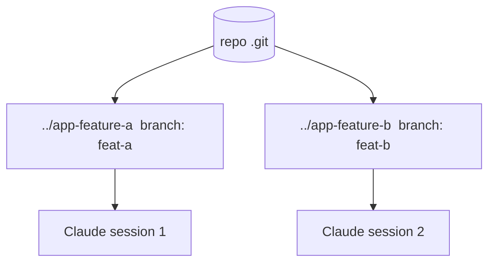

<LevelBadge level="advanced" />

تتيح **شجرة عمل git (git worktree)** لمستودع واحد أن يمتلك **عدة أدلة عمل**، كل منها مسحوب (checked out) إلى فرع مختلف. اقرن ذلك بـ Claude Code وسيمكنك تشغيل **عدة جلسات بالتوازي** على المشروع نفسه — كل جلسة تحرّر ملفاتها الخاصة، دون أي تصادمات.

## المشكلة التي يحلها

إذا حرّرت جلستا Claude دليل العمل نفسه في الوقت ذاته، فسوف تتعثر كل منهما بتغييرات الأخرى. تمنح أشجار العمل كل جلسة **دليلها وفرعها الخاص**، فيبقى العمل المتوازي معزولًا حتى تدمجه.



## الأساسيات

```bash
# from your repo
git worktree add ../app-feature-a -b feat-a   # new dir + new branch
git worktree add ../app-fix-123 -b fix-123
git worktree list
# when done with one:
git worktree remove ../app-feature-a
```

افتح جلسة Claude Code في كل دليل شجرة عمل ودعها تعمل باستقلالية.

## متى يستحق الأمر العناء

- **ميزات/إصلاحات متوازية** تريد إحراز تقدم فيها دفعةً واحدة.
- **مهمة طويلة تعمل** في شجرة عمل بينما تواصل العمل في أخرى.
- **تجارب محفوفة بالمخاطر** معزولة عن نسختك الرئيسية المسحوبة.

## المزالق

:::warning انتبه للدمج العكسي
- ستُدمج الفروع في النهاية **حتمًا** — وعندئذٍ تظهر التعارضات، لا أثناء العمل. أبقِ أشجار العمل مركّزة وقصيرة العمر.
- لا تشغّل **موارد ذات حالة ومشتركة** (قاعدة بيانات تطوير واحدة، منفذ واحد) من شجرتي عمل دون فصلها.
- نظّف بـ `git worktree remove` حتى لا تتراكم الأدلة القديمة.
:::

## أشجار العمل مقابل الوكلاء الفرعيين

- **[الوكلاء الفرعيون (Subagents)](/docs/claude-code/subagents)** = توازٍ *داخل* جلسة واحدة (تفويض، سياق معزول).
- **أشجار العمل** = توازٍ *عبر* الجلسات على القرص (فروع/ملفات معزولة). وهما يتكاملان جيدًا: جلسة داخل شجرة عمل يمكنها بدورها أن تُنشئ وكلاء فرعيين.

## التالي

- [الوكلاء الفرعيون والوكلاء المتوازون](/docs/claude-code/subagents)
- [الوضع بلا واجهة (Headless) وحزمة تطوير الوكلاء (Agent SDK)](/docs/claude-code/headless-and-agent-sdk)
- [إدارة السياق](/docs/claude-code/context-management)
