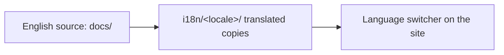

<LevelBadge level="intermediate" />

AILmanac إنجليزي أولًا لكنه **مبني ليُترجَم** — فهكذا يصل إلى "كل شخص في العالم." إن أردت أن تنقله إلى لغتك، فإليك المسار.

## كيف يعمل i18n هنا

يستخدم الموقع التدويل المدمج في Docusaurus. **الإنجليزية هي المصدر القانوني.** اللغة (locale) هي مجموعة موازية من الملفات المترجَمة؛ ويقدّم Docusaurus مبدِّل لغة بمجرد تفعيل لغة ما.

## القاعدة الذهبية: تولَّ مسؤوليتها قبل أن نشحنها

:::warning لا ترجمات نصفية في الإنتاج
لا تُفعَّل لغة في الإنتاج إلا **بمجرد أن يلتزم شخص ما بصيانتها.** لغة مترجَمة بنسبة 30% ومتقادمة منذ أشهر تضرّ بالمصداقية أكثر من عدم وجود ترجمة على الإطلاق. ترجمة *قسم كامل* جيدًا خير من تشتيت صفحات جزئية.
:::

## كيف تساهم بترجمة

1. **افتح مشكلة (issue)** (باستخدام قالب *translation*) تذكر فيها أي لغة وأي قسم ستتولاه.
2. **ترجم جزءًا متماسكًا** أولًا — مثل كامل قسم *ابدأ من هنا* — لا صفحات عشوائية.
3. **أبقِ الكود والأوامر ومصادر `VerifyNote` دون تغيير**؛ وترجم النص والعناوين ونصوص التنبيهات.
4. **لا تترجم معرّفات النماذج أو الروابط**؛ أبقِ مسارات `/docs/...` كما هي.
5. **افتح طلب سحب.** يراجعه أحد القائمين على الصيانة، وبمجرد أن يكون للغة مالك + قسم أول كامل، نُفعّلها.

## نصائح

- **استخدم Claude للمسودة**، ثم يراجعها إنسان متمكّن من اللغة — الترجمة الآلية تمريرة أولى رائعة، لا مرجعية نهائية ([الهلوسات](/docs/foundations/hallucinations) تنطبق على الترجمة أيضًا).
- **طابِق مستوى/نبرة** الصفحة الإنجليزية.
- **أشِر إلى المصطلحات غير القابلة للترجمة** (أبقِ "prompt" و"token" وغيرها حيث يكون ذلك هو المعتاد في مجتمع التقنية الناطق بلغتك).

## التالي

- [ساهم في 10 دقائق](/docs/contribute/contribute-in-10-minutes)
- [دليل أسلوب المحتوى](/docs/contribute/style-guide)
- [مدونة السلوك والحوكمة](/docs/contribute/governance)
