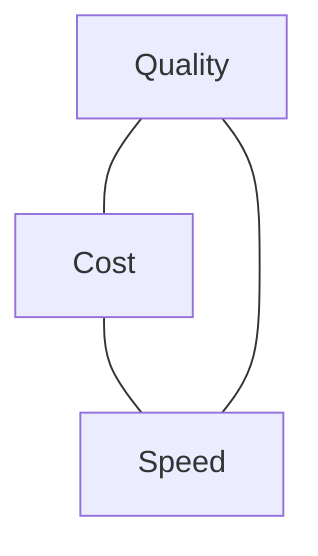

<LevelBadge level="intermediate" />

تتجاذب الجودة والتكلفة والسرعة فيما بينها. لا يمكنك تعظيمها الثلاث دفعةً واحدة — لكن *يمكنك* إنفاق كلٍّ منها حيث تهم والتوفير في كل ما عداها.

## المثلّث

النموذج الأكبر أذكى لكنه أبطأ وأغلى؛ والأصغر سريع ورخيص لكنه أقل قدرة. والهندسة الجيدة هي **توجيه كل مهمة إلى النقطة الصحيحة** على هذا المثلّث.

## أكبر الروافع (بترتيب تقريبي)

1. **اختر حجم النموذج المناسب.** لا تشغّل Opus للتصنيف. ابدأ بـ Sonnet، وانزل إلى Haiku للخطوات البسيطة/عالية الحجم، واحجز Opus للأجزاء الصعبة — [اختيار نموذج](/docs/api/choosing-a-model).
2. **تدرّج النماذج / التتابعات (cascades).** استخدم نموذجًا رخيصًا أولًا؛ وصعّد إلى أقوى منه فقط عند الحاجة (مثلًا الحالات منخفضة الثقة).
3. **[التخزين المؤقت للمطالبات](/docs/api/prompt-caching).** أعد استخدام بادئة مطالبة مستقرة عبر الاستدعاءات — توفير كبير لمطالبات النظام المتكررة، أو سياق RAG، أو فهارس أدوات الوكلاء.
4. **قلّص توكنات الإدخال.** أرسل فقط ما يهم؛ فـ [RAG](/docs/foundations/rag) أفضل من حشو قاعدة المعرفة بأكملها. المدخلات الأقصر = أرخص *وغالبًا* أفضل.
5. **حدّد سقف المخرجات** بقيمة معقولة لـ `max_tokens` وتعليمات صيغة محكمة.
6. **عالِج على دفعات** الأعمال غير المتزامنة حيث لا يهم زمن الاستجابة.

## مكاسب خاصة بزمن الاستجابة

- **البثّ (Stream)** للردود ليرى المستخدمون المخرجات فورًا — وهذا مكسب هائل للسرعة *المُدرَكة* حتى عندما لا يتغيّر الوقت الإجمالي ([البثّ](/docs/api/streaming)).
- **وازِ** بين الاستدعاءات الفرعية المستقلة.
- **خزّن مؤقتًا** الأعمال المتكررة؛ واحسب مسبقًا حيثما أمكن.
- اختر **نموذجًا أصغر** للمسار التفاعلي؛ ونفّذ الأعمال الثقيلة بشكل غير متزامن.

## لا تحسّن وأنت أعمى

قِس أولًا: أين تذهب التوكنات والثواني فعلًا؟ ثم حسّن أكبر بند. وأعد فحص الجودة بـ [التقييمات (evals)](/docs/foundations/evals) بعد أي خفض للتكلفة — فالإعداد الأرخص الذي يخطئ ليس أرخص.

## التالي

- [اختيار نموذج Claude](/docs/api/choosing-a-model)
- [التخزين المؤقت للمطالبات وتحسين التكلفة](/docs/api/prompt-caching)
- [التوكنات والسياق والأسعار](/docs/api/tokens-and-pricing)
