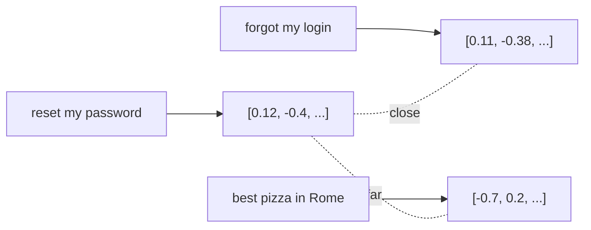

<LevelBadge level="intermediate" />

يحوّل **التضمين (Embedding)** قطعة من النص إلى قائمة من الأرقام (**متجه**) تلتقط *معناها*. فالنصوص ذات المعاني المتشابهة تحصل على متجهات قريبة من بعضها — حتى لو لم تشترك في أي كلمات. هذه هي الحيلة وراء **البحث الدلالي** و[RAG](/docs/foundations/rag).

## الحدس

تخيّل كل جملة موضوعة كنقطة في فضاء ضخم متعدد الأبعاد، مرتّبة بحيث **تجلس المعاني المتشابهة بالقرب من بعضها**. فجملة "كيف أعيد ضبط كلمة المرور الخاصة بي؟" تقع بالقرب من "نسيت بيانات تسجيل الدخول"، وبعيدًا عن "أفضل بيتزا في روما".

## البحث الدلالي مقابل البحث بالكلمات المفتاحية

- **البحث بالكلمات المفتاحية** يطابق الكلمات الحرفية ("password" تجد "password").
- **البحث الدلالي** يطابق *المعنى* — "لا أستطيع تسجيل الدخول" تجد مستند إعادة ضبط كلمة المرور حتى من دون كلمة "password".

غالبًا ما تأتي أفضل النتائج من **الجمع** بينهما (البحث الهجين).

## كيف يعمل البحث المتجهي

1. **ضمّن** مستنداتك (عادةً مقسّمة إلى **مقاطع**) وخزّن المتجهات في **قاعدة بيانات متجهية**.
2. عند الاستعلام، **ضمّن الاستعلام**.
3. اعثر على المتجهات **الأقرب** (عبر تشابه جيب التمام / المسافة).
4. أعِد تلك المقاطع — عادةً لتغذيتها في [RAG](/docs/foundations/rag).

## ملاحظات عملية

- **التقطيع إلى مقاطع مهم.** كبير جدًا = مطابقات مشوّشة؛ صغير جدًا = فقدان السياق. اضبطه.
- **استخدم نموذج تضمين واحدًا باستمرار** — المتجهات من نماذج مختلفة غير قابلة للمقارنة.
- **البيانات الوصفية + المرشّحات** (التاريخ، المصدر، النوع) تجعل الاسترجاع أكثر دقة بكثير.
- لا تكون قاعدة البيانات المتجهية ضرورية دائمًا — فللمجموعات الصغيرة، يكفي بحث بسيط في الذاكرة.

## التالي

- [التوليد المعزّز بالاسترجاع (RAG)](/docs/foundations/rag)
- [الضبط الدقيق مقابل التوجيه مقابل RAG](/docs/foundations/finetune-vs-prompt-vs-rag)
- [الهلوسة وكيفية الحد منها](/docs/foundations/hallucinations)
