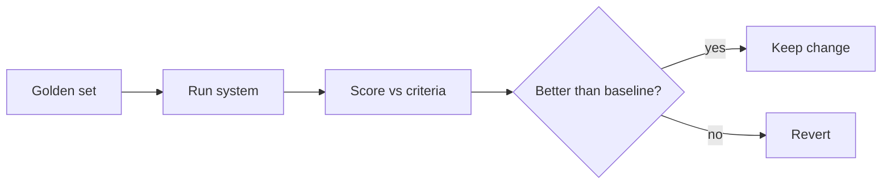

<LevelBadge level="advanced" />

إذا أطلقت أي شيء مبني على الذكاء الاصطناعي، فإن **التقييمات (evals)** هي الطريقة التي تعرف بها أنه يعمل — وكيف تعرف أن تغييرًا ما جعله أفضل لا أسوأ. من دونها أنت تطير على العمياء: فتعديل مطالبة يساعد حالة واحدة قد يكسر عشر حالات أخرى بصمت.

## الحد الأدنى للتقييم القابل للتطبيق

لست بحاجة إلى إطار عمل للبدء:

1. **اجمع مجموعة ذهبية.** من 20 إلى 100 مدخل حقيقي مع المخرجات *الصحيحة* أو *المقبولة* (أو معايير واضحة). غطِّ الحالات السهلة، والصعبة، والحالات الحدّية التي أوقعتك في مشكلة.
2. **حدّد ما يعنيه "الجيد"** لكل مهمة — تطابق تام، احتواء على حقائق أساسية، مخطط JSON صالح، لا أرقام مهلوسة، النبرة، إلخ.
3. **شغّل وقيّم** إعدادك الحالي مقابل المجموعة.
4. **غيّر شيئًا واحدًا** (المطالبة، النموذج، الاسترجاع)، وأعد التشغيل، و**قارن**. أبقِ التغيير فقط إذا تحسّنت النتيجة.

## اختيار المقاييس

- **الفحوص الحتمية** حيثما أمكن: هل المخطط صالح؟ هل يحتوي على القيمة الصحيحة؟ هل تجتاز الشيفرة الاختبارات؟ هذه رخيصة وجديرة بالثقة.
- **نموذج لغوي كحَكَم (LLM-as-judge)** للجودة الضبابية (الفائدة، النبرة): اجعل نموذجًا يقيّم المخرجات وفق معيار. مفيد لكن **عايره** — فالحَكَمات لديها تحيّزات (الطول، الموضع). تحقّق من الحَكَم مقابل تقييمات بشرية على عيّنة.
- **المراجعة البشرية** للشريحة الأعلى مخاطرةً.

## متى تشغّلها

- **قبل/بعد أي تغيير في المطالبة أو النموذج.**
- **عند الانتقال إلى نموذج جديد** — قد يغيّر النموذج الجديد السلوك ([الأخطاء والانتقال](/docs/api/errors-and-rate-limits)).
- **في التكامل المستمر (CI)** للأنظمة الإنتاجية، كبوابة.

:::tip افصل المراحل
بالنسبة لـ [RAG](/docs/foundations/rag) و[الوكلاء](/docs/api/building-agents)، قيّم كل مرحلة (هل عثر الاسترجاع على المستند الصحيح؟ هل استُدعيت الأداة بشكل صحيح؟) — وليس الإجابة النهائية فقط. فهذا يحدّد موقع الأعطال.
:::

## التالي

- [الهلوسة وكيفية الحد منها](/docs/foundations/hallucinations)
- [بناء الوكلاء على واجهة الـ API](/docs/api/building-agents)
- [اختيار النموذج والمزوّد](/docs/foundations/choosing-a-model-provider)
