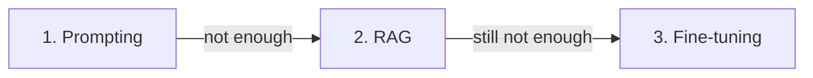

<LevelBadge level="intermediate" />

عندما لا يفعل النموذج ما تريد، هناك ثلاث روافع — والناس يمدّون أيديهم إلى الرافعة المكلفة أولًا. إليك الترتيب الذي ينجح فعلًا.

## جرّب بهذا الترتيب

### 1. التوجيه (Prompting) — ابدأ من هنا، دائمًا
تعليمات أوضح، وأمثلة، ودور، وقيود على المخرجات ([أساسيات التوجيه](/docs/prompting/basics)). يصلح **الغالبية العظمى** من المشكلات، ولا يكلّف شيئًا إضافيًا، والتكرار عليه فوري. معظم حالات "النموذج سيئ في X" تتبيّن أنها "كانت المطالبة غامضة".

### 2. RAG — عندما يحتاج إلى *معرفتك أنت*
إذا كانت الفجوة هي **معلومات ناقصة أو حديثة** (مستنداتك، بياناتك، حقائق راهنة)، فأضف [RAG](/docs/foundations/rag). يُبقي المعرفة قابلة للتحديث وللاستشهاد من دون المساس بالنموذج.

### 3. الضبط الدقيق (Fine-tuning) — الملاذ الأخير، لـ *السلوك/الصيغة* على نطاق واسع
يواصل الضبط الدقيق تدريب النموذج على أمثلتك. لا تلجأ إليه إلا عندما يعجز التوجيه + RAG عن تحقيق **أسلوب أو صيغة أو سلوك مهمّة** متّسق، وتتوفّر لديك **أمثلة كثيرة عالية الجودة** والحجم الذي يبرّره.

## جدول القرار

| مشكلتك | لجوؤك إلى |
|---|---|
| مخرجات غامضة/خاطئة، أو صيغة خاطئة | **التوجيه** |
| لا يعرف بياناتك / يحتاج إلى معلومات راهنة | **RAG** |
| يحتاج إلى أسلوب/سلوك محدد جدًا، بشكل متّسق، على نطاق واسع | **الضبط الدقيق** |
| يحتاج إلى تنفيذ إجراءات | (ليس أيًّا من هذه — فذلك [استخدام الأدوات/الوكلاء](/docs/api/tool-use)) |

## لماذا يخطئ الناس فيه

*يبدو* الضبط الدقيق وكأنه "تعليم النموذج"، فيشعر المرء أنه الحل الحقيقي. لكنه الخيار الأبطأ والأكثر كلفة والأقل مرونة، وهو **لا يضيف معرفة حديثة** جيدًا (RAG يفعل ذلك)، ومن السهل القيام به بشكل سيئ. استنفد التوجيه و RAG أولًا — فلن تحتاج عادةً إلى الخطوة الثالثة.

:::tip إنها تتكامل
غالبًا ما يكون النظام القوي هو **مطالبة** جيدة + **RAG** للمعرفة، مع حجز الضبط الدقيق لحاجة سلوكية ضيّقة. فهي ليست متنافية.
:::

## التالي

- [التوليد المعزّز بالاسترجاع (RAG)](/docs/foundations/rag)
- [أساسيات التوجيه (Prompting)](/docs/prompting/basics)
- [تقييم جودة الذكاء الاصطناعي (Evals)](/docs/foundations/evals)
