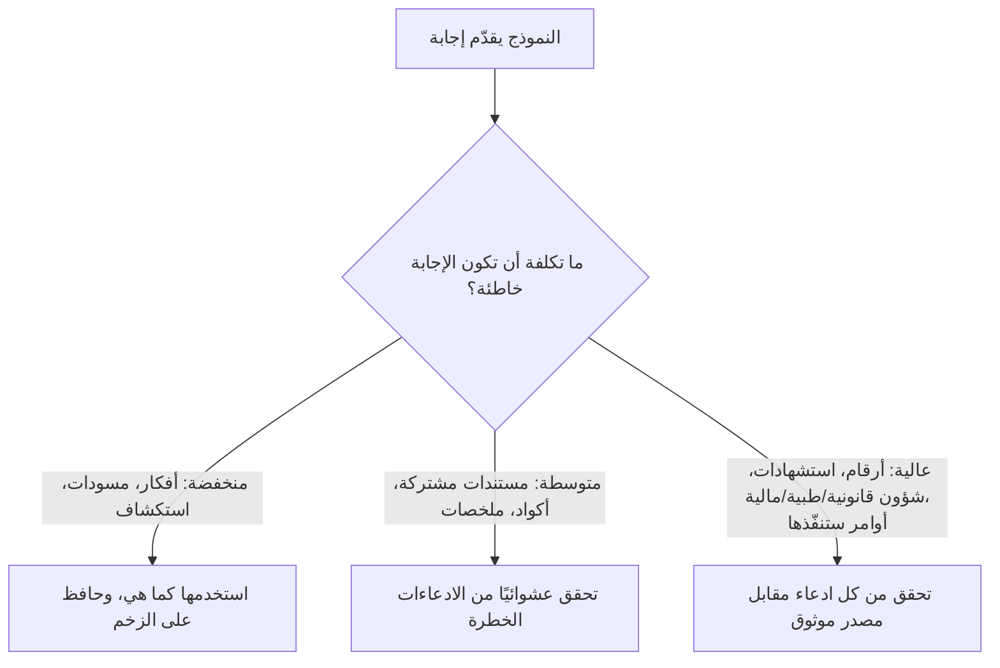

<LevelBadge level="intermediate" />

**الهلوسة** هي عندما يذكر النموذج شيئًا خاطئًا بثقة تامة. إنه لا يكذب وليس معطلًا — بل هذا هو الوجه الآخر لطريقة عمل نماذج LLM: فهي تولّد نصًا *معقولًا*، والمعقول ليس صحيحًا دائمًا (انظر [ما هو نموذج LLM؟](/docs/foundations/what-is-an-llm)). لا يمكنك التخلص من هذا بالكامل عبر المطالبات (prompts)، لكن يمكنك الحدّ منه بشكل كبير والتقاط ما تبقّى.

## لماذا يحدث ذلك

يتنبأ النموذج باستمرارٍ محتمل للنص. وعندما لا "يعرف" شيئًا ما، فإن الاستمرار *الأكثر اقترابًا من المظهر المحتمل* يكون غالبًا إجابة واثقة وحسنة الصياغة — وخاطئة. لا توجد إشارة مدمجة تقول "أنا غير متأكد" ما لم تترك له مجالًا لذلك.

## المناطق عالية الخطورة

كن أكثر تشككًا عندما يتضمن المُخرَج:

- **الاستشهادات والاقتباسات والمراجع** — أوراق بحثية ملفقة، وروابط URL مزيفة، واقتباسات منسوبة لغير أصحابها.
- **الأرقام والتواريخ والإحصاءات المحددة** — أرقام معقولة لكنها مختلقة.
- **الحقائق المتخصصة أو الحديثة جدًا** — خارج نطاق ما تعلّمه النموذج بشكل موثوق.
- **تفاصيل واجهات APIs والمكتبات** — دوال أو معاملات غير موجودة.
- **التفاصيل المتعلقة بالأشخاص والشؤون القانونية/الطبية** — مخاطرها عالية، ومن السهل أن تأتي خاطئة بشكل دقيق وخفي.

## مجموعة أدوات الحدّ من الهلوسة

اجمع بينها — كل واحدة منها تساعد:

1. **ثبّتها في المصادر.** الصق النص المصدر وقل *"أجب فقط من النص أعلاه؛ وإن لم يكن موجودًا فيه، فقل ذلك."* هذه هي الفكرة الجوهرية وراء [RAG](/docs/foundations/rag).
2. **امنحه مخرجًا.** اسمح صراحةً بأن *"إذا لم تكن متأكدًا، فقل 'لا أعرف'"* — فهذا يقلّل بشكل كبير من التخمين الواثق.
3. **اطلب التعليل والاستشهادات.** *"اقتبس الجملة بالضبط التي تدعم كل ادعاء."* تصبح الادعاءات غير المدعومة واضحة.
4. **اخفض مستوى الإبداع** في المهام الواقعية حيثما يتيح النموذج التحكم في درجة الحرارة (انظر [ضوابط أخذ العينات](/docs/foundations/sampling-controls)).
5. **استخدم الأدوات.** للحسابات أو البيانات الحالية أو عمليات البحث، امنح النموذج آلة حاسبة/بحثًا/[أداة](/docs/api/tool-use) بدلًا من الوثوق باستدعائه من الذاكرة.
6. **تحقّق بشكل متقاطع.** اطرح السؤال نفسه بطريقتين، أو اجعل مرورًا ثانيًا ينتقد المرور الأول.

## مطالبة جاهزة للنسخ واللصق لمكافحة الهلوسة

معظم مجموعة الأدوات أعلاه تنطوي في غلاف واحد قابل لإعادة الاستخدام. الصق مصدرك حيث هو مبيّن واطرح سؤالك — فهو يثبّت الإجابة، ويمنح النموذج مخرجًا، ويفرض الاستشهادات دفعة واحدة:

```text
أنت تجيب فقط من المصدر (SOURCE) أدناه.
القواعد:
- إذا لم تكن الإجابة موجودة في المصدر، فأجب حرفيًا: "غير مذكور في المصدر."
- بعد كل ادعاء، اقتبس الجملة بالضبط من المصدر التي تدعمه.
- لا تضف معرفة خارجية أو تقديرات أو افتراضات.

SOURCE:
"""
[الصق المستند أو النص المفرّغ أو البيانات هنا]
"""

QUESTION: [سؤالك]
```

لماذا ينجح هذا: إن مخرج الهروب "غير مذكور في المصدر." يزيل الضغط الدافع إلى التخمين، وقاعدة اقتباس-الجملة تجعل من المستحيل إخفاء أي ادعاء غير مدعوم. احذف كتلة المصدر (SOURCE) عندما تريد فعلًا معرفة النموذج الخاصة — لكن عندها يعود عبء التحقق إليك.

## العقلية التي تحميك فعلًا

:::warning تحقّق مما يهم — دائمًا
لا توجد مطالبة تجعل المُخرَج موثوقًا بنسبة 100%. لأي شيء له عواقب — رقم في تقرير، أو استشهاد، أو أمر ستنفّذه، أو تفصيل طبي/قانوني/مالي — **تحقق منه مقابل مصدر موثوق**. تعامل مع الذكاء الاصطناعي كمسودة أولى سريعة، لا كمرجع نهائي. هذا هو جوهر [الاستخدام المسؤول](/docs/security/responsible-use).
:::

قاعدة بسيطة: **تكلفة الخطأ تحدد مقدار التحقق المطلوب.** عصف ذهني؟ ثق بحرية. نشر إحصائية؟ تحقّق في كل مرة.



## التالي

- [التوليد المعزّز بالاسترجاع (RAG)](/docs/foundations/rag)
- [تقييم جودة الذكاء الاصطناعي (Evals)](/docs/foundations/evals)
- [الاستخدام المسؤول والأخلاقيات والتحقق](/docs/security/responsible-use)
