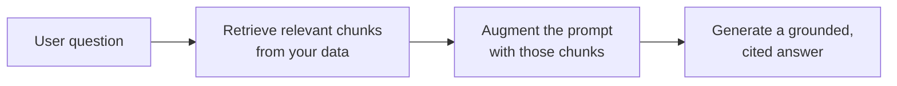

<LevelBadge level="intermediate" />

يجعل **RAG** النموذج يجيب عن أسئلة حول **بياناتك** — المستندات، أو قاعدة المعرفة، أو قاعدة الشيفرة — التي لم يُدرَّب عليها قط. الفكرة بسيطة: **استرجع** القطع ذات الصلة، ثم **عزّز** المطالبة بها، ثم **ولّد** إجابة مبنية على تلك القطع.

## الحلقة

1. **فهرس** بياناتك: قسّمها إلى مقاطع، و[ضمّنها](/docs/foundations/embeddings)، وخزّنها في فهرس متجهي (و/أو فهرس كلمات مفتاحية).
2. **استرجع** أعلى المقاطع صلةً بالسؤال.
3. **عزّز**: ضع تلك المقاطع في المطالبة مع تعليمة مثل *"أجب فقط من السياق أدناه؛ وإن لم يكن موجودًا فيه، فقل ذلك."*
4. **ولّد** — والأفضل أن **تستشهد** بالمقطع الذي جاء منه كل ادّعاء.

## لماذا RAG بدلًا من الضبط الدقيق؟

يُبقي RAG المعرفة **حديثة** (تحدّث البيانات، لا النموذج)، ويوفّر **استشهادات**، وهو أرخص بكثير من إعادة التدريب. ولمعظم احتياجات "أجب عن مستنداتي"، يكون الأداة الأولى الصحيحة — انظر [الضبط الدقيق مقابل التوجيه مقابل RAG](/docs/foundations/finetune-vs-prompt-vs-rag).

## أنماط الفشل (حيث تموت جودة RAG)

- **استرجاع سيئ = إجابة سيئة.** إذا لم يُسترجع المقطع الصحيح، فلن يستطيع النموذج استخدامه. معظم مشكلات "RAG مخطئ" هي مشكلات *استرجاع*.
- **تقطيع خشن/دقيق أكثر من اللازم** — يدمّر الصلة ([التضمينات](/docs/foundations/embeddings)).
- **غياب تعليمة الربط** — يمزج النموذج الحقائق المسترجعة بتخميناته الخاصة. أمره بالإجابة *فقط* من السياق والاعتراف بالثغرات.
- **الحشو الزائد** — تخفّف المقاطع غير ذات الصلة الإشارة وتستهلك [توكنات](/docs/foundations/tokens-and-context). استرجع مقاطع قليلة عالية الجودة.
- **غياب الاستشهادات** — لا يمكنك التحقّق، فلا يمكنك الوثوق.

:::tip قيّم الاسترجاع على حدة
قِس "هل استرجعنا المقطع الصحيح؟" بمعزل عن "هل أجاب النموذج جيدًا؟" فهذا يحدّد موقع المشكلة بسرعة. انظر [التقييمات (Evals)](/docs/foundations/evals).
:::

## التالي

- [التضمينات (Embeddings) والبحث المتجهي](/docs/foundations/embeddings)
- [الضبط الدقيق مقابل التوجيه مقابل RAG](/docs/foundations/finetune-vs-prompt-vs-rag)
- [دليل البحث والتركيب](/docs/playbooks/research)
