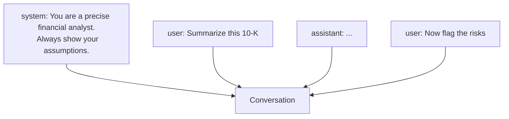

<LevelBadge level="beginner" />

كل محادثة مع الذكاء الاصطناعي مبنية من **رسائل**، ولكل رسالة **دور**. وفهم الأدوار الثلاثة يوضّح كيفية توجيه النموذج — ولماذا تثبت بعض التعليمات بينما لا تثبت أخرى.

## الأدوار الثلاثة

- **النظام (System)** — الإعداد عالي المستوى للمحادثة بأكملها: من يجب أن يكون النموذج، والقواعد، والصيغة. يُضبط مرة واحدة ويسري طوال المحادثة.
- **المستخدم (User)** — هذا أنت: أسئلتك ومدخلاتك، دورًا بعد دور.
- **المساعد (Assistant)** — ردود النموذج. (يمكنك أيضًا *وضع كلمات على لسان المساعد* كأمثلة — انظر [التوجيه بأمثلة قليلة (few-shot)](/docs/prompting/few-shot).)

## لماذا تكون مطالبة النظام أقوى أداة لديك

تؤطّر رسالة النظام **كل ما يأتي بعدها**. فهي المكان الذي تحدّد فيه دور النموذج ومعاييره ونبرته وقواعده الصارمة — والنموذج يوليها وزنًا كبيرًا. إذا أردت سلوكًا متّسقًا عبر محادثة كاملة (أو تطبيق كامل)، فضعه هنا، وليس مدفونًا في دور مستخدم.

عمليًا:
- **تطبيقات المحادثة:** تعمل [التعليمات المخصصة](/docs/claude-app/custom-instructions) في حسابك كمطالبة نظام شخصية.
- **Claude Code:** يلعب [CLAUDE.md](/docs/claude-code/claude-md) هذا الدور لمشروعك.
- **واجهة الـ API:** [بارامتر `system`](/docs/api/first-call).

الفكرة ذاتها، بثلاثة أوجه.

## نصائح عملية

- **كن محددًا في مطالبة النظام** بشأن الدور والقواعد وصيغة المخرجات — فهذا المكان الأعلى مردودًا للقيام بذلك.
- **اجعل أدوار المستخدم مركّزة** على المهمة الفعلية؛ لا تعد لصق القواعد في كل دور.
- **تعليمات متعارضة؟** يمكن لتعليمة مستخدم لاحقة وصريحة أن تتجاوز تعليمة نظام غامضة — كن متّسقًا لتجنّب المفاجآت ([استكشاف الأخطاء وإصلاحها](/docs/contribute/troubleshooting)).

## التالي

- [أساسيات التوجيه (Prompting)](/docs/prompting/basics)
- [التعليمات المخصصة والأنماط](/docs/claude-app/custom-instructions)
- [التوكنات والسياق والذاكرة](/docs/foundations/tokens-and-context)
