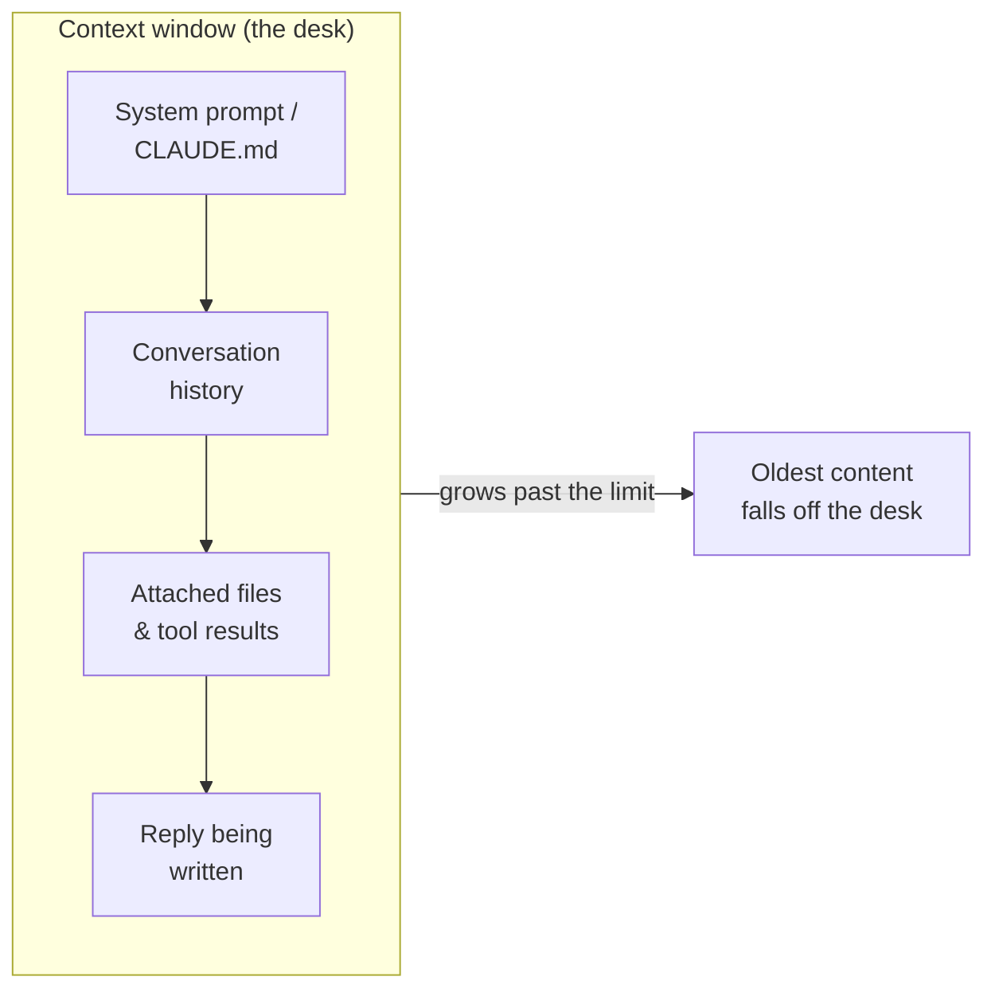

<LevelBadge level="beginner" />

ثلاث أفكار تفتح الكثير من لحظات "لماذا فعل ذلك؟": **الرموز (tokens)**، و**نافذة السياق**، و**الذاكرة**. افهم هذه الأفكار وستتوقف عن مفاجأتك بالانحراف، والنسيان، والفواتير المباغتة.

<Callout
  type="objectives"
  items={[
    "اقرأ النص بالطريقة التي يقرأه بها النموذج — برموز (tokens)، لا بكلمات أو أحرف",
    "تخيّل نافذة السياق كمكتب محدود المساحة، وتوقّع متى تسقط الأشياء عنه",
    "تعرّف على 'تعفّن السياق' (context rot) — لماذا قد تفقد النماذج منتصف مدخلٍ طويل",
    "اعرف المصادر الأربعة الحقيقية لـ 'الذاكرة' وكيف توفّرها عن قصد"
  ]}
/>

## الرموز (Tokens): الوحدة التي تفكّر بها النماذج

لا تقرأ النماذج الأحرف أو الكلمات — بل تقرأ **الرموز (tokens)**، وهي مقاطع نصية تعادل تقريبًا ثلاثة أرباع كلمة في الإنجليزية. قد تكون كلمة "Unbelievable" من 3 إلى 4 رموز؛ والكلمات الشائعة رمز واحد لكل منها؛ والمسافة أو الفاصلة أو مقطع من الكود يكلّف كل منها رموزًا أيضًا. يُحتسب كلٌّ من مدخلاتك *و* مخرجات النموذج، والرموز هي بالضبط ما يُقاس به [التسعير والحدود](/docs/api/tokens-and-pricing).

لست بحاجة إلى العدّ يدويًا، لكن إحساسًا تقريبيًا يفيد: **~750 كلمة ≈ ~1,000 رمز**. اكتب شيئًا وراقب:

<TokenEstimator />

:::tip لماذا تتغيّر النسبة
الإنجليزية العادية تقع قرب ثلاثة أرباع كلمة لكل رمز. أما الكود، وJSON، والكتابات غير اللاتينية، وعناوين URL الطويلة، والكلمات النادرة فتنقسم إلى رموزٍ *أكثر* — لذا فإن ملفًا من 500 سطر أو فقرة بالصينية يكلّف أكثر مما يوحي به عدد كلماتها. عندما تفاجئك فاتورة أو حدّ، فهذا هو السبب عادةً.
:::

## نافذة السياق: الذاكرة العاملة

**نافذة السياق** هي الحدّ الأقصى لعدد الرموز التي يمكن للنموذج أن يأخذها بعين الاعتبار دفعةً واحدة — *موجّه النظام لديك، وكامل المحادثة حتى الآن، وأي ملفات مرفقة، والردّ الذي يكتبه،* كلّها معًا. تخيّلها كمكتب النموذج: واسع، لكنه محدود. تختلف أحجام النوافذ باختلاف النموذج وتستمر في النمو — راجع [النماذج والتسعير](/docs/whats-new/models-and-pricing) للأرقام الحالية بدلًا من حفظ رقمٍ واحد.

كل ما "يعرفه" النموذج في اللحظة الراهنة يقبع على ذلك المكتب:

عندما تنمو محادثة بما يتجاوز النافذة، **يسقط أقدم محتوى**. لهذا قد تبدو المحادثة الطويلة جدًّا وكأنها "تنسى" كيف بدأت، أو تنحرف عن تعليمك الأصلي.

## تعفّن السياق: المسألة ليست مجرّد *ممتلئ* مقابل *فارغ*

مشكلة أكثر دقّة: حتى عندما يتّسع كل شيء، تميل النماذج إلى استخدام **بداية ونهاية** المدخل الطويل بموثوقية أكبر من **منتصفه**. ادفن الجملة الوحيدة المهمّة في وسط لصقٍ من 50 صفحة، وقد يُقلَّل من وزنها — وهو نمط فشل يُسمّى غالبًا *"الضياع في المنتصف"* (lost in the middle).

<VerifyNote lastVerified="2026-06-29" source="https://arxiv.org/abs/2307.03172">أثر "الضياع في المنتصف" — تدهور استخدام المعلومات الموضوعة في منتصف السياق — وثّقه Liu et al. (2023). تتعامل النماذج الأحدث ذات السياق الطويل معه بشكل أفضل، لكن العادة العملية أدناه ما زالت تؤتي ثمارها.</VerifyNote>

<Steps
  items={[
    {title: "ابدأ بالطلب", body: "ضع التعليمة أو السؤال الفعلي أولًا، قبل لصق مستند طويل — لا مدفونًا بعده."},
    {title: "أعد الصياغة في النهاية", body: "كرّر التعليمة الأساسية في سطرٍ واحد بعد المحتوى الطويل. الموضعان الأول والأخير هما الأقوى."},
    {title: "قلّم قبل أن تلصق", body: "احذف الأقسام غير ذات الصلة. ضوضاء أقل في المنتصف تعني أن الإشارة الباقية تنال انتباهًا أكبر."},
    {title: "قسّم عند الضخامة", body: "للمدخلات الكبيرة جدًّا، لخّص أو قسّم إلى أجزاء بدلًا من إلقاء كل شيء — أو ابدأ محادثة جديدة لمهمة فرعية جديدة."}
  ]}
/>

إليك الطلب نفسه، مُهيكلًا بحيث تقع التعليمة في المواضع القويّة:

<PromptCard title="التعليمة أولًا، مُعاد صياغتها أخيرًا">{`المهمة: ابحث عن كل موضع يحدّ فيه هذا العقد من مسؤوليتنا، واقتبس البند بالضبط.

[... الصق العقد الكامل المؤلف من 40 صفحة هنا ...]

تذكير بالمهمة: اذكر بنود تحديد المسؤولية فقط، مع اقتباسات دقيقة وأرقام الأقسام. تجاهل كل ما عدا ذلك.`}</PromptCard>

:::tip في Claude Code
تصطدم جلسات الوكيل الطويلة بالسقف نفسه. يديره Claude Code عن قصد — بضغط التاريخ والسماح لك بتوجيه ما يبقى في مجال الرؤية. راجع [إدارة السياق](/docs/claude-code/context-management) و[هندسة السياق](/docs/frontiers/context-engineering).
:::

## الذاكرة: لا وجود لها، إلا إذا وفّرتها أنت

افتراضيًا، كل محادثة هي **صفحة بيضاء**. لا يتذكّر النموذج محادثتك السابقة. كل ما يبدو كذاكرة هو واحد من أربعة أشياء:

| المصدر | ما هو | تتحكّم به عبر |
| --- | --- | --- |
| **التاريخ المُعاد إرساله** | تعيد تطبيقات المحادثة إرسال المحادثة في كل دور، حتى تمتلئ النافذة | بدء محادثات جديدة؛ إبقاء الخيوط مركّزة |
| **ميزات الذاكرة** | تحمل بعض واجهات Claude حقائق عبر المحادثات | إعدادات [الذاكرة عبر المحادثات](/docs/claude-app/memory) |
| **ملفات توفّرها أنت** | سياق دائم ترفقه عن قصد | [المشاريع](/docs/claude-app/projects)، [CLAUDE.md](/docs/claude-code/claude-md) |
| **شيفرتك الخاصة** | الـ API **عديم الحالة** — أنت تعيد إرسال الرسائل السابقة | [أول استدعاء API](/docs/api/first-call) |

الخيط الناظم: *إذا أردت أن يتذكّر النموذج شيئًا، فعليك أن تظلّ تضعه على المكتب.*

## لماذا يهمّ هذا

تقريبًا كل مشكلة من نوع "تجاهل تعليمي السابق" أو "فقد التتبّع" تعود إلى واحد من ثلاثة أمور: امتلأت النافذة، أو بدأت جلسة جديدة على البارد، أو قبعت التفصيلة الأساسية في المنتصف الميت من لصقٍ طويل. وإذ تعرف هذا، ستهيكل المُوجِّهات والجلسات لإبقاء المهم *في مجال الرؤية*.

## اختبر نفسك

<Quiz
  questions={[
    {
      q: "كم رمزًا تقريبًا تساوي 750 كلمة من الإنجليزية العادية؟",
      options: ["نحو 250", "نحو 1,000", "نحو 3,000", "بالضبط 750"],
      answer: 1,
      explain: "قاعدة عملية مفيدة: ~750 كلمة ≈ ~1,000 رمز للإنجليزية الاعتيادية. الكود والكتابات غير اللاتينية تأتي أعلى."
    },
    {
      q: "محادثة طويلة تبدأ 'بنسيان' كيف بدأت. السبب الأرجح هو:",
      options: [
        "النموذج معطّل",
        "أقدم محتوى سقط عن نافذة السياق مع نمو المحادثة",
        "تعلّم النموذج رسائلك السابقة بشكل دائم",
        "تمّ ردّ الرموز"
      ],
      answer: 1,
      explain: "نافذة السياق محدودة. مع تجاوز المحادثة لها، تسقط أقدم الرموز عن 'المكتب' — فتختفي التعليمات المبكرة من مجال الرؤية."
    },
    {
      q: "عليك أن تلصق مستندًا ضخمًا إضافةً إلى تعليمة أساسية واحدة. ما أفضل موضع؟",
      options: [
        "التعليمة في منتصف المستند بالضبط فقط",
        "التعليمة في البداية تمامًا، ومُعادة الصياغة في النهاية",
        "بلا تعليمة — اترك النموذج يخمّن",
        "التعليمة في محادثة منفصلة لا يستطيع النموذج رؤيتها"
      ],
      answer: 1,
      explain: "تستخدم النماذج بداية ونهاية المدخل الطويل بأكبر موثوقية ('الضياع في المنتصف'). ابدأ بالطلب وأعد صياغته في النهاية."
    }
  ]}
/>

## المصطلحات الأساسية

<Flashcards
  title="ثبّت المفردات"
  cards={[
    {front: "الرمز (Token)", back: "مقطع النص الذي يعالجه النموذج فعليًا — نحو ثلاثة أرباع كلمة إنجليزية. يُحتسب المدخل والمخرج كلاهما، والتسعير لكل رمز."},
    {front: "نافذة السياق", back: "الحدّ الأقصى للرموز التي يمكن للنموذج أخذها بعين الاعتبار دفعةً واحدة: موجّه النظام + التاريخ + الملفات + الردّ، كلّها معًا. محدودة — المحتوى بعد الحدّ يسقط."},
    {front: "الضياع في المنتصف", back: "الميل إلى استخدام بداية ونهاية المدخل الطويل بموثوقية أكبر من المنتصف. ضع التعليمات الحرجة في المواضع القويّة."},
    {front: "انعدام الحالة (Statelessness)", back: "الـ API لا يتذكّر شيئًا بين الاستدعاءات. لمتابعة محادثة، تعيد أنت إرسال الرسائل السابقة بنفسك."}
  ]}
/>

:::note الخلاصات
- **الرموز** هي وحدة التفكير والفوترة معًا — ~1,000 لكل 750 كلمة إنجليزية، وأكثر للكود والكتابات الأخرى.
- **نافذة السياق** مكتب محدود؛ المحادثات الطويلة تنسى لأن المحتوى القديم يسقط عنها.
- حتى ضمن النافذة، **ابدأ بتعليمتك وأعد صياغتها في النهاية** — المنتصف يُستخدَم بقدرٍ أقل.
- **لا ذاكرة افتراضيًا**. وفّرها عن قصد بالملفات، أو المشاريع، أو CLAUDE.md، أو بإعادة إرسال التاريخ.
:::

## التالي

- [ما هو نموذج اللغة الكبير (LLM)؟](/docs/foundations/what-is-an-llm)
- [أدوار النظام والمستخدم والمساعد](/docs/foundations/roles)
- [هندسة السياق](/docs/frontiers/context-engineering)
- [الرموز والسياق والتسعير (API)](/docs/api/tokens-and-pricing)
