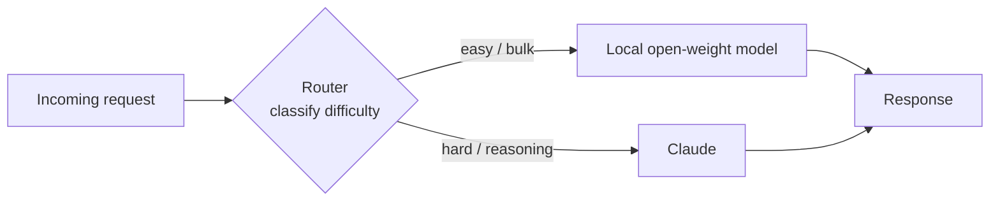

<LevelBadge level="advanced" />

إن صياغة السؤال بـ"نموذج رائد **أو** نموذج محلي" هي خيار زائف. أكثر الأنظمة فعالية من حيث التكلفة، واحتراماً للخصوصية، ومرونةً في الإنتاج تستخدم **كليهما** — نموذج صغير مفتوح الأوزان يعمل محلياً للأعمال السهلة أو عالية الحجم أو الحساسة، ونموذج رائد مثل Claude بوصفه **الطبقة الذكية** التي تتولى الاستدلال الصعب. هذه الصفحة تتناول *الأنماط* الدائمة التي تربط الاثنين معاً بحيث يقوم كلٌّ منهما بما يجيده. الأنماط محايدة تجاه المزوِّد — Claude ببساطة خيار ممتاز لدور "الاستدلال" — وهي تبقى صالحة بعد زوال أي اسم نموذج بعينه.

<Callout type="objectives" items={[
  "افهم لماذا يتفوّق النظام الهجين (رائد + محلي) على أي من النموذجين منفرداً في التكلفة والخصوصية والمرونة",
  "تعلّم الأنماط الهجينة الخمسة الدائمة: الموجِّه/الكبير-الصغير، والمسودة ثم التحسين، وإخفاء الخصوصية، والمعالجة المسبقة/اللاحقة بالجملة، والاحتياط دون اتصال",
  "لكل نمط: اعرف متى تلجأ إليه، والمقايضة التي تقبلها، ومخططاً عملياً ملموساً",
  "صمّم نظامك الهجين الخاص Claude+محلي بمنهجية قابلة للتكرار من أربع خطوات",
  "اعلم أن هذه الأنماط محايدة تجاه المزوِّد — يندرج Claude فيها بوصفه 'الطبقة الذكية'، لا قيداً يحبسك",
]} />

## لماذا الهجين، لا أحدهما أو الآخر

النموذج المحلي مفتوح الأوزان (انظر [شغّل النماذج محلياً مع Ollama](/docs/models/run-models-locally-ollama)) والنموذج الرائد جيدان في أشياء *مختلفة*:

- **المحلي** خاص (البيانات لا تغادر جهازك أبداً)، ورخيص على نطاق واسع (لا فاتورة لكل رمز)، ومنخفض الكمون للنماذج الصغيرة، ويعمل دون اتصال. لكن لديه **فجوة قدرة** حقيقية في أصعب مهام الاستدلال والسياق الطويل والمهام الوكيلة.
- **Claude (الرائد)** يتصدّر في تلك المهام الصعبة بالضبط، لكن كل استدعاء يكلّف رموزاً ويرسل البيانات إلى واجهة برمجية سحابية.

الفكرة الكامنة خلف كل نمط أدناه: **معظم الطلبات سهلة، والصعبة أقلية.** إذا كان نموذج محلي رخيص يستطيع تولّي الجزء الأكبر واحتفظت بالنموذج الرائد للشريحة الصعبة حقاً، فإنك تحصل على معظم جودة النموذج الرائد بجزء يسير من التكلفة — وتستطيع إبقاء البيانات الحساسة محلية. رسمَت ورقة Microsoft *Hybrid LLM* هذا الأمر رسمياً: موجِّه متعلِّم يرسل الاستعلامات السهلة إلى نموذج صغير أجرى **ما يصل إلى 40% استدعاءات أقل** إلى النموذج الكبير دون أي انخفاض في جودة الاستجابة ([arXiv 2404.14618](https://arxiv.org/abs/2404.14618)). ويُبلّغ إطار العمل مفتوح المصدر [RouteLLM](https://github.com/lm-sys/RouteLLM) عن نتائج مماثلة — جودة قريبة من الرائدة بنحو **نصف التكلفة** في المعايير الشائعة عبر توجيه نحو نصف الاستعلامات إلى النموذج الأرخص.

> اختر نظامك الهجين حسب **القيد**، لا حسب الضجيج. إن لم تكن تعرف بعد أي نموذج يناسب أي مهمة، فابدأ من [اختيار نموذج](/docs/models/choosing-a-model) — ثم عُد وقرِّر *أين يقع الحد الفاصل* بين المحلي والرائد.

---

## النمط 1 — الموجِّه / الكبير-الصغير

**الفكرة.** ضع **مصنِّفاً** رفيعاً أمام كل طلب. ينظر إلى المهمة ويقرر: سهلة/بالجملة → النموذج المحلي؛ استدلال صعب → Claude. مستعار من تصميم المعالجات "big.LITTLE"، حيث يشغّل الهاتف الأعمال الخلفية على أنوية صغيرة كفوءة ولا يوقظ النواة الكبيرة إلا للأحمال الثقيلة.

**متى تستخدمه.** لديك تدفّق مختلط من الطلبات — كثير منها تافه، وقليل منها صعب حقاً — وتريد أن تدفع أسعار النماذج الرائدة للصعبة فقط. هذا هو النظام الهجين العامل الأساسي.

**المقايضة.** قد *يخطئ* الموجِّه. وجِّه مهمة صعبة خطأً إلى النموذج المحلي فتنخفض الجودة؛ ووجِّه مهمة سهلة خطأً إلى Claude فتدفع زيادة. أنت تضبط عتبة لتوازن بين التكلفة والجودة، وينبغي أن **تقيس** تلك العتبة على بياناتك الخاصة بتقييم صغير (انظر [التقييمات](/docs/power-user/evals)).

**المخطط.** يمكن أن يكون الموجِّه بسيطاً كطبقة قواعد (الطول، الكلمات المفتاحية، وجود شيفرة) أو غنياً كنموذج مصنِّف صغير. خيار رخيص وشفّاف هو أن تطلب من النموذج **المحلي** نفسه تصنيف الصعوبة، ثم توزّع:

<PromptCard title="موجِّه تصنيف الطلب (يعمل على النموذج المحلي)">{`You are a request router. Classify the user request into exactly one tier.

Return ONLY a JSON object: {"tier": "...", "reason": "..."}

Tiers:
- "local"  → simple, mechanical, or high-volume: short rewrites, formatting,
             single-fact lookup, basic classification/extraction, boilerplate.
- "frontier" → hard reasoning, multi-step planning, long-context synthesis,
             ambiguous instructions, code that must be correct, anything where
             a wrong answer is costly.

Bias toward "local" when in doubt about a CHEAP, low-risk task,
and toward "frontier" when a mistake would be EXPENSIVE.

Request:
"""
{{REQUEST}}
"""`}</PromptCard>

مُخرَج الموجِّه هو قرار توجيه، لا الإجابة النهائية — أبقِه صغيراً وسريعاً. وللتوجيه الأغنى عبر أدوات أو نماذج كثيرة، يُعمَّم المنطق نفسه صنِّف-ثم-وزِّع (وهو يشبه كيفية اختيار النماذج بين [الأدوات](/docs/api/tool-use)).

---

## النمط 2 — مسودة ثم تحسين

**الفكرة.** ينتج النموذج المحلي **مسودة أولى رخيصة**؛ ويقوم Claude بـ**صقلها أو تصحيحها أو التحقق منها**. أنت تدفع رموز النموذج الرائد للتحسين، لا للتوليد من الصفر — والمسودة الجيدة تجعل مهمة Claude أقصر وأكثر موثوقية.

**متى تستخدمه.** التوليد المفتوح حيث تكون المسودة الخام أرخص بكثير من المثالية لكن المُخرَج النهائي يجب أن يكون عالي الجودة: الكتابة الطويلة، والشيفرة، والوثائق المنظّمة، والملخصات التي يجب أن تكون صحيحة تماماً.

**المقايضة.** استدعاءان للنموذج بدل واحد يضيفان كموناً، والمسودة *السيئة* قد تجرّ المُحسِّن نحو أخطائها. يظهر المكسب حين تكون الصياغة هي الجزء المكلف والتحسين رخيصاً نسبياً — تحقّق على بياناتك من أن "مسودة محلية + تحسين رائد" يتفوّق فعلاً على "الرائد يفعل كل شيء" من حيث التكلفة لكل مُخرَج مقبول.

**المخطط.** يسوّد النموذج المحلي → مرِّر المسودة إلى Claude بتعليمة مركّزة: *"إليك مسودة. صحّح الأخطاء، وأحكِمها، وتحقّق من الادعاءات؛ أعِد النسخة المصححة."* هذا هو الحدس نفسه الذي يدعم **فك الترميز التخميني** على مستوى الرمز — مسوِّد صغير يقترح، والنموذج الكبير يتحقّق ويحتفظ فقط بما يصمد ([NVIDIA: فك الترميز التخميني](https://developer.nvidia.com/blog/an-introduction-to-speculative-decoding-for-reducing-latency-in-ai-inference/)). على مستوى المهمة أنت تفعل الشيء نفسه يدوياً: اقتراح رخيص، تحقّق مكلف.

---

## النمط 3 — إخفاء الخصوصية

**الفكرة.** يقوم نموذج محلي (أو أدوات معالجة لغة طبيعية محلية) بـ**تجريد المعلومات الشخصية القابلة للتعريف (PII)** من النص *قبل* إرسال أي شيء إلى واجهة برمجية سحابية. يستدلّ Claude على النسخة المُخفاة؛ وتعيد إدراج القيم الحقيقية محلياً في طريق العودة إن لزم.

**متى تستخدمه.** تريد استدلالاً رائداً لكنك تتعامل مع بيانات منظَّمة أو حساسة (صحة، مالية، سجلات عملاء) ويجب **ألا** تغادر المعلومات الشخصية الخام بيئتك. يتيح لك الإخفاء استخدام النموذج السحابي على *شكل* المشكلة دون كشف الأشخاص فيها.

**المقايضة.** الإخفاء ليس مثالياً أبداً — الكيان المفقود تسريب، والإخفاء المفرط يدمّر السياق الذي يحتاجه النموذج للإجابة جيداً. عامل أداة الإخفاء بوصفها ضابطاً أمنياً: اختبر استدعاءها، وأبقِ خريطة إلغاء الإخفاء محلية تماماً.

**المخطط.** شغّل كاشفاً/مُجهِّلاً محلياً على المُدخَل، مستبدلاً الكيانات بعناصر نائبة (`[PERSON_1]`، `[EMAIL_1]`)، ثم أرسل النص المُخفى إلى Claude، ثم أعِد ترطيب العناصر النائبة محلياً. أداة Microsoft مفتوحة المصدر [Presidio](https://github.com/microsoft/presidio) هي اللبنة الشائعة هنا — تكشف المعلومات الشخصية وتجهّلها ويمكنها استخدام خلفية معالجة لغة طبيعية قابلة للتوصيل، تشمل نموذجاً محلياً لتمريرة ثانية على الحالات الصعبة. تفصيل حاسم كثيراً ما يُغفَل: أخفِ **كل شيء** يصل إلى النموذج، بما في ذلك الوثائق المسترجَعة ونتائج الأدوات — لا رسالة المستخدم الأخيرة فقط.

---

## النمط 4 — المعالجة المسبقة/اللاحقة بالجملة

**الفكرة.** يتولّى النموذج المحلي العمل **عالي الحجم المتكرر** — الاستخراج والتصنيف والوسم والتطبيع عبر آلاف العناصر — ويتولّى Claude فقط **الحالات الصعبة القليلة** التي يعلّمها النموذج المحلي بأنها منخفضة الثقة.

**متى تستخدمه.** أحمال خطوط الأنابيب: صنّف 100 ألف تذكرة دعم، واستخرج حقولاً من جبل من الوثائق، ووسم سيلاً من المحتوى. تمرير كل عنصر عبر واجهة برمجية رائدة سيكون بطيئاً ومكلفاً؛ ومعظم العناصر سهلة.

**المقايضة.** تحتاج إلى **إشارة ثقة / تصعيد** موثوقة كي تُصعَّد العناصر الصحيحة. متلهّف أكثر من اللازم فتدفع زيادة؛ خجول أكثر من اللازم فتنخفض الجودة على الذيل الصعب. الثقة الذاتية المُبلَّغة من النموذج المحلي نقطة انطلاق، لكن تحقّق منها.

**المخطط.** يعالج النموذج المحلي الدفعة الكاملة ويرفق درجة ثقة؛ والعناصر تحت العتبة (أو التي تفشل في فحص مخطط/تحقّق) تُصعَّد إلى Claude للحكم الصعب. هذا هو النمط 1 مطبَّقاً على دفعة بدل طلب حيّ — نفس اقتصاديات "الرخيص يتولّى الجزء الأكبر، والرائد يتولّى الذيل" التي تستغلها التسلسلات المتتالية، وغالباً **توفير 40–70% من التكلفة** مع خسارة جودة ضئيلة على الأغلبية السهلة.

---

## النمط 5 — الاحتياط دون اتصال

**الفكرة.** النموذج المحلي هو **شبكة الأمان**. حين تكون الواجهة البرمجية السحابية معطّلة أو محدودة المعدّل أو غير قابلة للوصول، تنتقل الطلبات *احتياطياً* إلى النموذج المحلي بدل الفشل *تماماً*. الإجابات المتدنية خير من صفحات الخطأ.

**متى تستخدمه.** أي شيء يهمّ فيه التوفّر أكثر من الجودة الأفضل دوماً: الأدوات الداخلية التي يجب أن تبقى عاملة، والميزات على الجهاز، والمنتجات التي لا يمكنها إظهار خطأ صريح للمستخدمين أثناء انقطاع مزوِّد.

**المقايضة.** استجابات الاحتياط **أدنى جودة** بالتعريف — أنت تقايض سقف النموذج الرائد بـ"لا يزال يعمل". اجعل التدنّي صريحاً (علِّمه، وضيِّق مجموعة الميزات) بدلاً من تقديم إجابات أضعف بصمت كأنها الأصلية.

**المخطط.** لُفّ الاستدعاءات في سلسلة مرتَّبة: جرّب Claude → عند خطأ توفّر (مهلة، 429/5xx)، أعِد المحاولة مع تراجع → إن استمر الفشل، وجِّه إلى النموذج المحلي. تنفّذ بوابات النماذج اللغوية مثل LiteLLM وOpenRouter نمط سلسلة الاحتياط هذا بالضبط، بما في ذلك تخزين مؤقت للطلبات الشائعة كي يظل مسار دون اتصال قادراً على تقديم شيء مفيد. المبدأ الدائم: **أبقِ نموذجاً محلياً دافئاً بوصفه خط دفاعك الأخير**، كي يتدنّى الانقطاع بالتجربة بدل أن يكسرها.

---

## صمّم نظامك الهجين الخاص Claude+محلي

<Steps items={[
  {title: "ارسم توزيع طلباتك", body: "اعتَبِر عيّنة من حركة حقيقية وصنّف أي نسبة منها صعبة فعلاً مقابل سهلة/بالجملة مقابل حساسة. شكل هذا التوزيع يخبرك أي نمط يؤتي ثماره — ذيل سهل طويل يفضّل موجِّهاً أو معالجة مسبقة بالجملة؛ شريحة حساسة صغيرة تفضّل الإخفاء."},
  {title: "اختر النمط الذي يطابق القيد", body: "حركة حيّة مختلطة → النمط 1 (الموجِّه). توليد عالي الجودة بميزانية → النمط 2 (مسودة ثم تحسين). بيانات منظَّمة/حساسة → النمط 3 (الإخفاء). حجم خط أنابيب / دفعة → النمط 4 (بالجملة). التوفّر حاسم → النمط 5 (الاحتياط). كثير من الأنظمة تجمع بين اثنين أو ثلاثة."},
  {title: "حدِّد الحد الفاصل، ثم قِسه", body: "قرِّر أين يتوقف المحلي وأين يبدأ Claude (عتبة موجِّه، حدّ ثقة، سياسة إخفاء). شغّل تقييماً صغيراً على بياناتك أنت لتضع أرقاماً على مقايضة التكلفة مقابل الجودة. لا تثق بلوحة صدارة أو بعنوان مزوِّد بارز — قِس على مهمتك. انظر صفحة التقييمات."},
  {title: "أضِف قابلية المراقبة وصمام أمان", body: "سجّل كل قرار توجيه/تصعيد ونتيجته كي تستطيع إعادة ضبط الحد الفاصل مع تغيّر النماذج والحركة. احتفظ باحتياط صريح (النمط 5) كي يتدنّى انقطاع المزوِّد بلطف بدل أن يكسر."},
]} />

<VerifyNote lastVerified="2026-06-28" source="https://docs.anthropic.com/en/docs/build-with-claude/models">
أسماء النماذج المحددة، ونوافذ السياق، والأسعار لكل رمز، وحدود المعدّل تتغيّر بكثرة و**لم** تُعَد كتابتها هنا عن قصد — فهي الجزء المتقلّب. قبل أن تثبّت عتبة تكلفة أو جودة لموجِّه أو تسلسل متتالٍ، تحقّق من تشكيلة نماذج Claude الحالية وأسعارها من المصدر أعلاه، ومن أسماء النماذج المحلية الحالية في <a href="https://ollama.com/library">مكتبة Ollama</a>. الأنماط في هذه الصفحة دائمة؛ أما الأرقام الدقيقة خلف الحد الفاصل فليست كذلك.
</VerifyNote>

<Quiz title="اختبر نفسك" questions={[
  {q: "ما الفكرة الاقتصادية الجوهرية التي تجعل كل نمط هجين يعمل؟", options: ["النماذج المحلية دائماً أفضل من النماذج الرائدة", "معظم الطلبات سهلة؛ وأقلية فقط تحتاج حقاً إلى استدلال رائد", "النماذج الرائدة أرخص لكل رمز من النماذج المحلية"], answer: 1, explain: "الجزء الأكبر من الحركة الحقيقية سهل. إذا تولّى نموذج محلي رخيص الأغلبية السهلة واحتفظت بالنموذج الرائد للأقلية الصعبة، فإنك تحصل على معظم الجودة بجزء يسير من التكلفة. هذا التفاوت هو ما يستغله كل نمط هنا."},
  {q: "يجب أن تستخدم نموذجاً رائداً للاستدلال على سجلات العملاء، لكن المعلومات الشخصية الخام لا يمكنها مغادرة بيئتك. أي نمط يناسب؟", options: ["الموجِّه / الكبير-الصغير", "إخفاء الخصوصية", "الاحتياط دون اتصال"], answer: 1, explain: "يجرّد إخفاء الخصوصية المعلومات الشخصية محلياً قبل أن يصل أي شيء إلى الواجهة البرمجية السحابية، فيستدلّ Claude على نسخة مُخفاة وتبقى القيم الحقيقية في بيئتك. الموجِّه يقرر أين يُرسَل العمل؛ لا يزيل البيانات الحساسة."},
  {q: "ما الخطر الرئيسي الخاص بنمط الموجِّه / الكبير-الصغير؟", options: ["لا يمكنه إلا استخدام نموذج واحد على الإطلاق", "المهمة الموجَّهة خطأً تكلّف جودة (صعبة أُرسلت للمحلي) أو مالاً (سهلة أُرسلت للرائد)", "يتطلّب أن تكون الواجهة البرمجية السحابية متصلة في كل وقت"], answer: 1, explain: "الموجِّه مصنِّف وقد يخطئ. توجيه مهمة صعبة إلى النموذج الضعيف يؤذي الجودة؛ وتوجيه مهمة سهلة إلى الرائد يهدر المال. لهذا تضبط عتبة التوجيه وتقيسها على بياناتك الخاصة."},
  {q: "لماذا لا تستحق المسودة ثم التحسين العناء أحياناً؟", options: ["تنتج دائماً جودة أدنى من استدعاء رائد واحد", "استدعاءان يضيفان كموناً، ومسودة محلية سيئة قد تجرّ المُحسِّن نحو أخطائها", "النماذج الرائدة لا تستطيع تحرير نص لم تكتبه"], answer: 1, explain: "لا تفوز المسودة ثم التحسين إلا حين تكون الصياغة هي الجزء المكلف والتحسين رخيصاً. استدعاءان للنموذج يضيفان كموناً، والمسودة الضعيفة قد تضلّل المُحسِّن — فتحقّق على بياناتك من أن مسودة محلية + تحسين رائد يتفوّق فعلاً على الرائد يفعل كل شيء."},
]} />

<Flashcards title="الأنماط الهجينة الخمسة في لمحة" cards={[
  {front: "الموجِّه / الكبير-الصغير", back: "صنّف كل طلب، ثم وزِّع: سهل/بالجملة → المحلي، استدلال صعب → Claude. النظام الهجين العامل الأساسي. المقايضة: قد يخطئ الموجِّه في التوجيه — اضبط العتبة على بياناتك الخاصة."},
  {front: "مسودة ثم تحسين", back: "يسوّد النموذج المحلي رخيصاً؛ ويصقل/يتحقّق Claude. ادفع رموز الرائد للتحسين، لا للتوليد. المقايضة: كمون إضافي، ومسودة سيئة قد تجرّ المُحسِّن."},
  {front: "إخفاء الخصوصية", back: "أداة نموذج محلي/معالجة لغة طبيعية تجرّد المعلومات الشخصية قبل أن يصل أي شيء إلى الواجهة السحابية؛ أعِد الترطيب محلياً. يتيح لك استخدام الاستدلال الرائد على بيانات حساسة. المقايضة: الكيان المفقود تسريب؛ أخفِ نتائج الأدوات والوثائق المسترجَعة أيضاً، لا رسالة المستخدم فقط."},
  {front: "معالجة مسبقة/لاحقة بالجملة", back: "يتولّى المحلي الاستخراج/التصنيف عالي الحجم عبر الدفعة كاملة؛ ويتولّى Claude فقط التصعيدات منخفضة الثقة. النمط 1 مطبَّقاً على دفعة. يحتاج إشارة ثقة/تصعيد موثوقة."},
  {front: "الاحتياط دون اتصال", back: "النموذج المحلي شبكة الأمان: حين تكون الواجهة السحابية معطّلة أو محدودة المعدّل، انتقل احتياطياً إلى المحلي بدل الفشل تماماً. الإجابات المتدنية خير من الأخطاء. اجعل التدنّي صريحاً."},
]} />

<Callout type="takeaways" items={[
  "الرائد مقابل المحلي خيار زائف — أفضل الأنظمة تستخدم كليهما، مع Claude بوصفه 'الطبقة الذكية' المحايدة تجاه المزوِّد للأقلية الصعبة من العمل",
  "الأنماط الخمسة جميعها تركب فكرة واحدة: معظم الطلبات سهلة ورخيصة؛ احتفظ بإنفاق الرائد للشريحة الصعبة حقاً",
  "الموجِّه/الكبير-الصغير هو العامل الأساسي؛ والمسودة ثم التحسين تشتري جودة بميزانية؛ والإخفاء يفتح البيانات الحساسة؛ والمعالجة المسبقة بالجملة توسِّع خطوط الأنابيب؛ والاحتياط دون اتصال يشتري مرونة — وهي تتركّب معاً",
  "لكل نمط حدّ فاصل (عتبة، حدّ ثقة، سياسة إخفاء) — قِسه على بياناتك أنت بتقييم صغير، لا على لوحة صدارة أبداً",
  "أبقِ الأرقام المتقلّبة (أسماء النماذج، الأسعار، الحدود) خلف خطوة تحقّق؛ الأنماط دائمة، والتفاصيل ليست كذلك",
]} />

## المصادر والقراءة الإضافية

- [Hybrid LLM: Cost-Efficient and Quality-Aware Query Routing (arXiv 2404.14618, ICLR 2024)](https://arxiv.org/abs/2404.14618)
- [RouteLLM — إطار عمل مفتوح المصدر لتشغيل وتقييم موجِّهات النماذج اللغوية (GitHub, LMSYS)](https://github.com/lm-sys/RouteLLM)
- [RouteLLM: An Open-Source Framework for Cost-Effective LLM Routing (مدوّنة LMSYS)](https://www.lmsys.org/blog/2024-07-01-routellm/)
- [Microsoft Presidio — كشف المعلومات الشخصية وإخفاؤها وتجهيلها (GitHub)](https://github.com/microsoft/presidio)
- [إخفاء المعلومات الشخصية بـ Presidio مع LiteLLM — دليل تعليمي](https://docs.litellm.ai/docs/tutorials/presidio_pii_masking)
- [مقدمة في فك الترميز التخميني (مدوّنة NVIDIA التقنية)](https://developer.nvidia.com/blog/an-introduction-to-speculative-decoding-for-reducing-latency-in-ai-inference/)
- [احتياطات النماذج — ذكاء اصطناعي موثوق مع تحويل آلي عند الفشل (توثيق OpenRouter)](https://openrouter.ai/docs/guides/routing/model-fallbacks)
- [Anthropic — نظرة عامة على نماذج Claude](https://docs.anthropic.com/en/docs/build-with-claude/models)
