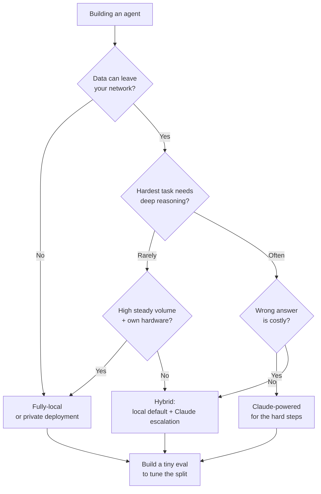

<LevelBadge level="intermediate" />

أنت تبني وكيلًا. أول مفترق طرق حقيقي: هل يعمل على نموذج مفتوح الأوزان **محلي بالكامل** (خاص، مجاني التشغيل، ملكك)، أم على **Claude** (جودة الطليعة، مستضاف)، أم على **هجين** من الاثنين؟ هذه الصفحة إطار عمل لاتخاذ القرار — العوامل التي تحسم الأمر فعلًا، ومسار واضح بصيغة "إذا حدث X ← مِلْ إلى Y"، والحقيقة الصادقة بأن **الهجين يفوز عادةً**: المحلي للـ 90% السهل/الحساس، وClaude للـ 10% الصعب.

<Callout type="objectives" items={[
  "تسمية العوامل التي تحسم فعلًا الاختيار بين المحلي وClaude والهجين",
  "السير في مسار قرار واضح بصيغة 'إذا حدث X ← مِلْ إلى Y' لوكيلك",
  "فهم لماذا يتفوّق الهجين (محلي افتراضي + تصعيد إلى Claude) غالبًا على أيٍّ من الطرفين",
  "الخروج بتقييم صغير كفيصل ترجيح لك — لا بلوحة صدارة",
]} />

<VerifyNote lastVerified="2026-06-28" source="https://artificialanalysis.ai/">
الادعاءات الثابتة هنا — *وجود فجوة قدرة بين أفضل النماذج مفتوحة الأوزان ونماذج الطليعة، لكنها تستمر في التضيّق*، و*أن التوجيه/التتالي (النموذج الرخيص أولًا، والتصعيد عند الصعب) يوفّر التكلفة مع الحفاظ على الجودة* — مستقرة. لكن **الأرقام المحددة** (حجم الفجوة هذا الشهر، وأيّ نموذج مفتوح يتصدّر، وأسعار Claude لكل توكِن، وعدد التوكِنات في الثانية بالضبط على عتاد معيّن) تتغيّر باستمرار. تعامل مع أي رقم محدّد على أنه قابل للتقادم، وتحقّق من متتبّع حيّ مثل [Artificial Analysis](https://artificialanalysis.ai/) قبل المراهنة عليه.
</VerifyNote>

## الخيارات الثلاثة في نفَس واحد

- **وكيل محلي بالكامل** — نموذج مفتوح الأوزان (Llama, Qwen, Mistral, DeepSeek، إلخ) يعمل على عتادك الخاص عبر Ollama/LM Studio/vLLM. البيانات لا تغادر جهازك أبدًا؛ لا تكلفة لكل استدعاء؛ يعمل دون اتصال؛ محدود بعتادك وسقف النموذج. ← [الوكلاء المحليون للذكاء الاصطناعي](/docs/models/local-ai-agents)
- **وكيل مدعوم بـ Claude** — يستدعي واجهة Claude البرمجية. استدلال طليعي واستخدام أدوات، لا بنية تحتية تُعنى بها، ويتوسّع فورًا؛ لكن البيانات تغادر شبكتك، وتدفع لكل استدعاء، وتحتاج إلى اتصال.
- **الهجين** — نموذج محلي يتولّى الكتلة الروتينية/الحساسة؛ والخطوات الصعبة أو عالية المخاطر تُصعَّد إلى Claude. النمط الذي تتقارب عنده معظم وكلاء الإنتاج. ← [Claude + النماذج المحلية](/docs/models/claude-plus-local-models)

## العوامل التي تحسم الأمر فعلًا

مرّر وكيلك عبر هذه العوامل. معظم القرارات تُحسم بأول عاملين أو ثلاثة فقط.

| العامل | يميل إلى **المحلي** حين… | يميل إلى **Claude** حين… |
|---|---|---|
| **حساسية البيانات / الخصوصية** | البيانات منظَّمة أو لا يمكن أن تغادر شبكتك | البيانات غير حساسة أو لديك اتفاقية بيانات متوافقة |
| **صعوبة المهمة وعمق الاستدلال** | المهام ضيّقة، محدّدة النطاق، متكرّرة | المهام تحتاج استدلالًا عميقًا متعدد الخطوات، وسياقًا طويلًا، واستخدامًا معقدًا للأدوات |
| **متطلبات الموثوقية** | إعادة المحاولة أو تدخّل بشري مقبول عند الخطأ | كل خطوة يجب أن تكون صحيحة؛ الإخفاقات مكلفة |
| **زمن الاستجابة** | العتاد المحلي يستجيب بسرعة كافية | تفضّل الدفع مقابل السرعة على توفير وحدات معالجة رسومية |
| **التكلفة عند حجمك** | حجم مرتفع وثابت — العتاد الثابت يُستهلَك بكفاءة | حجم منخفض/متقطّع — الدفع لكل استدعاء يتفوّق على وحدات معالجة خاملة |
| **متطلّب العمل دون اتصال** | يجب أن يعمل معزولًا / دون اتصال | العمل المتصل دائمًا مقبول |
| **العتاد الذي تملكه** | تمتلك وحدة/وحدات معالجة رسومية قادرة / ذاكرة موحّدة | لا تمتلكها، ولا تريد شراءها/استئجارها |
| **ميزانية الاعتناء** | يمكنك الضبط والتكميم والتقييم والصيانة | تريده أن "يعمل ببساطة" دون عمليات تشغيل |

**العاملان اللذان يحسمان الأمر عادةً:** إن كانت البيانات *لا تستطيع* مغادرة شبكتك، فهذا وحده يدفعك نحو المحلي (أو نحو نشر خاص) بغضّ النظر عن كل شيء آخر. وإن كانت تستطيع، فإن **صعوبة المهمة** هي عامل الترجيح التالي — العمل السهل رخيص التنفيذ محليًا؛ أما الاستدلال الصعب فهو حيث تلدغ [فجوة الطليعة](/docs/models/choosing-a-model) ما زالت.

<Callout type="info" items={[
  "فجوة القدرة بين مفتوح الأوزان والطليعة حقيقية لكنها تتضيّق بسرعة — أفضل النماذج المفتوحة ممتازة في المهام الروتينية وكثير من مهام البرمجة، ولا تزال متأخرة في معظم أصعب المهام الوكيلية والطويلة الأمد والعميقة الاستدلال.",
  "هذا التباين تحديدًا هو ما يجعل الهجين قويًا: أرسِل الأغلبية السهلة/الحساسة إلى المحلي، واحتفظ بـ Claude للشريحة التي تحتاج فعلًا استدلالًا طليعيًا.",
]} />

## مسار القرار

<Steps items={[
  {title: "هل يمكن للبيانات أن تغادر شبكتك؟", body: "إذا لا ← المحلي (أو نشر خاص/VPC) هو خط الأساس لديك. الخصوصية قيد صارم لا تفضيل — وهي تهيمن على بقية العوامل. إذا نعم ← تابع المسار."},
  {title: "ما مدى صعوبة أصعب شيء يجب أن يفعله وكيلك؟", body: "إذا كانت كل مهمة ضيّقة ومتكرّرة ← نموذج محلي جيد يجتاز العتبة على الأرجح؛ مِلْ إلى المحلي. إذا احتاجت بعض الخطوات استدلالًا عميقًا أو سياقًا طويلًا أو تنسيقًا دقيقًا لأدوات متعددة ← مِلْ إلى Claude على الأقل لتلك الخطوات."},
  {title: "ما تكلفة الإجابة الخاطئة؟", body: "إذا كان الخطأ يعني مجرد إعادة محاولة أو نظرة بشرية ← تسامحات المحلي مقبولة. إذا كانت خطوة سيئة واحدة مكلفة أو غير آمنة ← فضّل موثوقية Claude حيث تهمّ."},
  {title: "ما حجمك وعتادك؟", body: "حجم مرتفع وثابت على عتاد تملكه بالفعل ← المحلي يُستهلَك بكفاءة رائعة. حجم منخفض أو متقطّع، دون وحدات معالجة رسومية ← الدفع لكل استدعاء في Claude يتجنّب العتاد الخامل."},
  {title: "هل تريد فعلًا تشغيل بنية تحتية؟", body: "مستعد للتكميم والتقديم والمراقبة وإعادة تقييم النماذج ← المحلي/الهجين قابل للتطبيق. تريد صفر عمليات تشغيل ← Claude، أو هجين يكون فيه الجزء المحلي بسيطًا للغاية."},
  {title: "اجعل الافتراضي هجينًا، ثم أثبت أنك لا تحتاجه", body: "النموذج المحلي عاملًا افتراضيًا؛ وClaude مسار تصعيد للشريحة الصعبة/عالية المخاطر. ابدأ من هنا ما لم تفرض الخطوة 1 المحلي البحت أو كانت المهمة صعبة بشكل موحّد (عندها Claude البحت)."},
]} />

## لماذا يفوز الهجين غالبًا

معظم أحمال العمل الحقيقية **غير متوازنة**: أغلبية كبيرة من الطلبات سهلة و/أو حساسة، وأقلية صغيرة صعبة فعلًا. الهجين يستغل هذا الشكل مباشرة.

- **المحلي يتولّى الـ 90% السهل/الحساس** — سريع، ومجاني على الهامش، وخاص، وقادر على العمل دون اتصال. الجزء الأكبر من حركة مرورك لا يلمس أي واجهة برمجية.
- **Claude يتولّى الـ 10% الصعب** — الاستدلال متعدد الخطوات، والحالات الحدّية الغامضة، والخطوات التي يهمّ فيها الصواب. تدفع أسعار الطليعة فقط على الشريحة التي تحتاج جودة الطليعة.

هذا هو نمط **التتالي / التوجيه**: جرّب النموذج الرخيص (المحلي) أولًا؛ وصعّد إلى Claude حين تقول إشارة جودة إن الإجابة المحلية ليست جيدة بما يكفي، أو وجّه مسبقًا عبر مصنّف صعوبة/حساسية. إنها طريقة راسخة للحفاظ على معظم الجودة مع دفع جزء بسيط من تكلفة الطليعة الكاملة — وتعمل أيضًا كحدّ للخصوصية، إذ يمكن تثبيت الحالات الحساسة على "المحلي فقط".

<PromptCard title="فحص ذاتي قبل أن تلتزم بأحد الطرفين">{`Answer for YOUR agent:
1. Must any data stay on my machine?            (yes -> local baseline)
2. What % of tasks are genuinely HARD?          (high -> Claude leans heavier)
3. What's a wrong answer cost me?               (high -> Claude on those steps)
4. My volume + hardware?                        (high+own GPU -> local amortizes)
5. Can I babysit infra?                         (no -> Claude or simple hybrid)

If answers conflict -> you've just described a HYBRID.
Now build the tiny eval below and let DATA pick the split.`}</PromptCard>

التحذير الصادق: الهجين يعني **أجزاءً متحركة أكثر** — مساري نموذجين، وموجّهًا، وإشارة جودة يجب صيانتها. إن كان وكيلك بسيطًا بشكل موحّد *أو* صعبًا بشكل موحّد، فإعداد نموذج واحد أبسط وأرجح صوابًا. الجأ إلى الهجين حين يكون حمل عملك غير متوازن فعلًا.

<Flashcards title="مفردات دليل القرار" cards={[
  {front: "وكيل محلي بالكامل", back: "وكيل مدعوم بنموذج مفتوح الأوزان على عتادك الخاص. خاص، لا تكلفة لكل استدعاء، قادر على العمل دون اتصال؛ محدود بعتادك وسقف النموذج."},
  {front: "وكيل مدعوم بـ Claude", back: "وكيل يستدعي واجهة Claude البرمجية. استدلال طليعي واستخدام أدوات، لا بنية تحتية، توسّع فوري؛ البيانات تغادر شبكتك وتدفع لكل استدعاء."},
  {front: "الهجين (التتالي / التوجيه)", back: "النموذج المحلي يتولّى الأغلبية السهلة/الحساسة؛ وClaude يتولّى الأقلية الصعبة/عالية المخاطر. جرّب-الرخيص-أولًا-ثم-صعّد، أو وجّه حسب الصعوبة/الحساسية مسبقًا."},
  {front: "العامل الحاسم، عادةً", back: "حساسية البيانات أولًا (هل يمكن أن تغادر الشبكة؟)، ثم صعوبة المهمة (ما مدى صعوبة أصعب خطوة؟). والباقي فياصل ترجيح."},
  {front: "فجوة القدرة", back: "أفضل النماذج مفتوحة الأوزان متأخرة عن نماذج الطليعة أساسًا في أصعب مهام الاستدلال/الوكيلية. حقيقية لكنها تتضيّق — وهذا تحديدًا سبب فعالية الهجين الكبيرة."},
]} />

<Quiz title="اختبر نفسك" questions={[
  {q: "يعالج وكيلك بيانات لا يمكنها قانونيًا مغادرة شبكتك. ماذا يعني ذلك أولًا؟", options: ["استخدم Claude — فهو أعلى جودة", "النشر المحلي بالكامل أو الخاص هو خط الأساس، بغضّ النظر عن العوامل الأخرى", "اختر أيّها أرخص لكل توكِن"], answer: 1, explain: "الخصوصية قيد صارم. إن كانت البيانات لا تستطيع مغادرة الشبكة، فهذا يهيمن على القرار — المحلي (أو نشر خاص/VPC) هو خط أساسك قبل أن تزن أي شيء آخر."},
  {q: "لماذا يفوز الوكيل الهجين غالبًا لحمل عمل نموذجي غير متوازن؟", options: ["نماذج الطليعة دائمًا أرخص على نطاق واسع", "المحلي يتولّى الأغلبية السهلة/الحساسة برخص وخصوصية؛ وClaude محجوز للأقلية الصعبة التي تحتاج استدلالًا طليعيًا", "يزيل الحاجة إلى أي تقييم"], answer: 1, explain: "معظم أحمال العمل غير متوازنة. توجيه الـ 90% السهل/الحساس إلى نموذج محلي والـ 10% الصعب إلى Claude يحافظ على معظم الجودة بجزء بسيط من تكلفة الطليعة الكاملة — ويثبّت الحالات الحساسة على المحلي."},
  {q: "متى يكون إعداد نموذج واحد (محلي بحت أو Claude بحت) القرار الأفضل من الهجين؟", options: ["دائمًا — الهجين لا يستحق أبدًا", "حين يكون حمل العمل بسيطًا بشكل موحّد أو صعبًا بشكل موحّد، بحيث لا تُبرّر آلية الموجّه وإشارة الجودة الإضافية وجودها", "فقط حين لا تمتلك وحدات معالجة رسومية"], answer: 1, explain: "الهجين يضيف أجزاءً متحركة (مساران، وموجّه، وإشارة جودة). إن كانت مهامك كلها سهلة أو كلها صعبة، فنموذج واحد أبسط وأرجح صوابًا. الهجين يؤتي ثماره حين يكون حمل العمل غير متوازن فعلًا."},
]} />

## ثم افعل الشيء الوحيد الذي يحسمه: اختبره

كل عامل أعلاه يضيّق الميدان؛ **وتقييم صغير يختار الفائز.** لا تختر حسب الانطباع أو لوحة صدارة عامة.

- اجمع **من 10 إلى 50 حالة حقيقية** من حمل عملك الفعلي، بإجابات صحيحة معروفة (أدرِج أصعب حالاتك وأكثرها حساسية).
- شغّل قائمتك المختصرة — نموذجًا محليًا مرشّحًا، وClaude، و(إن كان مناسبًا) موجّهًا هجينًا — على نفس الحالات.
- قِس الجودة، ثم وازن **التكلفة وزمن الاستجابة عند حجمك الحقيقي**. مكسب جودة بنسبة 2% يكلّف عشرة أضعاف قد لا يستحق؛ ومكسب بنسبة 2% على الخطوة التي يجب أن تكون صحيحة قد يكون غير قابل للتفاوض.
- بالنسبة للهجين، يخبرك التقييم أيضًا **أين ترسم الخط** — ما الذي يُصعَّد إلى Claude وما الذي يبقى محليًا.

احتفظ بالتقييم. حين يصدر نموذج مفتوح الأوزان جديد أو يتغيّر التسعير، تحوّل إعادة تشغيله هجرةً مقلقة إلى فحص من خمس دقائق. ← [التقييمات](/docs/power-user/evals)

<Callout type="takeaways" items={[
  "قرّر بالترتيب: حساسية البيانات أولًا (هل يمكن أن تغادر الشبكة؟)، ثم صعوبة المهمة (ما مدى صعوبة أصعب خطوة؟). والباقي — زمن الاستجابة، والحجم، والعتاد، وميزانية الاعتناء — فياصل ترجيح.",
  "المحلي البحت يفوز في الخصوصية والعمل دون اتصال والتكلفة عند حجم مرتفع ثابت؛ وClaude يفوز في أصعب الاستدلال والموثوقية والتوسّع بصفر عمليات تشغيل.",
  "الهجين يفوز عادةً لأحمال العمل غير المتوازنة: المحلي للـ 90% السهل/الحساس، وClaude للـ 10% الصعب — تتالٍ/توجيه، وادفع أسعار الطليعة فقط حيث تستحق.",
  "فجوة مفتوح الأوزان حقيقية لكنها تتضيّق — وهذا تحديدًا ما يجعل الهجين فعالًا للغاية اليوم.",
  "لا تقرّر حسب الانطباع: ابنِ تقييمًا صغيرًا على بياناتك أنت، ووازن التكلفة وزمن الاستجابة عند حجمك أنت، واحتفظ به لإصدار النموذج القادم.",
]} />

## المصادر والقراءة الإضافية

- [Artificial Analysis](https://artificialanalysis.ai/) — مقارنات مستقلة ومحدّثة باستمرار للقدرة/السعر/السرعة عبر النماذج المفتوحة والطليعية (المكان الذي تعيد فيه فحص التفاصيل القابلة للتقادم).
- [Anthropic — نظرة عامة على النماذج](https://docs.anthropic.com/en/docs/about-claude/models) — تشكيلة Claude الراهنة وسياقها وقدراتها.
- [Anthropic — تسعير الواجهة البرمجية](https://www.anthropic.com/pricing) — التكاليف الراهنة لكل توكِن لحساب أرقامك عند الحجم.
- [Ollama](https://ollama.com/) · [LM Studio](https://lmstudio.ai/) — لتشغيل النماذج المفتوحة الأوزان محليًا لمسار المحلي/الهجين.
- [Meta — Llama](https://www.llama.com/) · [Mistral — النماذج](https://docs.mistral.ai/getting-started/models/) — عائلات مفتوحة الأوزان شائعة الاستخدام في الوكلاء المحليين.

## التالي

- ابنِ الجانب المحلي ← [الوكلاء المحليون للذكاء الاصطناعي](/docs/models/local-ai-agents)
- اربط الهجين ← [Claude + النماذج المحلية](/docs/models/claude-plus-local-models)
- أطّر الاختيار بشكل أوسع ← [اختيار نموذج](/docs/models/choosing-a-model)
- اجعل القرار قابلًا للقياس ← [التقييمات](/docs/power-user/evals)
