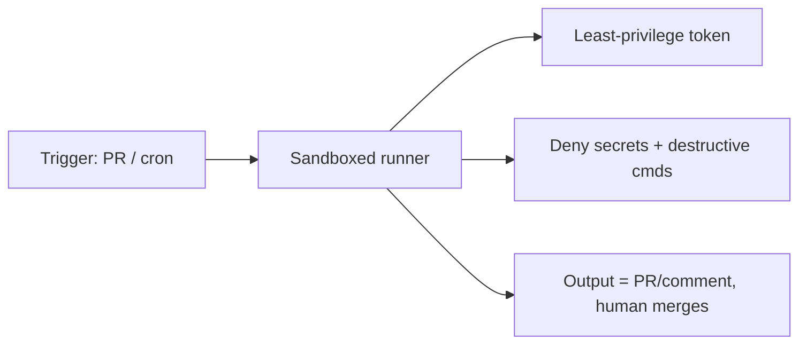

<LevelBadge level="advanced" />

تشغيل Claude في وضع [headless](/docs/claude-code/headless-and-agent-sdk) أو على [جدول زمني](/docs/claude-code/background-tasks) — في CI، أو مهمة cron، أو خطاف pre-commit — يزيل الإنسان الذي كان من المعتاد أن يلتقط الإجراء السيئ. وتلك السهولة هي بالضبط سبب حاجة هذه التشغيلات إلى أشد الضوابط الوقائية.

## المخاطر الفريدة للتشغيلات غير المراقَبة

- **لا أحد ليقول "لا"** لاستدعاء أداة خطر في اللحظة المناسبة.
- **بيانات اعتماد محيطة.** غالبًا ما يمتلك CI رموزًا قوية (نشر، سجل حزم، سحابة). والوكيل هناك يرثها.
- **مدخلات غير موثوقة.** قد يعالج تشغيلٌ مُفعَّل عبر طلب سحب (PR) أو مشكلة محتوى من تأليف المهاجم ([الحقن](/docs/security/prompt-injection)).

## قائمة تحقق للتحصين

- **امنع الأسرار صراحةً.** احظر قراءة `.env` وملفات المفاتيح ومسارات بيانات الاعتماد عبر [قواعد رفض الأذونات](/docs/claude-code/permissions). لا تعتمد على النموذج في تجنّبها.
- **لا تستخدم أبدًا وضع bypass/yolo على جهاز ذي وصول حقيقي.** احتفظ بخيار "تخطّي كل التنبيهات" للبيئات المعزولة القابلة للتخلص.
- **حدِّد نطاق الرمز.** امنح التشغيل رمزًا بأدنى امتياز (للقراءة فقط حيثما أمكن)، وليس بيانات اعتمادك ذات الوصول الكامل.
- **معزول ومؤقت.** شغّل داخل حاوية تُدمَّر بعد الانتهاء؛ بلا وصول دائم إلى الإنتاج.
- **ضع قوائم سماح للأوامر والنطاقات.** اسمح بأوامر الاختبار/الفحص/البناء؛ وامنع المتصلة بالشبكة أو المدمِّرة.
- **ضع سقفًا.** أقصى عدد من التكرارات، وميزانية زمنية، وميزانية للرموز/التكلفة — كي لا تتمكن حلقة لا متناهية أو وكيل مُتلاعَب به من الانفلات.
- **اجعل المخرجات قابلة للمراجعة، لا مطبَّقة تلقائيًا.** فضِّل "فتح طلب سحب / نشر تعليق" على "الدفع إلى main". الإنسان هو من يدمج.

## مثال: مراجِع CI آمن

ينبغي لبوت مراجعة طلبات السحب أن: يسحب نسخة من الكود للقراءة فقط، وألا يمتلك **أي** وصول إلى النشر أو الأسرار، وأن يعمل داخل حاوية، وأن **يعلّق** على ما يجده — دون أن يعدّل الفروع المحمية أبدًا. راجع [شرح مراجعة طلبات السحب خطوة بخطوة](/docs/walkthroughs/pr-review-action).

## التالي

- [الأذونات وأوضاع الأذونات](/docs/claude-code/permissions)
- [تأمين الوكلاء والأدوات](/docs/security/securing-agents)
- [وضع Headless وعدة Agent SDK](/docs/claude-code/headless-and-agent-sdk)
