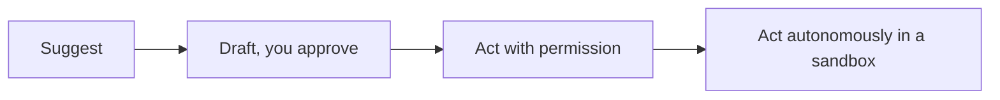

<LevelBadge level="all" />

تحقيق أقصى استفادة من الذكاء الاصطناعي يشمل استخدامه *بمسؤولية*. هذه الصفحة قصيرة وعملية وتنطبق على الجميع — من المبتدئ إلى المطوّر.

## عقلية التحقق

أهم عادة على الإطلاق: **اجعل تحققك متناسبًا مع حجم المخاطر.**

| المخاطر | مثال | مقدار التحقق |
|---|---|---|
| منخفضة | العصف الذهني، المسوّدات الأولية | ثِق بحرية، تصفّح سريعًا |
| متوسطة | بريد إلكتروني للعمل، ملخّص | اقرأه، تحقّق من سلامة الحقائق |
| عالية | إحصاءات منشورة، كود ستشغّله، أمور قانونية/طبية/مالية | تحقّق من كل ادعاء مقابل مصدر موثوق |

الذكاء الاصطناعي مسوّدة أولى سريعة، وليس سلطة نهائية أبدًا — راجع [الهلوسات](/docs/foundations/hallucinations).

## سلّم الاستقلالية

امنح الذكاء الاصطناعي مزيدًا من الاستقلالية فقط بقدر ما تُكتسب الثقة:

ابدأ بـ "اقترح، وأنا أوافق" ([وضع التخطيط](/docs/claude-code/plan-mode))؛ واحتفظ بالاستقلالية الكاملة للأعمال منخفضة المخاطر والمعزولة والقابلة للتراجع ([تحصين التشغيلات الذاتية](/docs/security/hardening-autonomous-runs)).

## الخصوصية والبيانات

- لا تلصق الأسرار أو بيانات الاعتماد أو البيانات الشخصية للآخرين في أداة لم تتحقّق منها.
- اعرف سياسة معالجة البيانات والتدريب لدى مزوّدك قبل مشاركة مواد حساسة — راجع [الخصوصية ومعالجة البيانات](/docs/foundations/privacy).
- بالنسبة للبيانات الخاضعة للتنظيم أو السرية، استخدم الإعدادات المؤسسية/المضبوطة المناسبة.

## التحيّز والإنصاف والحدود

تعكس النماذج الأنماط الموجودة في بيانات تدريبها، والتي يمكن أن تحمل **تحيّزًا**. كن حذرًا بشكل خاص عندما تؤثر مخرجات الذكاء الاصطناعي في قرارات تخصّ أشخاصًا (التوظيف، الإقراض، الإشراف). أبقِ إنسانًا مسؤولًا عن القرارات المصيرية، وتعامل مع الذكاء الاصطناعي كأداة مساعِدة للحكم، لا بديلًا عنه.

## لا تُسنِد تفكيرك للغير

:::tip استخدم الذكاء الاصطناعي لتفكّر بشكل أفضل، لا أقل
أفضل المستخدمين يظلون منخرطين — يشكّكون في المخرجات، ويتعلمون منها، ويتملّكون النتيجة. وبالنسبة للدراسة، فهذا يعني [حلقة الشرح المعاكس](/docs/playbooks/learning)، لا النسخ واللصق. أنت المسؤول عمّا تطرحه بمساعدة الذكاء الاصطناعي.
:::

## الأمان، باختصار

إذا قرأ الذكاء الاصطناعي يومًا محتوى غير موثوق (صفحات ويب، رسائل بريد، مستندات) أو اتخذ إجراءات، فأنت ترث نموذجًا أمنيًا. اقرأ [حقن الأوامر](/docs/security/prompt-injection) و[تأمين الوكلاء](/docs/security/securing-agents).

## التالي

- [شرح حقن الأوامر (Prompt Injection)](/docs/security/prompt-injection)
- [الهلوسات وكيفية تقليلها](/docs/foundations/hallucinations)
- [الخصوصية ومعالجة البيانات](/docs/foundations/privacy)
