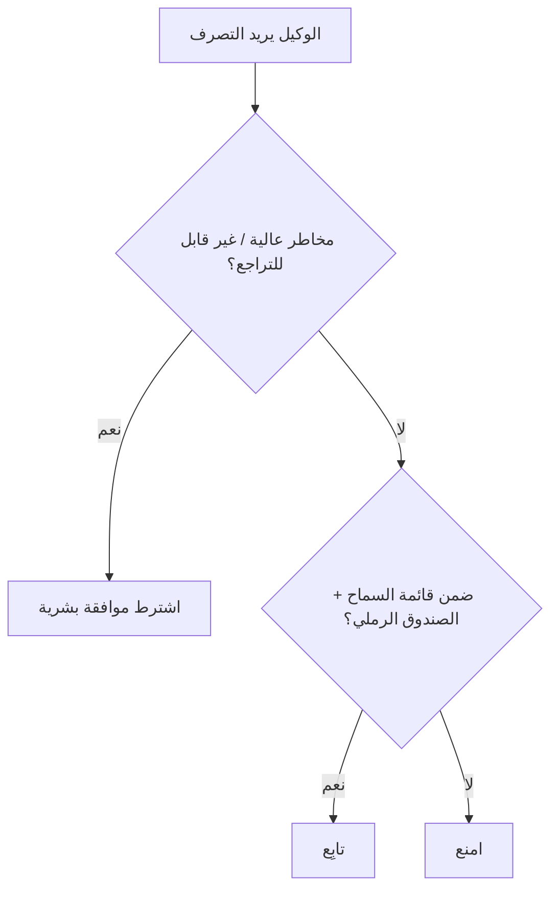

<LevelBadge level="advanced" />

<Callout type="objectives" items={["طبّق مبدأ الامتياز الأدنى — امنح الوكيل فقط الوصول الذي تتطلبه مهمته", "تعرّف على مشكلة النائب المرتبك: وكيل يستعير صلاحيتك", "ركّب طبقات الدفاع الخمس التي تقلّص نطاق الضرر عندما يُخدَع الوكيل", "قرّر أي الإجراءات يستلزم وجود إنسان في الحلقة", "تحقّق من مدخلات الأدوات كي لا يتمكن وسيط سيء أو مُتلاعَب به من التنفيذ"]} />

في اللحظة التي يستطيع فيها الذكاء الاصطناعي **اتخاذ إجراءات** (استدعاء أدوات، تشغيل كود، الاتصال بواجهات برمجة التطبيقات)، فإنه يرث نموذجًا أمنيًا. والهدف ليس جعل النموذج غير قابل للخداع — بل التأكد من أنه **حتى لو خُدِع، فلا يستطيع إحداث ضرر كبير**.

## المبدأ الأساسي: الامتياز الأدنى

امنح الوكيل **الحد الأدنى** من الوصول الذي تتطلبه مهمته، لا أكثر.

- يحتاج مُلخِّص المستندات إلى **القراءة**، لا الكتابة أو الشبكة.
- يحتاج المراجِع إلى قراءة الكود ونشر تعليق — لا الدفع أو النشر.
- حدِّد نطاق الأدوات ومفاتيح واجهات برمجة التطبيقات والوصول إلى الملفات لكل مهمة. فالوكيل ضيّق النطاق الذي يتعرّض [للحقن](/docs/security/prompt-injection) لا يمكنه إحداث سوى ضرر ضيّق.

## مشكلة النائب المرتبك

غالبًا ما يتصرف الوكيل **بصلاحيتك** (رموزك، جلساتك). فإذا وجّهه مدخل يتحكم فيه المهاجم، استعار المهاجم امتيازاتك — وهو "نائب مرتبك". الدفاع: لا تمنح الوكيل صلاحية محيطة لا يحتاجها، واشترط بيانات اعتماد صريحة ومحدودة النطاق للأدوات الحساسة.

## طبقات الدفاع

ركّب هذه الطبقات معًا — لا تكفي أي واحدة بمفردها. كل طبقة تفترض أن الطبقات التي فوقها قد تفشل.

<Steps items={[
  {title: "اعزل التنفيذ والوصول إلى الملفات في صندوق رملي", body: "شغّل الكود وعمليات الملفات في حاويات أو أدلة مؤقتة بلا وصول إلى النظام الأوسع أو الأسرار. فإذا خُدِع الوكيل، لعب داخل صندوق."},
  {title: "ضع قائمة سماح للسطح الخطر", body: "قرّر أي الأوامر وأي النطاقات وأي المسارات مسموح بها — وامنع ما عدا ذلك. في Claude Code، هذه هي الأذونات (/docs/claude-code/permissions)."},
  {title: "إنسان في الحلقة للمخاطر العالية", body: "اشترط موافقة صريحة للإجراءات غير القابلة للتراجع أو الحساسة: إرسال المال، إرسال البريد، الحذف، النشر، أو تغيير إعدادات الإنتاج."},
  {title: "افصل مناطق الثقة", body: "لا تدع وكيلًا واحدًا يمتلك الأسرار ويقرأ المحتوى غير الموثوق ويجري اتصالات صادرة عشوائية في آن واحد — تلك التركيبة هي مسار التسريب."},
  {title: "سجِّل استدعاءات الأدوات وراجِعها", body: "سجّل الأدوات التي استدعاها الوكيل فعليًا وبأي وسائط، كي تتمكن من تدقيق السلوك واكتشاف الانحراف."}
]} />

## اكتب قائمة السماح صراحةً

"وضع قائمة سماح للسطح الخطر" سهل الموافقة عليه بإيماءة وسهل تخطيه. في Claude Code يكون ملموسًا: ملف `settings.json` يسمح بالمجموعة الضيقة من الأوامر والنطاقات التي تحتاجها المهمة ويمنع ما عداها. ابدأ متقيّدًا ووسّع فقط عندما تتعثر مهمة حقيقية.

<PromptCard title="كتلة أذونات Claude Code بالامتياز الأدنى">{`{
  "permissions": {
    "allow": [
      "Read",
      "Edit",
      "Bash(npm test:*)",
      "Bash(npm run build:*)",
      "Bash(git status)",
      "Bash(git diff:*)"
    ],
    "deny": [
      "Bash(git push:*)",
      "Bash(rm:*)",
      "Bash(curl:*)",
      "Read(./.env)",
      "Read(./secrets/**)"
    ]
  }
}`}</PromptCard>

قائمة `deny` تتغلب على `allow`، لذا يظل حجب `.env` و`secrets/**` ساريًا حتى لو مُنِح `Read` واسع النطاق. راجع [الأذونات](/docs/claude-code/permissions) للاطلاع على صيغة القواعد الكاملة وأسبقيتها.

## للأدوات مخططات — تحقّق منها

يمكن أن تكون مدخلات الأدوات التي ينتجها النموذج خاطئة أو مُتلاعَبًا بها. **تحقّق** من الوسائط قبل التنفيذ، و**أعد الأخطاء كنتائج** كي يتعافى الوكيل بدلًا من إعادة المحاولة بشكل أعمى.

<Flashcards title="تدرّب على المصطلحات الأساسية" cards={[{front: "الامتياز الأدنى", back: "امنح الوكيل فقط الوصول الذي تحتاجه مهمته المحددة — لا أكثر. الوكيل ضيّق النطاق الذي يُخدَع لا يمكنه إحداث سوى ضرر ضيّق."}, {front: "النائب المرتبك", back: "يتصرف الوكيل بصلاحيتك (رموزك، جلساتك). فإذا وجّهه مدخل يتحكم فيه المهاجم، استعار المهاجم امتيازاتك."}, {front: "الصندوق الرملي", back: "شغّل الكود والوصول إلى الملفات في حاوية معزولة أو دليل مؤقت بلا مسار إلى النظام الأوسع أو الأسرار، كي يبقى الوكيل المخدوع محصورًا في الصندوق."}, {front: "مناطق الثقة", back: "أبقِ الأسرار والمحتوى غير الموثوق والشبكة الصادرة في وكلاء منفصلين. الوكيل الواحد الذي يمتلك الثلاثة معًا هو مسار تسريب."}, {front: "الإنسان في الحلقة", back: "بوابة موافقة بشرية مطلوبة قبل الإجراءات غير القابلة للتراجع أو الحساسة — إرسال المال، الحذف، النشر، تغيير إعدادات الإنتاج."}]} />

<Quiz title="اختبر نفسك" questions={[
  {
    q: "ماذا يطلب منك مبدأ الامتياز الأدنى فعله عند إعداد وكيل؟",
    options: ["امنحه وصولًا واسعًا كي لا يتعثر أبدًا في منتصف المهمة", "امنحه فقط الوصول الذي تتطلبه مهمته المحددة", "امنحه الأذونات نفسها التي يملكها الإنسان الذي يشغّله"],
    answer: 1,
    explain: "الامتياز الأدنى يعني الحد الأدنى من الوصول الذي تحتاجه المهمة. الوكيل ضيّق النطاق الذي يتعرّض للحقن لا يمكنه إحداث سوى ضرر ضيّق."
  },
  {
    q: "لماذا يُعدّ الوكيل الذي يتصرف برموزك خطر 'نائب مرتبك'؟",
    options: ["يخلط بين أي نموذج يستدعي", "يمكن للمدخل الذي يتحكم فيه المهاجم أن يوجّهه لاستخدام امتيازاتك", "يوكّل وكلاء آخرين دون سؤال"],
    answer: 1,
    explain: "الوكيل يحمل صلاحيتك. فإذا وجّهه مدخل يتحكم فيه المهاجم، استعار المهاجم امتيازاتك فعليًا — مشكلة النائب المرتبك."
  },
  {
    q: "في كتلة أذونات Claude Code، أي مدخل يمنع الوكيل بشكل موثوق من قراءة ملف أسرار؟",
    options: ["مدخل allow لـ Read", "مدخل deny لمسار الأسرار، لأن deny يتغلب على allow", "إزالة أداة Bash"],
    answer: 1,
    explain: "deny له الأسبقية على allow، لذا يظل deny على secrets/** ساريًا حتى عند منح Read واسع النطاق."
  }
]} />

<Callout type="takeaways" items={["الامتياز الأدنى أولًا: حدِّد نطاق الأدوات والمفاتيح والوصول إلى الملفات لكل مهمة كي لا يتمكن الوكيل المخدوع من إحداث سوى ضرر ضيّق", "يتصرف الوكيل بصلاحيتك — لا تمنحه امتيازات محيطة لا يحتاجها (مشكلة النائب المرتبك)", "ركّب الطبقات الخمس: الصندوق الرملي، قائمة السماح، الإنسان في الحلقة، فصل مناطق الثقة، التسجيل والمراجعة", "في Claude Code، قواعد deny تتغلب على قواعد allow — احجب مسارات .env والأسرار صراحةً", "تحقّق من وسائط الأدوات قبل التنفيذ، وأعد الأخطاء كنتائج كي يتعافى الوكيل بدلًا من إعادة المحاولة بشكل أعمى"]} />

## التالي

- [شرح حقن الأوامر (Prompt Injection)](/docs/security/prompt-injection)
- [تحصين التشغيلات الذاتية](/docs/security/hardening-autonomous-runs)
- [مراجعة الكود الخارجي](/docs/security/reviewing-third-party-code)
