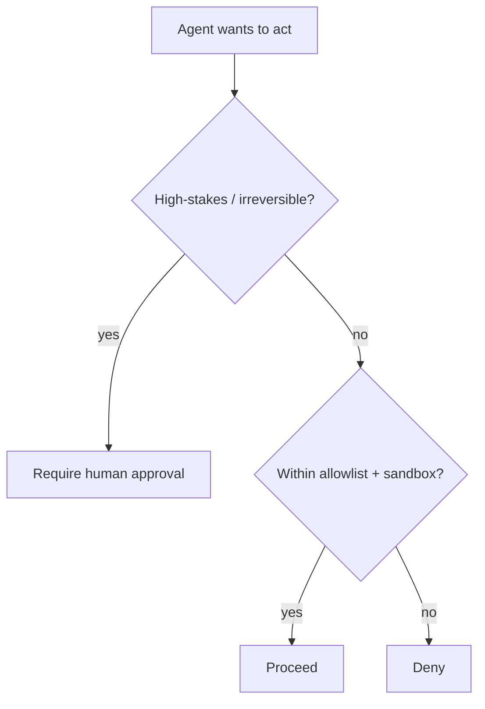

<LevelBadge level="advanced" />

في اللحظة التي يستطيع فيها الذكاء الاصطناعي **اتخاذ إجراءات** (استدعاء أدوات، تشغيل كود، الاتصال بواجهات برمجة التطبيقات)، فإنه يرث نموذجًا أمنيًا. والهدف ليس جعل النموذج غير قابل للخداع — بل التأكد من أنه **حتى لو خُدِع، فلا يستطيع إحداث ضرر كبير**.

## المبدأ الأساسي: الامتياز الأدنى

امنح الوكيل **الحد الأدنى** من الوصول الذي تتطلبه مهمته، لا أكثر.

- يحتاج مُلخِّص المستندات إلى **القراءة**، لا الكتابة أو الشبكة.
- يحتاج المراجِع إلى قراءة الكود ونشر تعليق — لا الدفع أو النشر.
- حدِّد نطاق الأدوات ومفاتيح واجهات برمجة التطبيقات والوصول إلى الملفات لكل مهمة. فالوكيل ضيّق النطاق الذي يتعرّض [للحقن](/docs/security/prompt-injection) لا يمكنه إحداث سوى ضرر ضيّق.

## مشكلة النائب المرتبك

غالبًا ما يتصرف الوكيل **بصلاحيتك** (رموزك، جلساتك). فإذا وجّهه مدخل يتحكم فيه المهاجم، استعار المهاجم امتيازاتك — وهو "نائب مرتبك". الدفاع: لا تمنح الوكيل صلاحية محيطة لا يحتاجها، واشترط بيانات اعتماد صريحة ومحدودة النطاق للأدوات الحساسة.

## طبقات الدفاع

1. **اعزل** تنفيذ الكود والوصول إلى الملفات — حاويات، أدلة مؤقتة، بلا وصول إلى النظام الأوسع أو الأسرار.
2. **ضع قائمة سماح** للسطح الخطر: أي أوامر، أي نطاقات، أي مسارات. وامنع ما عدا ذلك. (في Claude Code، هذه هي [الأذونات](/docs/claude-code/permissions).)
3. **أبقِ الإنسان في الحلقة** للإجراءات غير القابلة للتراجع أو عالية المخاطر: إرسال المال، البريد، الحذف، النشر، تغيير إعدادات الإنتاج.
4. **افصل مناطق الثقة.** لا تدع وكيلًا واحدًا يمتلك الأسرار ويقرأ المحتوى غير الموثوق ويجري اتصالات صادرة عشوائية في آن واحد.
5. **سجِّل وراجِع** الأدوات التي استدعاها الوكيل فعليًا.

## للأدوات مخططات — تحقّق منها

يمكن أن تكون مدخلات الأدوات التي ينتجها النموذج خاطئة أو مُتلاعَبًا بها. **تحقّق** من الوسائط قبل التنفيذ، و**أعد الأخطاء كنتائج** كي يتعافى الوكيل بدلًا من إعادة المحاولة بشكل أعمى.

## التالي

- [شرح حقن الأوامر (Prompt Injection)](/docs/security/prompt-injection)
- [تحصين التشغيلات الذاتية](/docs/security/hardening-autonomous-runs)
- [مراجعة الكود الخارجي](/docs/security/reviewing-third-party-code)
